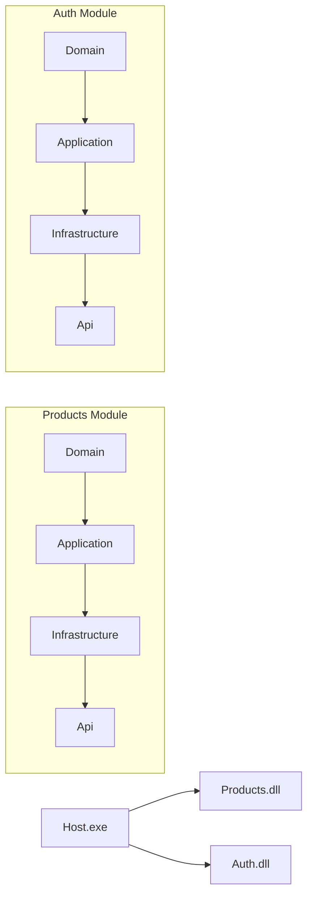

# 🛒 Modular Monolithic Marketplace API

A .NET 10 project demonstrating **Clean Architecture** with **modular monolith** design, **CQRS + MediatR** pattern, and **16 business modules** for a complete e-commerce platform.


---

## 📋 Table of Contents

1. [Overview](#-over-view)
2. [Architecture](#-architecture)
3. [Modules](#-modules)
4. [Technology Stack](#-technology-stack)
5. [Project Structure](#-project-structure)
6. [Getting Started](#-getting-started)
7. [API Endpoints](#-api-endpoints)
8. [Documentation](#-documentation)
9. [Contributing](#-contributing)

---

## 🎯 Overview

This project demonstrates enterprise-level patterns for building modular monolithic applications in .NET with **Clean Architecture**, **CQRS + MediatR**, and **16 business modules**.

### Key Features

- ✅ **16 Business Modules** (Auth, Products, Cart, Order, Payment, etc.)
- ✅ **Clean Architecture** with per-module structure
- ✅ **CQRS + MediatR** for command/query segregation
- ✅ **JWT Authentication** with BCrypt password hashing
- ✅ **FluentValidation** for declarative validation
- ✅ **EF Core** with InMemory database
- ✅ **Swagger/OpenAPI** documentation
- ✅ **State Machines** for Order, Payment, Shipping

---

## 🏗️ Architecture

### Clean Architecture (Per-Module)

```
┌─────────────────────────────────────────────────────────────┐
│                    PRESENTATION LAYER                     │
│              Controllers / HTTP Endpoints                  │
└──────────────────────┬──────────────────────────────────┘
                       │ Send via MediatR
┌──────────────────────▼──────────────────────────────────┐
│                    APPLICATION LAYER                     │
│   Commands │ Queries │ Handlers │ Validators │ Results  │
└──────────────────────┬──────────────────────────────────┘
                       │
┌──────────────────────▼──────────────────────────────────┐
│                      DOMAIN LAYER                       │
│         Entities │ Interfaces │ Business Rules              │
└──────────────────────┬──────────────────────────────────┘
                       │
┌──────────────────────▼──────────────────────────────────┐
│                   INFRASTRUCTURE LAYER                   │
│              DbContext │ Repositories │ External                     │
└─────────────────────────────────────────────────────────────┘
```

### Why Per-Module Structure?

Each module contains **all layers** (Domain → Application → Infrastructure → API), making it easy to extract into microservices later:



**Benefit**: When migrating to microservices, extract the **entire module** (not individual layers).

---

## 📦 Modules

### Core Business Modules

| Module | Description | Key Features |
|--------|-------------|---------------|
| **Auth** | User authentication | JWT tokens, BCrypt hashing, Refresh tokens |
| **Products** | Product catalog | CRUD, Search, Pagination |
| **Category** | Category tree | Hierarchical structure, Move categories |
| **Cart** | Shopping cart | Add/Remove items, Clear cart |
| **Order** | Order processing | Place order, Cancel, State machine |
| **Payment** | Payment processing | Stripe/PayPal simulation, Refunds |
| **Shipping** | Shipment tracking | Create shipment, Update tracking |
| **Reviews** | Product reviews | Create, Moderate, Approve |

### Supporting Modules

| Module | Description | Key Features |
|--------|-------------|---------------|
| **Inventory** | Stock management | Increment/Decrement stock |
| **Address** | User addresses | Multiple addresses, Default address |
| **Notifications** | User alerts | Event-driven notifications |
| **Search** | Product search | History tracking |
| **Discounts** | Coupon codes | Activate/Deactivate, Validate |
| **Wishlist** | Saved products | Add/Remove from wishlist |
| **Analytics** | Event tracking | Dashboard, Event logging |
| **Media** | File uploads | Image management |

---

## 💻 Technology Stack

### Runtime & Framework

| Technology | Version | Purpose |
|------------|---------|---------|
| **.NET SDK** | 10.0 | Runtime framework |
| **C#** | 12.0 | Programming language |
| **ASP.NET Core** | 10.0 | Web API framework |

### Libraries & Packages

| Package | Version | Purpose |
|---------|---------|---------|
| **MediatR** | 12.4.1 | CQRS mediator |
| **FluentValidation.AspNetCore** | 11.3.0 | Model validation |
| **Microsoft.EntityFrameworkCore** | 10.0.0 | ORM |
| **Microsoft.EntityFrameworkCore.InMemory** | 10.0.0 | InMemory database |
| **BCrypt.Net-Next** | 4.1.0 | Password hashing |
| **System.IdentityModel.Tokens.Jwt** | 8.3.1 | JWT token generation |
| **Swashbuckle.AspNetCore** | 7.0.0 | Swagger/OpenAPI |

---

## 📂 Project Structure

```
modular-monolithic-marketPlace/
├── LearningApi.sln              ← Solution file
├── .editorconfig               ← Code style rules
├── .gitignore                  ← Git ignore rules
├── README.md                   ← This file
│
├── src/
│   ├── Host/                  ← Web API entry point
│   │   ├── Program.cs
│   │   ├── Host.csproj
│   │   ├── appsettings.json    ← JWT config (secret empty!)
│   │   ├── Configuration/
│   │   │   └── JwtSettings.cs
│   │   ├── Middleware/
│   │   │   ├── ExceptionHandlingMiddleware.cs
│   │   │   └── RequestLoggingMiddleware.cs
│   │   └── http/                ← REST Client test files
│   │
│   ├── Shared/                ← Shared abstractions
│   │   ├── Shared.csproj
│   │   └── Abstractions/
│   │       └── BaseEntity.cs
│   │
│   └── Modules/              ← All business modules
│       ├── Auth/
│       ├── Products/
│       ├── Category/
│       ├── Cart/
│       ├── Order/
│       ├── Payment/
│       ├── Shipping/
│       ├── Reviews/
│       ├── Inventory/
│       ├── Address/
│       ├── Notifications/
│       ├── Search/
│       ├── Discounts/
│       ├── Wishlist/
│       └── Analytics/
│
└── docs/                      ← Comprehensive documentation
    ├── Guides/                ← Architecture & patterns
    ├── API/                   ← Endpoint documentation
    ├── Database/              ← Database design
    ├── Architecture/          ← Configuration & compilation
    ├── Authentication/        ← JWT & CQRS docs
    └── [Module]/             ← Per-module LLD & CQRS docs
```

### Module Structure (Example: Products)

```
Modules/Products/
├── Products.csproj
├── Domain/
│   ├── Entities/
│   │   └── Product.cs
│   └── Interfaces/
│       └── IProductRepository.cs
├── Application/
│   ├── Commands/
│   │   └── ProductCommands.cs
│   ├── Queries/
│   │   └── ProductQueries.cs
│   ├── Handlers/             ← Business logic
│   │   ├── CreateProductHandler.cs
│   │   ├── UpdateProductHandler.cs
│   │   ├── DeleteProductHandler.cs
│   │   ├── GetProductByIdHandler.cs
│   │   └── GetAllProductsHandler.cs
│   ├── Validators/
│   │   └── ProductValidators.cs
│   └── Results.cs
├── Infrastructure/
│   ├── Data/
│   │   └── ProductsDbContext.cs
│   └── Repositories/
│       └── ProductRepository.cs
└── Api/
    └── Controllers/
        └── ProductController.cs
```

---

## 🚀 Getting Started

### Prerequisites

- **.NET 10 SDK** ([Download](https://dotnet.microsoft.com/download))
- **VS Code** or **Visual Studio 2022+**
- **Git**

### Clone & Run

```bash
# Clone the repository
git clone https://github.com/AbdulrhmanMohamed/modular-monolithic-marketPlace.git
cd modular-monolithic-marketPlace

# Build the solution
dotnet build

# Run the API
dotnet run --project src/Host

# Open Swagger UI
# Navigate to http://localhost:5000/swagger
```

### Test Authentication

```bash
# Register a new user
curl -X POST http://localhost:5000/api/auth/register \
  -H "Content-Type: application/json" \
  -d '{"username":"john","password":"password123","email":"john@example.com"}'

# Login and get JWT token
curl -X POST http://localhost:5000/api/auth/login \
  -H "Content-Type: application/json" \
  -d '{"username":"john","password":"password123"}'
```

### Test Products (Use token from login)

```bash
# Create a product
curl -X POST http://localhost:5000/api/product \
  -H "Authorization: Bearer YOUR_TOKEN" \
  -H "Content-Type: application/json" \
  -d '{"name":"Laptop","price":999.99,"description":"High-performance","stock":50}'

# Get all products
curl http://localhost:5000/api/product \
  -H "Authorization: Bearer YOUR_TOKEN"
```

---

## 🌐 API Endpoints

### Authentication (No auth required)

| Method | Endpoint | Description |
|--------|----------|-------------|
| POST | `/api/auth/register` | Register new user |
| POST | `/api/auth/login` | Login and get JWT token |
| POST | `/api/auth/refresh` | Refresh access token |

### Products (Auth required)

| Method | Endpoint | Description |
|--------|----------|-------------|
| GET | `/api/product` | Get all products (paginated) |
| GET | `/api/product/{id}` | Get product by ID |
| POST | `/api/product` | Create new product |
| PUT | `/api/product/{id}` | Update product |
| DELETE | `/api/product/{id}` | Delete product |
| GET | `/api/product/search?name=X` | Search products by name |

### Order & Cart (Auth required)

| Method | Endpoint | Description |
|--------|----------|-------------|
| GET | `/api/cart` | Get user's cart |
| POST | `/api/cart` | Add item to cart |
| PUT | `/api/cart/{id}` | Update cart item |
| DELETE | `/api/cart/{id}` | Remove from cart |
| POST | `/api/order` | Place order |

**Full API documentation**: See [docs/API/ENDPOINTS.md](docs/API/ENDPOINTS.md)

---

---

## 📚 Documentation

Comprehensive documentation is available in the `docs/` folder:

### Quick Reference

| Document | Description |
|----------|-------------|
| [Complete Guide](docs/Guides/COMPLETE_GUIDE.md) | Full project overview |
| [Architecture](docs/Guides/ARCHITECTURE.md) | Clean Architecture explanation |
| [Project Structure](docs/Guides/Project_Structure.md) | File organization |
| [CQRS & MediatR](docs/Authentication/CQRS_MEDIATOR.md) | CQRS pattern details |
| [Commit Convention](docs/Guides/COMMIT_CONVENTION.md) | Commit message format |
| [Quick Reference](docs/Guides/QUICK_REFERENCE.md) | Cheat sheet |

### Technical Documentation

| Document | Description |
|----------|-------------|
| [Database Design](docs/Database/DB_DESIGN.md) | ERD, tables, relationships |
| [API Endpoints](docs/API/ENDPOINTS.md) | All API endpoints |
| [Authentication](docs/Authentication/AUTHENTICATION.md) | JWT flow |
| [Request Flow](docs/API/REQUEST_FLOW.md) | Request lifecycle |
| [LLD Index](docs/Guides/LLD_INDEX.md) | Low-level design index |

### Per-Module Documentation

Each module has its own LLD and CQRS documentation in `docs/[Module]/`:

- [Products](docs/Products/) - LLD, CQRS
- [Auth](docs/Authentication/) - LLD, CQRS
- [Cart](docs/Cart/) - LLD, CQRS
- [Order](docs/Order/) - LLD, CQRS
- [Payment](docs/Payment/) - LLD, CQRS
- [Shipping](docs/Shipping/) - LLD, CQRS
- And more...

---

## 🤝 Contributing

This is a **learning project**, but feedback is welcome!

### Commit Convention

We follow a structured commit format:

```
<type>(<module>): <description>
```

| Type | Description |
|------|-------------|
| `feat` | New module |
| `ext` | Extend existing module |
| `fix` | Bug fix |
| `refactor` | Code improvement |
| `config` | Configuration changes |
| `docs` | Documentation updates |
| `chore` | Build/tooling |

**Examples**:
```
feat(auth): add authentication module with JWT
ext(products): add search handler for product lookup
fix(cart): correct quantity update logic
docs(cart): update LLD with state diagram
```

See [Commit Convention Guide](docs/Guides/COMMIT_CONVENTION.md) for details.

---

## 🔒 Security Notes

- **No secrets in version control**: `appsettings.json` contains an empty `SecretKey` field
- **JWT Secret**: Load from environment variables or User Secrets (not in repo)
- **`.gitignore`**: Prevents `appsettings.*.json` environment files from being committed
- **Password hashing**: BCrypt with work factor 12

---

## 📄 License

This project is for **learning purposes**. Feel free to use the patterns and code structure for your own projects.

---

## 🎓 Learning Outcomes

By studying this project, you will learn:

- ✅ How to structure a **modular monolith** in .NET
- ✅ How to implement **Clean Architecture** with per-module structure
- ✅ How to use **CQRS + MediatR** for request handling
- ✅ How to implement **JWT authentication** with refresh tokens
- ✅ How to use **FluentValidation** for declarative validation
- ✅ How to design **EF Core** entities and relationships
- ✅ How to prepare for **microservices migration**

---

## 🏗️ For Seniors & Architects

This section provides deep-dive analysis for experienced developers evaluating architectural decisions and production readiness.

### Design Decisions & Trade-offs

| Decision | Why | Trade-off |
|----------|-----|-----------|
| **Modular Monolith** | Faster development, shared DB, easier debugging | Scaling requires extraction to microservices |
| **Per-Module Structure** | Clear boundaries, easy extraction | More projects (.csproj) in solution |
| **CQRS + MediatR** | Separates reads/writes, testable handlers | Additional abstraction layer, MediatR dependency |
| **InMemory Database** | Fast development, no SQL needed | Not for production; swap to SQL Server/PostgreSQL |
| **EF Core** | Rapid development, LINQ queries | Performance tuning required for high-load scenarios |
| **BCrypt Hashing** | Battle-tested, adaptive work factor | CPU intensive (tune work factor for your hardware) |

**Why NOT microservices initially?**
- Team size < 10 developers
- Deploying 16 services adds operational overhead
- Transactional consistency across modules is simpler in monolith
- Extract to microservices when: specific module needs independent scaling, team ownership, or deployment frequency

---

### Testing Strategy

```
tests/
├── Unit/                    ← Handler tests (mock repositories)
│   ├── Products/
│   │   └── CreateProductHandlerTests.cs
│   └── Auth/
│       └── RegisterHandlerTests.cs
├── Integration/              ← API tests (TestServer)
│   └── ProductEndpointTests.cs
└── Architecture/            ← Dependency rule tests
    └── LayerDependencyTests.cs
```

**Current Coverage:**
- ✅ Handlers are unit-testable (no HTTP dependency)
- ✅ Validators can be tested in isolation
- ⚠️ **Missing**: No automated tests in repo (learning project)
- ⚠️ **Recommendation**: Add `xUnit` + `Moq` for handlers

**Example Test Pattern:**
```csharp
[Fact]
public async Task CreateProductHandler_Should_ReturnProductResult()
{
    // Arrange
    var mockRepo = new Mock<IProductRepository>();
    mockRepo.Setup(r => r.CreateAsync(It.IsAny<Product>()))
        .ReturnsAsync(new Product { Id = 1, Name = "Test" });
    
    var handler = new CreateProductHandler(mockRepo.Object);
    var command = new CreateProductCommand("Test", 10.0m, "Desc", 5);
    
    // Act
    var result = await handler.Handle(command, CancellationToken.None);
    
    // Assert
    Assert.True(result.Success);
    Assert.Equal("Test", result.Product.Name);
}
```

---

### Performance & Concurrency

#### EF Core Optimizations

| Issue | Solution |
|-------|----------|
| **N+1 Queries** | Use `.Include()` / `.ThenInclude()` for related data |
| **Select N+1** | Project to DTOs with `.Select()` |
| **Tracking Overhead** | Use `.AsNoTracking()` for read-only queries |
| **Large Results** | Always paginate (`Skip/Take`) |

#### Concurrency Control

```csharp
// Optimistic concurrency (Version column)
public class Product : BaseEntity
{
    public string Name { get; set; }
    public byte[] Version { get; set; }  // EF Core handles this
}

// In DbContext
protected override void OnModelCreating(ModelBuilder modelBuilder)
{
    modelBuilder.Entity<Product>()
        .Property(p => p.Version)
        .IsRowVersion();  // SQL Server timestamp
}
```

**Transaction Boundaries:**
- Each handler runs in its own transaction (EF Core default)
- Use `IDbContextTransaction` for multi-repository operations
- Read-only queries don't require transactions

---

### Security Deep Dive

#### JWT Configuration

```csharp
// TokenGeneration.cs
var key = new SymmetricSecurityKey(Encoding.UTF8.GetBytes(secretKey));
var credentials = new SigningCredentials(key, SecurityAlgorithms.HmacSha256);

var tokenDescriptor = new SecurityTokenDescriptor
{
    Subject = new ClaimsIdentity(claims),
    Expires = DateTime.UtcNow.AddMinutes(30),
    SigningCredentials = credentials,
    Issuer = "LearningApi",
    Audience = "LearningApiClients"
};
```

**Security Headers (Middleware):**
```csharp
app.Use(async (context, next) =>
{
    context.Response.Headers.Add("X-Content-Type-Options", "nosniff");
    context.Response.Headers.Add("X-Frame-Options", "DENY");
    context.Response.Headers.Add("Content-Security-Policy", "default-src 'self'");
    await next();
});
```

#### BCrypt Configuration

| Work Factor | Time to Hash | Use Case |
|--------------|---------------|----------|
| 10 | ~100ms | Development |
| 12 | ~400ms | Production (default) |
| 14 | ~1600ms | High security, slower auth |

---

### Monitoring & Logging

#### Structured Logging (Recommended)

```csharp
// Add to Host.csproj
// <PackageReference Include="Serilog.AspNetCore" Version="8.0.0" />

// In Program.cs
Log.Logger = new LoggerConfiguration()
    .WriteTo.Console(outputTemplate: "[{Timestamp:HH:mm:ss} {Level:u3}] {Message:lj}{NewLine}{Exception}")
    .WriteTo.Seq("http://localhost:5341")  // Optional: Seq server
    .CreateLogger();

builder.Host.UseSerilog();
```

#### Health Checks

```csharp
// Add to Host.csproj
// <PackageReference Include="Microsoft.Extensions.Diagnostics.HealthChecks" Version="10.0.0" />

builder.Services.AddHealthChecks();
// In Program.cs
app.MapHealthChecks("/health");
```

#### Metrics to Track

| Metric | Tool |
|--------|------|
| Request rate, latency | Prometheus + Grafana |
| Error rates | Seq / ELK Stack |
| Database performance | EF Core logging |
| JWT validation failures | Security audit log |

---

### Configuration Management

#### Environment-Specific Settings

```json
// appsettings.json (committed - NO secrets)
{
  "Jwt": {
    "Issuer": "LearningApi",
    "Audience": "LearningApiClients",
    "SecretKey": "",  // ← Load from env vars!
    "TokenExpiryMinutes": 30
  }
}

// appsettings.Development.json (NOT committed)
{
  "Jwt": {
    "SecretKey": "DevSecretKey123!"
  }
}
```

**Production Secrets:**
- Azure: Azure Key Vault
- AWS: Secrets Manager
- On-Premise: Environment variables or HashiCorp Vault

---

## 🔗 Links

- **GitHub Repository**: https://github.com/AbdulrhmanMohamed/modular-monolithic-marketPlace
- **Issue Tracker**: https://github.com/AbdulrhmanMohamed/modular-monolithic-marketPlace/issues

---

<p align="center">
  Built with ❤️ as a learning project for enterprise .NET development
</p>
