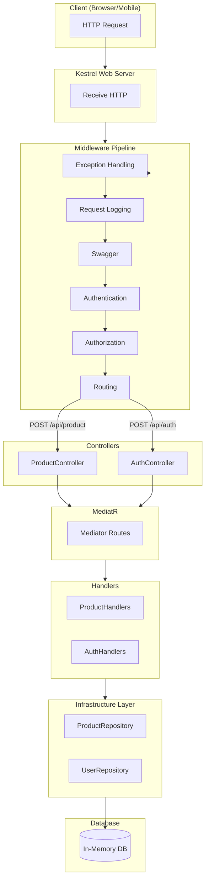
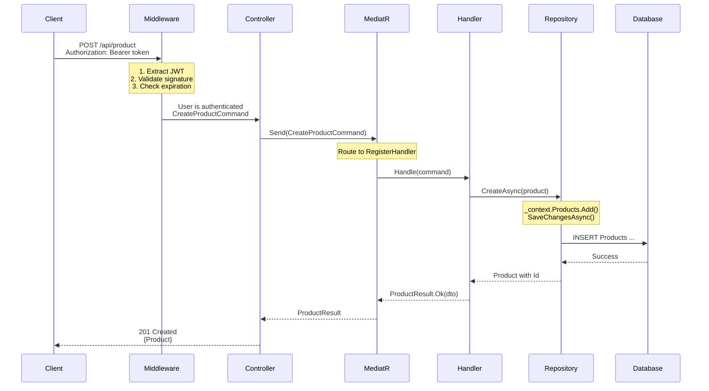
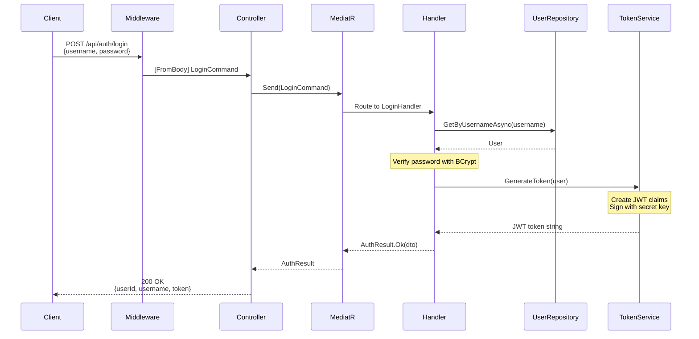
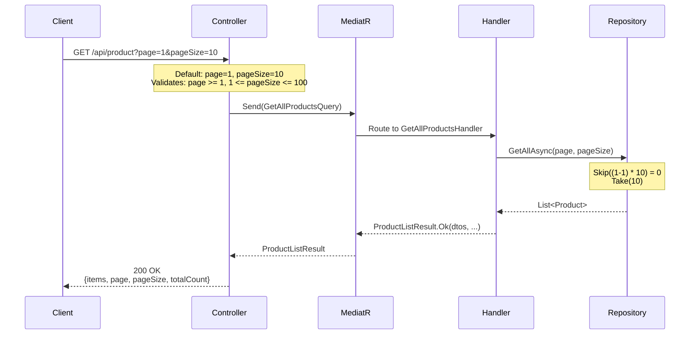
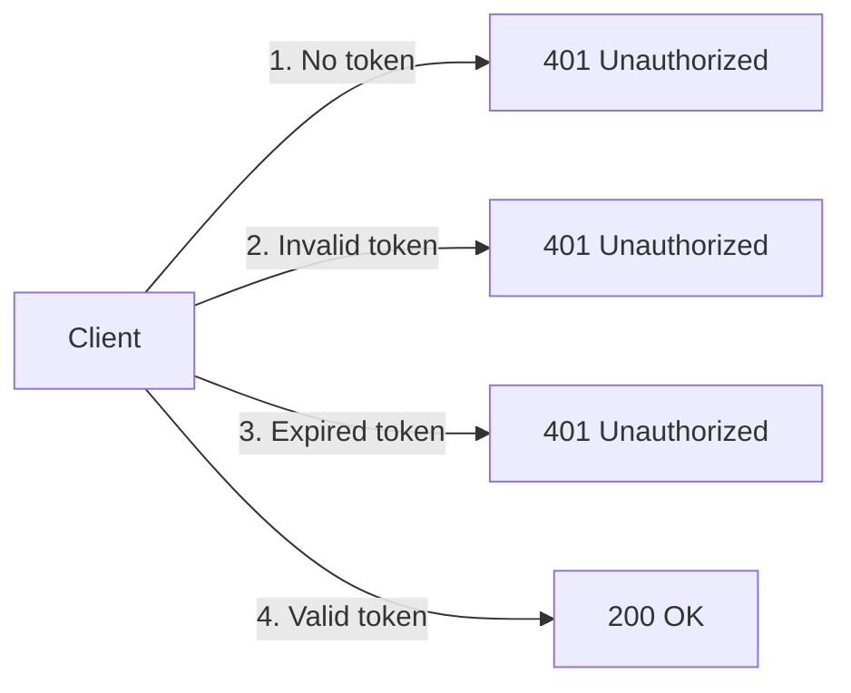
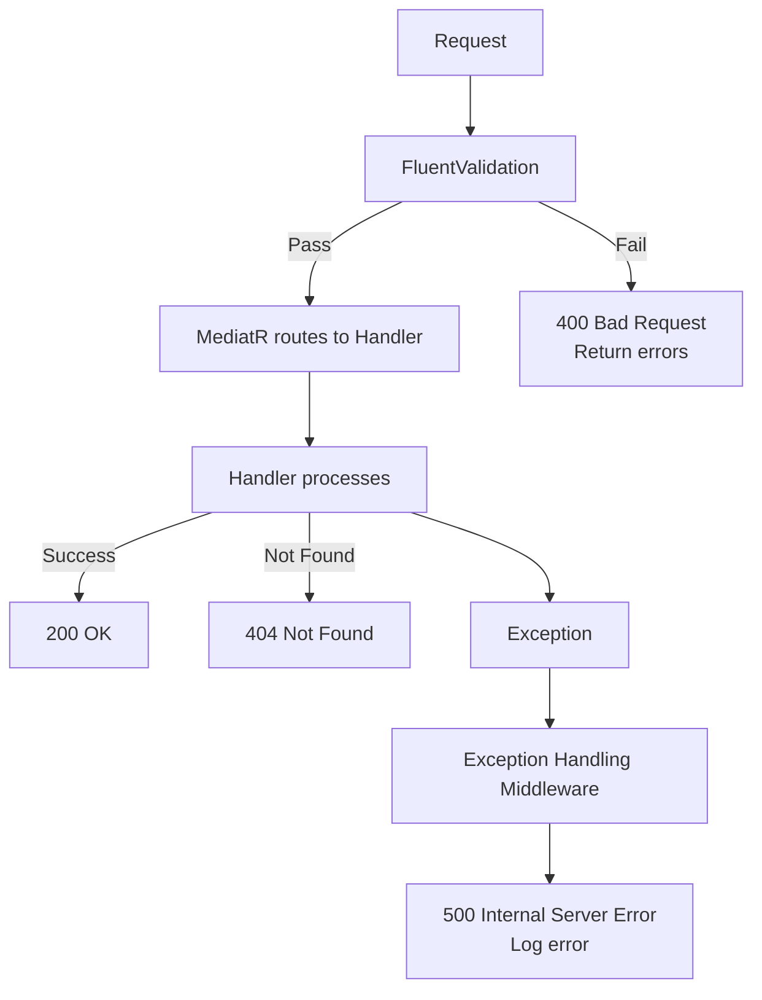
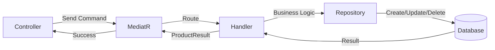
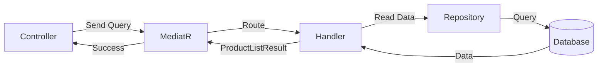

# Complete Request Flow

This document traces the complete flow of HTTP requests through the application with CQRS + MediatR.

---

## Architecture Diagram



---

## Request Flow: Create Product



---

## Request Flow: Login



---

## Request Flow: Get Products (Paginated)



---

## Request Flow: Access Protected Endpoint



### Complete Auth Flow

```mermaid
flowchart TD
    A[Request] --> B{Has Authorization header?}

    B -->|No| C[401 Unauthorized]
    B -->|Yes| D{Starts with "Bearer"?}

    D -->|No| E[401 Unauthorized]
    D -->|Yes| F[Extract JWT token]

    F --> G[Validate token]
    G --> H{Signature valid?}

    H -->|No| I[401 Unauthorized]
    H -->|Yes| J{Token expired?}

    J -->|Yes| K[401 Unauthorized]
    J -->|No| L{Create User.Identity}

    L --> M[Continue to MediatR]
    M --> N[Handler processes request]
```

---

## Error Flow



---

## Middleware Pipeline

```mermaid
flowchart LR
    subgraph Request["Incoming Request"]
        REQ[HTTP Request]
    end

    subgraph Pipeline1["Middleware Pipeline"]
        EXC[Exception Handling<br/>Catches all errors]
        LOG[Request Logging<br/>Logs request/response]
        SW1[Swagger<br/>Serve OpenAPI]
        AUTH[Authentication<br/>JWT]
        AUTHz[Authorization<br/>[Authorize]]
        ROUTE[Routing<br/>Match route]
    end

    subgraph MediatRRoute["CQRS Pattern"]
        M[MediatR]
        H[Handler]
    end

    subgraph Response["Response"]
        RES[HTTP Response]
    end

    REQ --> EXC --> LOG --> SW1 --> AUTH --> AUTHz --> ROUTE
    ROUTE --> M --> H --> RES
```

### Order Matters

The middleware order in `Program.cs`:

```csharp
app.UseExceptionHandlingMiddleware();  // 1. Catch errors
app.UseRequestLoggingMiddleware();    // 2. Log requests
app.UseSwagger();                   // 3. OpenAPI
app.UseSwaggerUI();                 // 4. OpenAPI UI
app.UseAuthentication();            // 5. JWT auth
app.UseAuthorization();           // 6. Authorization
app.MapControllers();             // 7. Map routes
```

**Why this order?**

1. Exception handling first: catches all errors
2. Logging: for all requests
3. Swagger: available in development
4. Authentication: before authorization
5. Authorization: after auth
6. Map: last

---

## CQRS Flow Summary

### Command Flow (WRITE)



### Query Flow (READ)



---

## Request-Response Summary

| Operation | Flow | Status Codes |
|-----------|------|-------------|
| Register | POST /api/auth/register -> MediatR -> Handler -> Repository -> DB | 201, 400 |
| Login | POST /api/auth/login -> MediatR -> Handler -> Token -> JWT | 200, 401 |
| Get All | GET /api/product -> MediatR -> Handler -> Repository -> DB | 200 |
| Get One | GET /api/product/{id} -> MediatR -> Handler -> Repository -> DB | 200, 404 |
| Create | POST /api/product -> MediatR -> Handler -> Repository -> DB | 201, 400 |
| Update | PUT /api/product/{id} -> MediatR -> Handler -> Repository -> DB | 200, 404 |
| Delete | DELETE /api/product/{id} -> MediatR -> Handler -> Repository -> DB | 204, 404 |

---

## Next Steps

- See [CODE_WALKTHROUGH.md](./CODE_WALKTHROUGH.md) for detailed code explanations
- See [QUICK_REFERENCE.md](./QUICK_REFERENCE.md) for commands
- See [CQRS_MEDIATOR.md](./CQRS_MEDIATOR.md) for CQRS pattern details