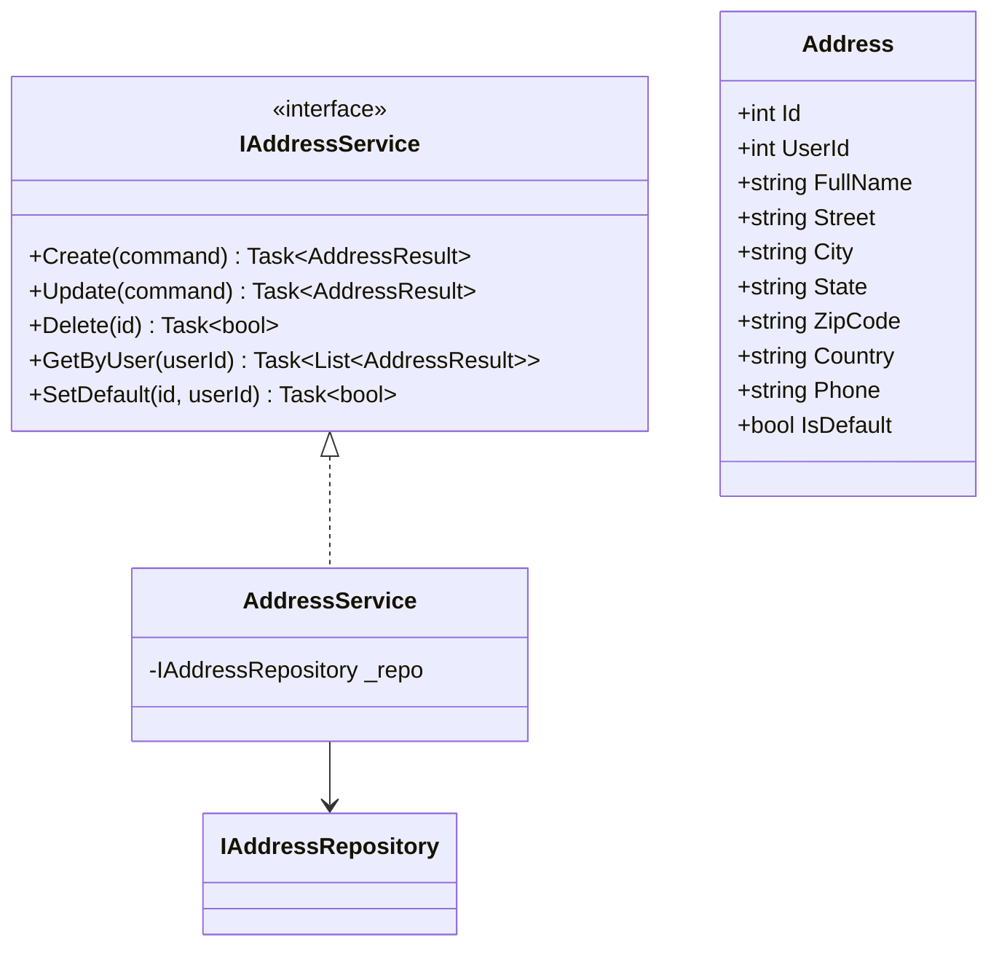
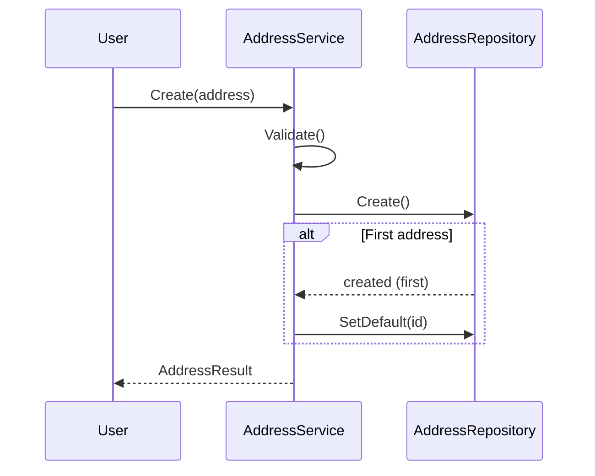

# Address Module - Low Level Design

---

## Table of Contents

1. [Use Cases](#1-use-cases)
2. [Class Diagram](#2-class-diagram)
3. [Sequence Diagrams](#3-sequence-diagrams)
4. [Class Responsibilities](#4-class-responsibilities)
5. [Design Patterns](#5-design-patterns)
6. [SOLID Compliance](#6-solid-compliance)

---

## 1. Use Cases

### 1.1 Add Address

```
Actors: Customer
Flow: Enter address details → Validate → Create → Set as default if first
```

### 1.2 Update Address

```
Actors: Customer
Flow: Select address → Edit → Validate → Update
```

### 1.3 Delete Address

```
Actors: Customer
Flow: Select address → Soft delete → Update default if needed
```

### 1.4 Get Addresses

```
Actors: Customer
Flow: Fetch all addresses → Return list
```

### 1.5 Set Default

```
Actors: Customer
Flow: Select address → Update all to non-default → Set as default
```

---

## 2. Class Diagram



---

## 3. Sequence: Add Address



---

## 4. Responsibilities

| Method | Description |
|--------|-------------|
| Create | Add new address |
| Update | Edit existing |
| Delete | Soft delete |
| GetByUser | List user addresses |
| SetDefault | Mark as default |

---

## 5. Design Patterns ✅

Repository, CQRS, Service Layer

---

## 6. SOLID ✅