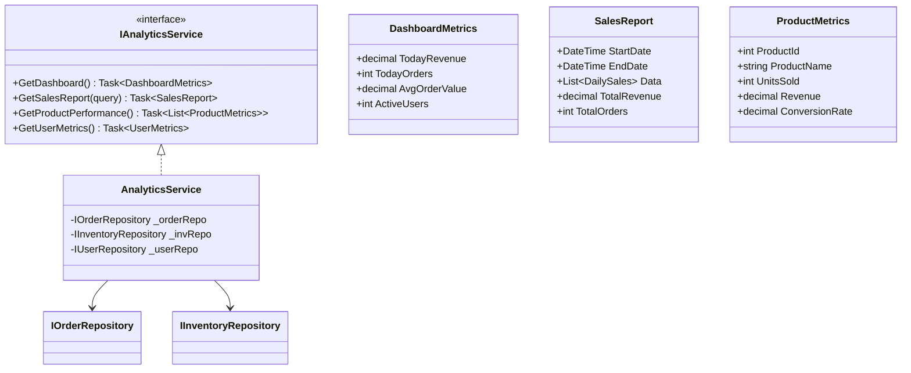
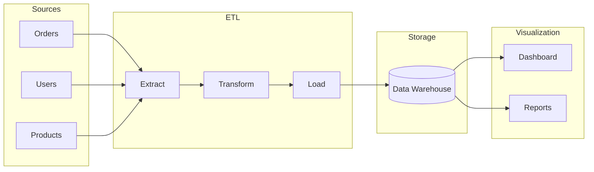

# Analytics Module - Low Level Design

---

## Table of Contents

1. [Use Cases](#1-use-cases)
2. [Class Diagram](#2-class-diagram)
3. [Metrics & KPIs](#3-metrics--kpis)
4. [Data Pipeline](#4-data-pipeline)
5. [Design Patterns](#5-design-patterns)
6. [SOLID Compliance](#6-solid-compliance)

---

## 1. Use Cases

### 1.1 Sales Dashboard

```
Actors: Admin
Flow: Fetch today's sales → Calculate metrics → Return dashboard data
```

### 1.2 Revenue Reports

```
Actors: Admin
Flow: Select date range → Aggregate by period → Return chart data
```

### 1.3 Product Performance

```
Actors: Admin
Flow: Get product stats → Rank by sales → Return top products
```

### 1.4 User Analytics

```
Actors: Admin
Flow: Get user activity → Calculate LTV → Return user metrics
```

### 1.5 Inventory Alerts

```
Actors: System
Flow: Check low stock → Notify → Log alert
```

---

## 2. Class Diagram



---

## 3. Metrics & KPIs

### 3.1 Dashboard Metrics

| Metric | Calculation |
|-------|-------------|
| Today Revenue | SUM(order.TotalAmount) WHERE today |
| Today Orders | COUNT(orders) WHERE today |
| Avg Order Value | Revenue / Orders |
| Active Users | COUNT(users) last 30 days |
| Conversion Rate | Orders / Site Visits |

### 3.2 Sales Metrics

| Metric | Description |
|--------|-------------|
| Revenue | Total sales amount |
| Orders | Number of orders |
| AOV | Average order value |
| Unit Sales | Units sold |
| Return Rate | Returns / Orders |

### 3.3 User Metrics

| Metric | Description |
|--------|-------------|
| New Users | Registrations |
| Active Users | Users with orders |
| Churn Rate | Users not ordered in 90 days |
| LTV | Average lifetime value |

---

## 4. Data Pipeline

### 4.1 Data Flow



### 4.2 Key Architecture

```
┌───────────────────────────���─────────────┐
│           Analytics Service              │
├─────────────────────────────────────────┤
│  Read Replica DB → Aggregations         │
│  (Lightweight, fast queries)          │
├─────────────────────────────────────────┤
│  Background Jobs → ETL                 │
│  (Data warehouse for complex)         │
└─────────────────────────────────────────┘
```

---

## 5. Design Patterns

### 5.1 CQRS (Analytics as Queries)

```csharp
public record GetDashboardQuery() : IRequest<DashboardMetrics>;
public record GetSalesReportQuery(DateRange) : IRequest<SalesReport>;
```

### 5.2 Read Replica Pattern

```csharp
// Analytics can use separate read replica
public class AnalyticsService(IReadOnlyRepository repo) {
    // All queries go to read replica
}
```

### 5.3 Background Jobs

```csharp
// Daily aggregation job
public class DailyAggregationJob : IJob {
    public async Task Execute() {
        // Aggregate yesterday's data
    }
}
```

---

## 6. SOLID Compliance ✅