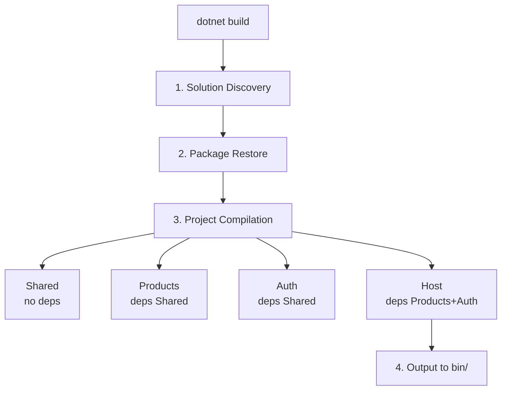
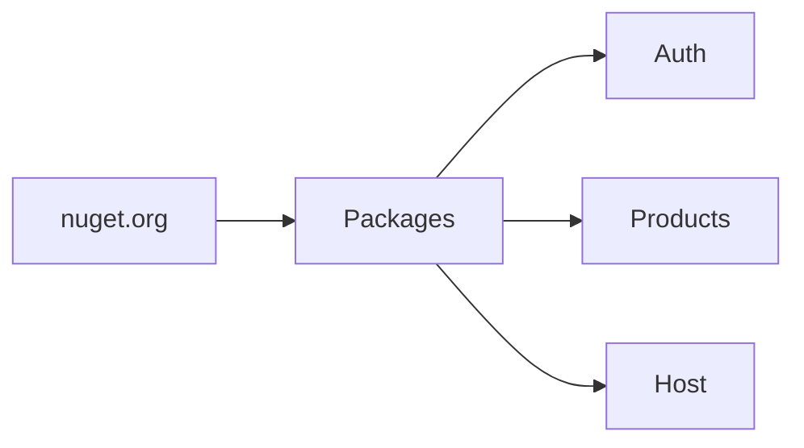
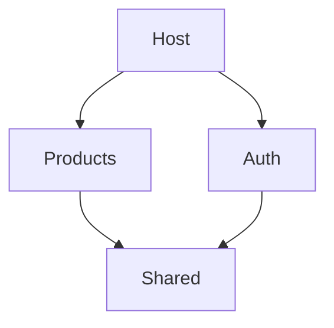
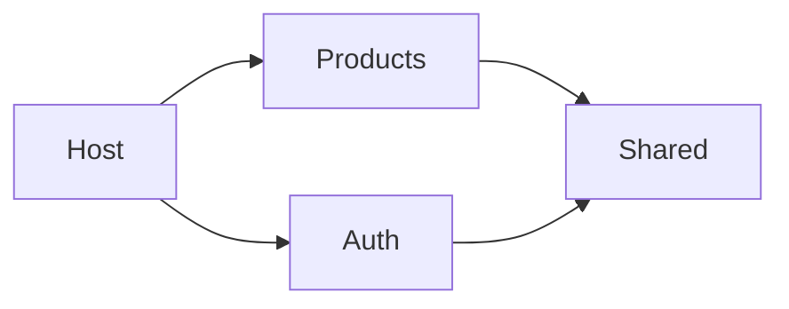
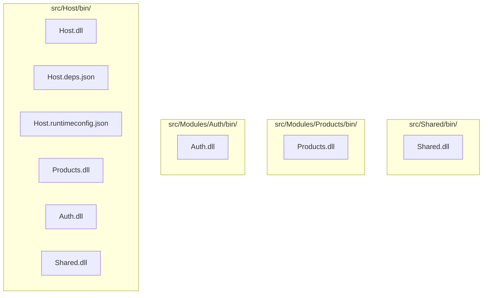

# Compilation & Build Process

This document explains how the projects compile and the build pipeline.

---

## Build Process Overview



---

## Solution Discovery

When you run `dotnet build`:

1. .NET finds `LearningApi.sln`
2. Reads project references
3. Determines build order
4. Handles circular dependencies

### LearningApi.sln Contents

```bash
$ dotnet sln list
Project(s)
----------
src/Host/Host.csproj
src/Modules/Auth/Auth.csproj
src/Modules/Products/Products.csproj
src/Shared/Shared.csproj
```

---

## Package Restore

.NET restores NuGet packages to `obj/project.assets.json`:



---

## Project Build Order

.NET determines build order automatically:



### Why This Order?

Build order follows the dependency graph:



---

## SDK Types

| SDK Type | Produces | Use Case |
|----------|---------|----------|
| `Microsoft.NET.Sdk` | DLL (class library) | Shared library |
| `Microsoft.NET.Sdk` + FrameworkReference | DLL | Module with Controllers |
| `Microsoft.NET.Sdk.Web` | Executable | Web application |

### Example: Products.csproj

```xml
<Project Sdk="Microsoft.NET.Sdk">
  <!-- Uses FrameworkReference to get ASP.NET types -->
  <FrameworkReference Include="Microsoft.AspNetCore.App" />
</Project>
```

This is a DLL because it doesn't use `.Web` SDK, but includes `FrameworkReference` so it has access to:
- `ControllerBase`
- `[HttpGet]`, `[HttpPost]`
- `[Authorize]`
- etc.

### Example: Host.csproj

```xml
<Project Sdk="Microsoft.NET.Sdk.Web">
  <!-- Implicitly includes Microsoft.AspNetCore.App -->
</Project>
```

This produces an executable that can run with `dotnet run`.

---

## Compilation Steps

For each project:

```mermaid
flowchart TD
    subgraph Compile["1. COMPILER (CSC)"]
        T[Tokenize]
        P[Parse]
        S[Semantic Analysis]
        I[IL Generation]
    end

    subgraph Refs["2. REFERENCES"]
        SYS[System Assemblies]
        NUPKG[NuGet Packages]
        PROJ[Project References]
    end

    subgraph Out["3. OUTPUT"]
        B[bin/Debug/net10.0/]
    end

    T --> P --> S --> I
    SYS --> Out
    NUPKG --> Out
    PROJ --> Out

### Compiler Flags
```

In `.csproj`:

```xml
<PropertyGroup>
  <TargetFramework>net10.0</TargetFramework>
  <ImplicitUsings>enable</ImplicitUsings>
  <Nullable>enable</Nullable>
</PropertyGroup>
```

| Flag | Purpose |
|------|---------|
| `TargetFramework` | .NET version (net10.0 = .NET 10) |
| `ImplicitUsings` | Auto-adds common `using` statements |
| `Nullable` | Enables nullable reference types |

---

## Build Outputs

After successful build:



---

## Build Commands

### Basic Build

```bash
dotnet build
```

Compiles all projects in the solution.

### Build Specific Project

```bash
dotnet build src/Host/Host.csproj
```

### Build Output Location

```
bin/Debug/net10.0/      ← Debug build
bin/Release/net10.0/    ← Release build
```

### Clean Build

```bash
dotnet clean
```

Removes `bin/` and `obj/` folders.

---

## Build Warnings

### NU1510 Warning

```
PackageReference Microsoft.Extensions.Logging.Abstractions 
will not be pruned. Consider removing this package.
```

**Solution**: Remove from project (it's included in ASP.NET Core).

### NETSDK1086 Warning

```
A FrameworkReference for 'Microsoft.AspNetCore.App' was included 
in the project. This is implicitly referenced by the .NET SDK.
```

**Solution**: Safe to ignore, but can remove explicit reference.

---

## Runtime vs Compile Time

### Compile Time

When `dotnet build` runs:
- Syntax checking
- Type checking
- IL generation

```csharp
// This compiles fine
var x = "hello";
```

### Runtime

When `dotnet run` executes:
- JIT compilation
- Execution

```csharp
// This fails at runtime
throw new Exception("error");
```

---

## Debug vs Release

### Debug Build

```bash
dotnet build --configuration Debug
```

- Full debugging symbols
- No optimization
- Slower execution
- More logging

### Release Build

```bash
dotnet build --configuration Release
```

- No debugging symbols
- Full optimization
- Faster execution
- Less logging

In `.csproj`:

```xml
<PropertyGroup Condition="'$(Configuration)' == 'Release'">
  <Optimize>true</Optimize>
</PropertyGroup>
```

---

## Build Errors

### CS5001: No Main method

```
Program does not contain a static 'Main' method suitable for an entry point
```

**Cause**: Using `Microsoft.NET.Sdk` instead of `.Web` SDK for web project.

**Solution**:
```xml
<Project Sdk="Microsoft.NET.Sdk.Web">
```

### CS0234: Missing assembly

```
The type or namespace name 'AspNetCore' does not exist 
in the namespace 'Microsoft'
```

**Cause**: Missing `FrameworkReference`.

**Solution**:
```xml
<FrameworkReference Include="Microsoft.AspNetCore.App" />
```

### NETSDK1045: Wrong SDK version

```
The current .NET SDK does not support targeting .NET 10.0.
```

**Cause**: .NET 10 SDK not installed.

**Solution**: Install .NET 10 SDK.

---

## Continuous Integration

For CI/CD pipelines:

```yaml
# GitHub Actions example
- name: Build
  run: dotnet build --configuration Release

- name: Test
  run: dotnet test --configuration Release

- name: Publish
  run: dotnet publish -c Release -o ./publish
```

---

## Next Steps

- See [PROJECT_STRUCTURE.md](./PROJECT_STRUCTURE.md) for file organization
- See [DATABASE.md](./DATABASE.md) for EF Core
- See [CODE_WALKTHROUGH.md](./CODE_WALKTHROUGH.md) for code patterns