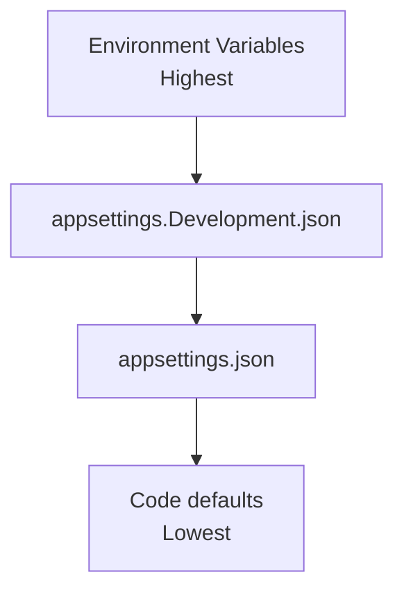

# Configuration Files

This document explains all configuration files and their settings.

---

## appsettings.json

The main configuration file:

```json
{
  "Logging": {
    "LogLevel": {
      "Default": "Information",
      "Microsoft.AspNetCore": "Warning"
    }
  },
  "Jwt": {
    "Issuer": "LearningApi",
    "Audience": "LearningApiClients",
    "SecretKey": "YourSuperSecretKey1234567890!@#$%"
  }
}
```

### Logging Section

**Purpose**: Configure logging verbosity

| Log Level | What It Shows |
|----------|--------------|
| `Trace` | Everything (very detailed) |
| `Debug` | Debug messages and above |
| `Information` | Info messages and above (default) |
| `Warning` | Warnings and above |
| `Error` | Errors only |
| `Critical` | Critical only |

```json
"Logging": {
  "LogLevel": {
    "Default": "Information",
    "Microsoft.AspNetCore": "Warning"
  }
}
```

**Explanation**:
- `Default`: Log everything from our code
- `Microsoft.AspNetCore`: Only warnings and errors from ASP.NET (reduces noise)

### JWT Section

```json
"Jwt": {
  "Issuer": "LearningApi",
  "Audience": "LearningApiClients",
  "SecretKey": "YourSuperSecretKey1234567890!@#$%"
}
```

| Property | Purpose | Notes |
|----------|---------|-------|
| `Issuer` | Who created the token | Validated on login |
| `Audience` | Who the token is for | Validated on login |
| `SecretKey` | Key to sign tokens | Must be 32+ characters for HS256 |

### Configuration Loading Code

In `Program.cs`:

```csharp
var jwtSettings = new JwtSettings();
builder.Configuration.GetSection(JwtSettings.SectionName).Bind(jwtSettings);
builder.Services.AddSingleton(jwtSettings);
```

---

## appsettings.Development.json

Development-specific overrides:

```json
{
  "Logging": {
    "LogLevel": {
      "Default": "Debug"
    }
  }
}
```

**Purpose**: More verbose logging in development.

---

## launchSettings.json

Located in `src/Host/Properties/`:

```json
{
  "$schema": "https://json.schemastore.org/launchsettings.json",
  "profiles": {
    "http": {
      "commandName": "Project",
      "dotnetRunMessages": true,
      "launchBrowser": false,
      "applicationUrl": "http://localhost:5000",
      "environmentVariables": {
        "ASPNETCORE_ENVIRONMENT": "Development"
      }
    }
  }
}
```

| Property | Purpose |
|----------|---------|
| `commandName` | "Project" = use dotnet run |
| `dotnetRunMessages` | Show build messages |
| `launchBrowser` | Don't auto-open browser |
| `applicationUrl` | URL to listen on |
| `ASPNETCORE_ENVIRONMENT` | Environment name |

### Port Configuration

Default ports:
- `5000` - HTTP (this project)
- `5001` - HTTPS
- `5043` - Old project (legacy)

---

## .csproj Files

### Host.csproj

```xml
<Project Sdk="Microsoft.NET.Sdk.Web">
  <PropertyGroup>
    <TargetFramework>net10.0</TargetFramework>
    <ImplicitUsings>enable</ImplicitUsings>
    <Nullable>enable</Nullable>
  </PropertyGroup>

  <ItemGroup>
    <PackageReference Include="Microsoft.AspNetCore.Authentication.JwtBearer" Version="10.0.0" />
    <PackageReference Include="Microsoft.EntityFrameworkCore.InMemory" Version="10.0.0" />
    <PackageReference Include="Swashbuckle.AspNetCore" Version="7.0.0" />
  </ItemGroup>

  <ItemGroup>
    <ProjectReference Include="..\Modules\Products\Products.csproj" />
    <ProjectReference Include="..\Modules\Auth\Auth.csproj" />
  </ItemGroup>
</Project>
```

### PropertyGroup Explained

| Property | Purpose |
|----------|---------|
| `TargetFramework` | .NET version (net10.0) |
| `ImplicitUsings` | Auto-adds `using System;`, etc. |
| `Nullable` | Enables nullable reference types |

```csharp
// With Nullable enabled
string? name = null;  // ✓ allowed
string name = null;   // ✗ error
```

### PackageReference

NuGet packages used:

| Package | Version | Purpose |
|---------|---------|---------|
| `Microsoft.AspNetCore.Authentication.JwtBearer` | 10.0.0 | JWT authentication |
| `Microsoft.EntityFrameworkCore.InMemory` | 10.0.0 | In-memory database |
| `Swashbuckle.AspNetCore` | 7.0.0 | Swagger/OpenAPI |

### ProjectReference

References to other projects:

```xml
<ProjectReference Include="..\Modules\Products\Products.csproj" />
<ProjectReference Include="..\Modules\Auth\Auth.csproj" />
```

### Products.csproj

```xml
<Project Sdk="Microsoft.NET.Sdk">

  <PropertyGroup>
    <TargetFramework>net10.0</TargetFramework>
    <ImplicitUsings>enable</ImplicitUsings>
    <Nullable>enable</Nullable>
  </PropertyGroup>

  <ItemGroup>
    <ProjectReference Include="..\..\Shared\Shared.csproj" />
  </ItemGroup>

  <ItemGroup>
    <FrameworkReference Include="Microsoft.AspNetCore.App" />
  </ItemGroup>

  <ItemGroup>
    <PackageReference Include="Microsoft.EntityFrameworkCore" Version="10.0.0" />
  </ItemGroup>

</Project>
```

### FrameworkReference

`Microsoft.AspNetCore.App` provides:
- MVC controllers
- Razor views
- SignalR
- Authentication middleware
- CORS

We need this because Products module has Controllers.

---

## Configuration Classes

### JwtSettings Class

```csharp
namespace Host.Configuration;

public class JwtSettings
{
    public const string SectionName = "Jwt";
    public string Issuer { get; set; } = "LearningApi";
    public string Audience { get; set; } = "LearningApiClients";
    public string SecretKey { get; set; } = string.Empty;
}
```

This binds to `appsettings.json`:

```json
"Jwt": {
  "Issuer": "LearningApi",
  ...
}
```

---

## Environment Variables

Run with different environment:

```bash
# Development (default)
ASPNETCORE_ENVIRONMENT=Development dotnet run

# Staging
ASPNETCORE_ENVIRONMENT=Staging dotnet run

# Production
ASPNETCORE_ENVIRONMENT=Production dotnet run
```

### What Each Environment Does

| Environment | Behavior |
|--------------|----------|
| Development | Detailed errors, verbose logging |
| Staging | Less detail |
| Production | Generic errors, no details |

---

## Secrets Management

### Development

Store in `appsettings.json` (not for production!):

```json
"Jwt": {
  "SecretKey": "YourSuperSecretKey1234567890!@#$%"
}
```

### Production

Use **Environment Variables** or **Azure Key Vault**:

```bash
# Environment variable
export Jwt__SecretKey="YourSuperSecretKey1234567890!@#$%"
```

Or use **Azure Key Vault** (recommended).

---

## Configuration Priority

When the same setting exists in multiple places:



---

## Next Steps

- See [COMPILATION.md](./COMPILATION.md) for build process
- See [DATABASE.md](./DATABASE.md) for database configuration
- See [AUTHENTICATION.md](./AUTHENTICATION.md) for JWT settings