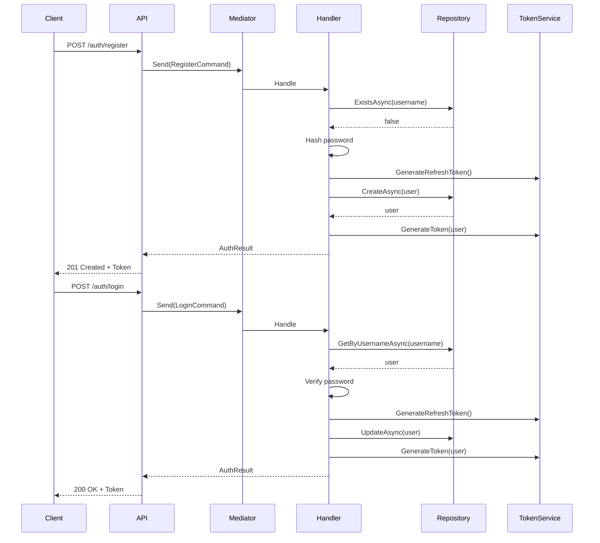

# Auth CQRS Implementation

---

## Commands

```csharp
public record RegisterCommand(string Username, string Email, string Password) : IRequest<AuthResult>;

public record LoginCommand(string Username, string Password) : IRequest<AuthResult>;

public record RefreshTokenCommand(string RefreshToken) : IRequest<AuthResult>;
```

## Queries

No direct queries - Auth uses commands that return AuthResult with token data.

---

## Flow


