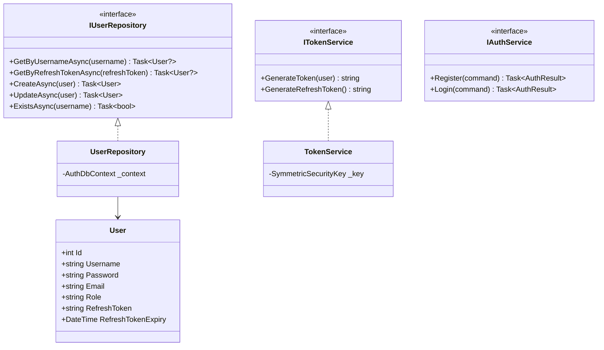
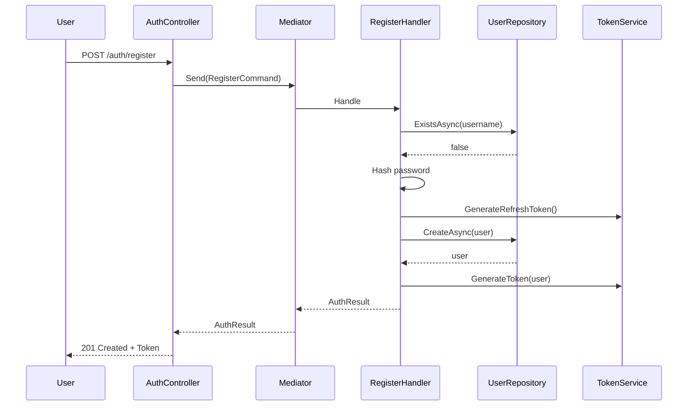
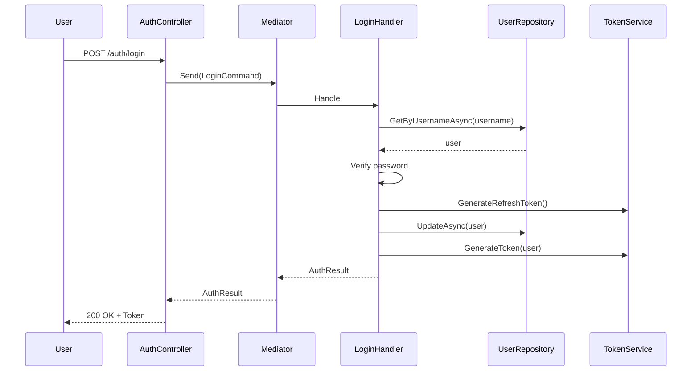

# Auth Component - Low Level Design

---

## Use Cases

1. Register User
2. Login User
3. Refresh Token

---

## Class Diagram

---

## Sequence: Register

---

## Sequence: Login

---

## Design Patterns ✅

- CQRS (Commands/Queries)
- Repository
- Service Layer
- Factory (Token generation)

---

## SOLID ✅

| Principle | Status | Description |
|-----------|--------|-------------|
| **S** - Single Responsibility | ✅ | Each class has one reason to change |
| **O** - Open/Closed | ✅ | Can extend with new auth providers |
| **L** - Liskov Substitution | ✅ | Repositories and services are interchangeable |
| **I** - Interface Segregation | ✅ | Focused interfaces |
| **D** - Dependency Inversion | ✅ | Depends on abstractions |

---

## Security Notes

- Passwords hashed using BCrypt
- JWT tokens for authentication
- Refresh tokens with 7-day expiry
- Tokens stored in database linked to user

---

*Last updated: 2026-04-30*
