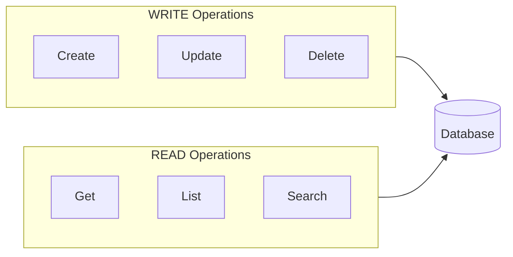
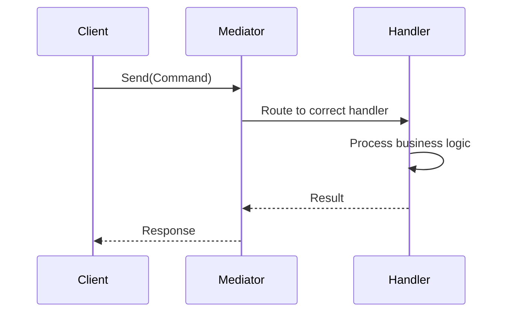
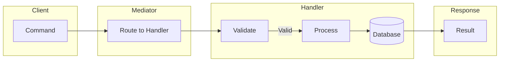
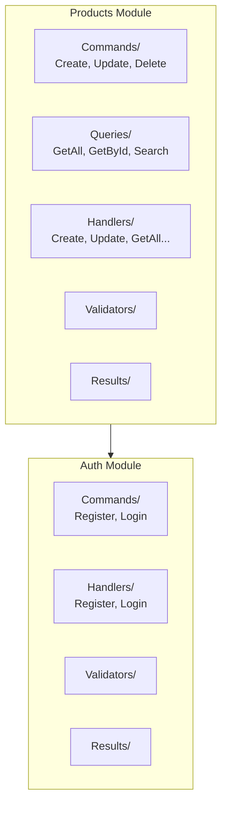

# CQRS & Mediator Pattern

This document explains CQRS (Command Query Responsibility Segregation) and Mediator patterns that can be added to the project for enterprise-grade e-commerce functionality.

---

## What is CQRS?

**CQRS** separates READ operations from WRITE operations into different models.



### Why CQRS?

| Traditional (CRUD) | CQRS |
|---------------------|------|
| Same model for read/write | Separate models |
| One method does everything | Explicit intent |
| Hard to optimize | Optimize each operation |

---

## What is Mediator?

**Mediator** decouples sending a command from handling it:



### Why Mediator?

| Without Mediator | With Mediator |
|-------------------|----------------|
| Controller calls Service directly | Controller just sends command |
| Hard to add validation | Rules in handler |
| Hard to test | Easy to test handlers |
| Business logic in controller | Clean controllers |

---

## CQRS + Mediator Together

### How They Work Together



---

## Implementation Structure

### Folder Structure



### Required Packages

```xml
<PackageReference Include="MediatR" Version="12.4.1" />
<PackageReference Include="FluentValidation.AspNetCore" Version="11.3.0" />
```

---

## Commands (WRITE)

### Products - Creating a Product Command

```csharp
// Commands/CreateProductCommand.cs
namespace Modules.Products.Application.Commands;

using MediatR;
using Modules.Products.Application.Results;

public record CreateProductCommand(
    string Name,
    decimal Price,
    string? Description,
    int Stock
) : IRequest<ProductResult>;
```

### Auth - Register & Login Commands

```csharp
// Commands/AuthCommands.cs
namespace Modules.Auth.Application.Commands;

using MediatR;
using Modules.Auth.Application.Results;

public record RegisterCommand(
    string Username,
    string Email,
    string Password
) : IRequest<AuthResult>;

public record LoginCommand(
    string Username,
    string Password
) : IRequest<AuthResult>;
```

### Handler for Command

```csharp
// Handlers/CreateProductHandler.cs
namespace Modules.Products.Application.Handlers;

using MediatR;
using Modules.Products.Application.Commands;
using Modules.Products.Application.Results;
using Modules.Products.Domain.Interfaces;

public class CreateProductHandler : IRequestHandler<CreateProductCommand, ProductResult>
{
    private readonly IProductRepository _repository;

    public CreateProductHandler(IProductRepository repository)
    {
        _repository = repository;
    }

    public async Task<ProductResult> Handle(CreateProductCommand request,
        CancellationToken cancellationToken)
    {
        var product = new Product
        {
            Name = request.Name,
            Price = request.Price,
            Description = request.Description,
            Stock = request.Stock
        };

        var created = await _repository.CreateAsync(product);

        return ProductResult.Ok(new ProductDto(
            created.Id,
            created.Name,
            created.Price,
            created.Description,
            created.Stock,
            created.CreatedAt,
            created.UpdatedAt
        ));
    }
}
```

### Auth Handler - Register

```csharp
// Handlers/RegisterHandler.cs
namespace Modules.Auth.Application.Handlers;

using MediatR;
using Modules.Auth.Application.Commands;
using Modules.Auth.Application.Results;
using Modules.Auth.Application.Services;
using Modules.Auth.Domain.Entities;
using Modules.Auth.Domain.Interfaces;
using Modules.Auth.Infrastructure.Services;

public class RegisterHandler : IRequestHandler<RegisterCommand, AuthResult>
{
    private readonly IUserRepository _userRepository;
    private readonly ITokenService _tokenService;

    public RegisterHandler(IUserRepository userRepository, ITokenService tokenService)
    {
        _userRepository = userRepository;
        _tokenService = tokenService;
    }

    public async Task<AuthResult> Handle(RegisterCommand request, CancellationToken cancellationToken)
    {
        if (await _userRepository.ExistsAsync(request.Username))
            return AuthResult.Bad("Username is already taken");

        var passwordHash = BCrypt.Net.BCrypt.HashPassword(request.Password);

        var user = new User
        {
            Username = request.Username,
            Email = request.Email,
            Password = passwordHash,
            Role = "User",
            CreatedAt = DateTime.UtcNow
        };

        var created = await _userRepository.CreateAsync(user);
        var token = _tokenService.GenerateToken(created);

        var authDto = new AuthDto(
            created.Id,
            created.Username,
            created.Email,
            created.Role,
            token
        );

        return AuthResult.Ok(authDto);
    }
}
```

### Auth Handler - Login

```csharp
// Handlers/LoginHandler.cs
namespace Modules.Auth.Application.Handlers;

using MediatR;
using Modules.Auth.Application.Commands;
using Modules.Auth.Application.Results;
using Modules.Auth.Application.Services;
using Modules.Auth.Domain.Interfaces;
using Modules.Auth.Infrastructure.Services;

public class LoginHandler : IRequestHandler<LoginCommand, AuthResult>
{
    private readonly IUserRepository _userRepository;
    private readonly ITokenService _tokenService;

    public LoginHandler(IUserRepository userRepository, ITokenService tokenService)
    {
        _userRepository = userRepository;
        _tokenService = tokenService;
    }

    public async Task<AuthResult> Handle(LoginCommand request, CancellationToken cancellationToken)
    {
        var user = await _userRepository.GetByUsernameAsync(request.Username);

        if (user is null)
            return AuthResult.Bad("Invalid username or password");

        if (!BCrypt.Net.BCrypt.Verify(request.Password, user.Password))
            return AuthResult.Bad("Invalid username or password");

        var token = _tokenService.GenerateToken(user);

        var authDto = new AuthDto(
            user.Id,
            user.Username,
            user.Email,
            user.Role,
            token
        );

        return AuthResult.Ok(authDto);
    }
}

---

## Queries (READ)

### Creating a Query

```csharp
// Queries/GetAllProductsQuery.cs
namespace Modules.Products.Application.Queries;

using MediatR;
using Modules.Products.Application.Results;

public record GetAllProductsQuery(
    int Page,
    int PageSize
) : IRequest<ProductListResult>;
```

### Handler for Query

```csharp
// Handlers/GetAllProductsHandler.cs
namespace Modules.Products.Application.Handlers;

using MediatR;
using Modules.Products.Application.Queries;
using Modules.Products.Application.Results;
using Modules.Products.Domain.Interfaces;

public class GetAllProductsHandler : IRequestHandler<GetAllProductsQuery, ProductListResult>
{
    private readonly IProductRepository _repository;

    public GetAllProductsHandler(IProductRepository repository)
    {
        _repository = repository;
    }

    public async Task<ProductListResult> Handle(GetAllProductsQuery request, 
        CancellationToken cancellationToken)
    {
        var products = await _repository.GetAllAsync(request.Page, request.PageSize);
        
        var dtos = products.Select(p => new ProductDto(
            p.Id, p.Name, p.Price, p.Description, p.Stock, p.CreatedAt, p.UpdatedAt
        )).ToList();

        return ProductListResult.Ok(dtos, request.Page, request.PageSize, dtos.Count);
    }
}
```

---

## Validation (FluentValidation)

### Products Validator

```csharp
// Validators/ProductValidators.cs
namespace Modules.Products.Application.Validators;

using FluentValidation;
using Modules.Products.Application.Commands;

public class CreateProductValidator : AbstractValidator<CreateProductCommand>
{
    public CreateProductValidator()
    {
        RuleFor(x => x.Name)
            .NotEmpty().WithMessage("Name is required")
            .MaximumLength(100);

        RuleFor(x => x.Price)
            .GreaterThan(0).WithMessage("Price must be greater than 0");

        RuleFor(x => x.Stock)
            .GreaterThanOrEqualTo(0);
    }
}
```

### Auth Validators

```csharp
// Validators/AuthValidators.cs
namespace Modules.Auth.Application.Validators;

using FluentValidation;
using Modules.Auth.Application.Commands;

public class RegisterValidator : AbstractValidator<RegisterCommand>
{
    public RegisterValidator()
    {
        RuleFor(x => x.Username)
            .NotEmpty().WithMessage("Username is required")
            .MinimumLength(3).WithMessage("Username must be at least 3 characters")
            .MaximumLength(50).WithMessage("Username cannot exceed 50 characters");

        RuleFor(x => x.Email)
            .NotEmpty().WithMessage("Email is required")
            .EmailAddress().WithMessage("Invalid email format");

        RuleFor(x => x.Password)
            .NotEmpty().WithMessage("Password is required")
            .MinimumLength(6).WithMessage("Password must be at least 6 characters");
    }
}

public class LoginValidator : AbstractValidator<LoginCommand>
{
    public LoginValidator()
    {
        RuleFor(x => x.Username)
            .NotEmpty().WithMessage("Username is required");

        RuleFor(x => x.Password)
            .NotEmpty().WithMessage("Password is required");
    }
}
```

---

## Results (Response Models)

### Products Results

```csharp
// Results/ProductResult.cs
namespace Modules.Products.Application.Results;

public record ProductResult(
    bool Success,
    ProductDto? Product,
    string? Error
)
{
    public static ProductResult Ok(ProductDto product) => new(true, product, null);
    public static ProductResult NotFound(string error) => new(false, null, error);
}

public record ProductListResult(
    bool Success,
    List<ProductDto> Products,
    int Page,
    int PageSize,
    int TotalCount,
    string? Error
);

public record ProductDto(
    int Id,
    string Name,
    decimal Price,
    string? Description,
    int Stock,
    DateTime CreatedAt,
    DateTime UpdatedAt
);
```

### Auth Results

```csharp
// Results/AuthResult.cs
namespace Modules.Auth.Application.Results;

public record AuthResult(
    bool Success,
    AuthDto? Auth,
    string? Error
)
{
    public static AuthResult Ok(AuthDto auth) => new(true, auth, null);
    public static AuthResult Bad(string error) => new(false, null, error);
}

public record AuthDto(
    int UserId,
    string Username,
    string Email,
    string Role,
    string Token
);
```

---

## Controller (Using MediatR)

### Product Controller

```csharp
// Controllers/ProductController.cs
namespace Modules.Products.Api.Controllers;

using MediatR;
using Microsoft.AspNetCore.Authorization;
using Microsoft.AspNetCore.Mvc;
using Modules.Products.Application.Commands;
using Modules.Products.Application.Queries;
using Modules.Products.Application.Results;

[ApiController]
[Route("api/[controller]")]
[Authorize]
public class ProductController : ControllerBase
{
    private readonly IMediator _mediator;

    public ProductController(IMediator mediator)
    {
        _mediator = mediator;
    }

    [HttpGet]
    public async Task<IActionResult> GetAll([FromQuery] int page = 1, [FromQuery] int pageSize = 10)
    {
        var result = await _mediator.Send(new GetAllProductsQuery(page, pageSize));

        if (!result.Success)
            return BadRequest(result.Error);

        return Ok(new { result.Products, result.Page, result.PageSize, result.TotalCount });
    }

    [HttpPost]
    public async Task<IActionResult> Create([FromBody] CreateProductCommand command)
    {
        var result = await _mediator.Send(command);

        if (!result.Success)
            return BadRequest(result.Error);

        return CreatedAtAction(nameof(GetById), new { id = result.Product?.Id }, result.Product);
    }
}
```

### Auth Controller

```csharp
// Controllers/AuthController.cs
namespace Modules.Auth.Api.Controllers;

using MediatR;
using Microsoft.AspNetCore.Mvc;
using Modules.Auth.Application.Commands;
using Modules.Auth.Application.Results;

[ApiController]
[Route("api/[controller]")]
public class AuthController : ControllerBase
{
    private readonly IMediator _mediator;

    public AuthController(IMediator mediator)
    {
        _mediator = mediator;
    }

    [HttpPost("register")]
    public async Task<IActionResult> Register([FromBody] RegisterCommand command)
    {
        var result = await _mediator.Send(command);

        if (!result.Success)
            return BadRequest(new { result.Error });

        return Created("", result.Auth);
    }

    [HttpPost("login")]
    public async Task<IActionResult> Login([FromBody] LoginCommand command)
    {
        var result = await _mediator.Send(command);

        if (!result.Success)
            return Unauthorized(new { result.Error });

        return Ok(result.Auth);
    }
}
```

---

## Registration in Program.cs

```csharp
// Add FluentValidation
builder.Services.AddFluentValidationAutoValidation();
builder.Services.AddValidatorsFromAssemblyContaining<CreateProductValidator>();

// Add MediatR
builder.Services.AddMediatR(cfg => 
    cfg.RegisterServicesFromAssembly(typeof(CreateProductCommand).Assembly));
```

---

## Benefits for E-Commerce

### 1. Clear Intent

```csharp
// Before (ambiguous)
await _productService.GetAllAsync(page, pageSize);

// After (explicit intent)
await _mediator.Send(new GetAllProductsQuery(page, pageSize));
await _mediator.Send(new CreateProductCommand(name, price, description, stock));
```

### 2. Easy to Add Validation

```csharp
// One place for all product validation
public class CreateProductValidator : AbstractValidator<CreateProductCommand>
{
    // All validation rules here
}
```

### 3. Easy to Test

```csharp
// Test handler in isolation
var handler = new CreateProductHandler(mockRepository);
var result = await handler.Handle(new CreateProductCommand(...), CancellationToken.None);

// No controller dependencies!
```

### 4. Different Read/Write Models

```csharp
// Write model (has all fields for creation)
public record CreateProductCommand(...) : IRequest<ProductResult>;

// Read model (lighter for API response)  
public record ProductDto(...);

// Different queries can return different DTOs
public record ProductListDto(...); // For list view
public record ProductDetailDto(...); // For detail view
```

---

## Next Steps

To implement CQRS/Mediator in this project:

1. Install packages:
   ```bash
   dotnet add package MediatR
   dotnet add package FluentValidation.AspNetCore
   ```

2. Create folder structure (Commands, Queries, Handlers, Validators)

3. Migrate existing service methods to handlers

4. Update controller to use MediatR

---

## Summary

| Pattern | Purpose |
|---------|---------|
| **CQRS** | Separate READ from WRITE |
| **Mediator** | Decouple caller from handler |
| **FluentValidation** | Declarative validation |

These patterns are commonly used in enterprise .NET applications for better maintainability, testability, and scalability.

---

*See architecture docs for more patterns*