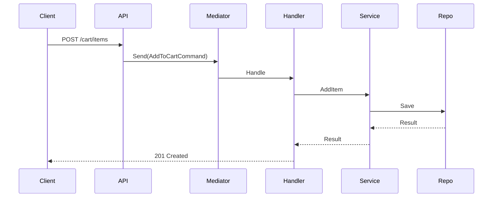

# Cart CQRS Implementation

---

## Commands

```csharp
public record AddToCartCommand(int ProductId, int Quantity) : IRequest<CartResult>;
public record RemoveFromCartCommand(int CartItemId) : IRequest<bool>;
public record UpdateQuantityCommand(int CartItemId, int Quantity) : IRequest<CartResult>;
```

## Queries

```csharp
public record GetCartQuery(int UserId) : IRequest<CartResult>;
```

---

## Flow

