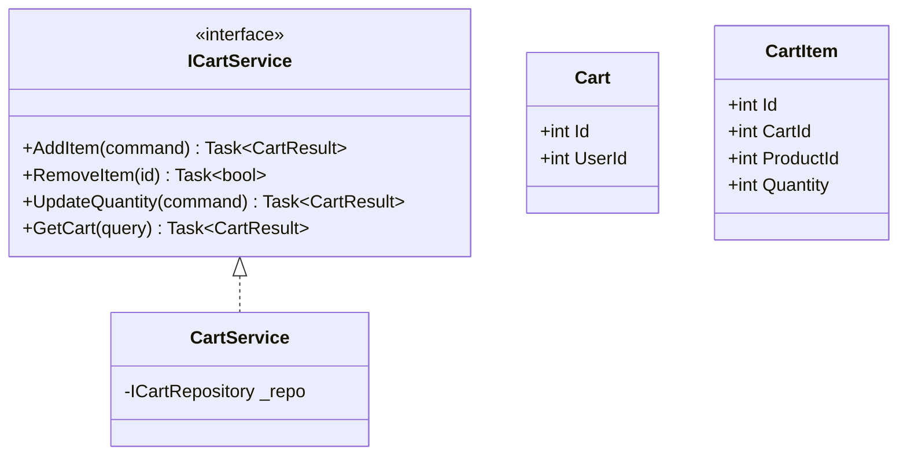
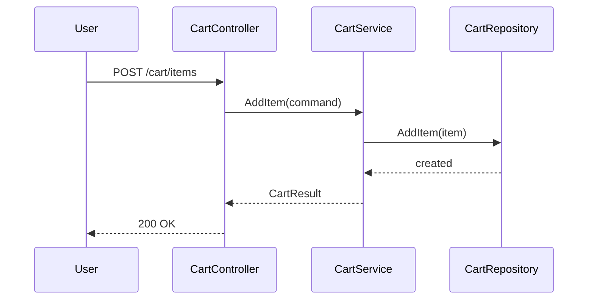
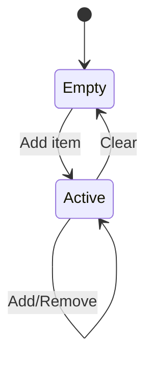

# Cart Component - Low Level Design

---

## Table of Contents

1. [Use Cases](#1-use-cases)
2. [Class Diagram](#2-class-diagram)
3. [Sequence Diagrams](#3-sequence-diagrams)
4. [State Diagram](#4-state-diagram)
5. [Design Patterns](#5-design-patterns)
6. [SOLID Compliance](#6-solid-compliance)

---

## 1. Use Cases

### 1.1 Add to Cart
### 1.2 Remove from Cart
### 1.3 Update Quantity
### 1.4 Get Cart
### 1.5 Clear Cart

---

## 2. Class Diagram

---

## 3. Sequence: Add to Cart

---

## 4. State Diagram

---

## 5. Design Patterns ✅

- CQRS
- Repository
- Unit of Work

---

## 6. SOLID ✅