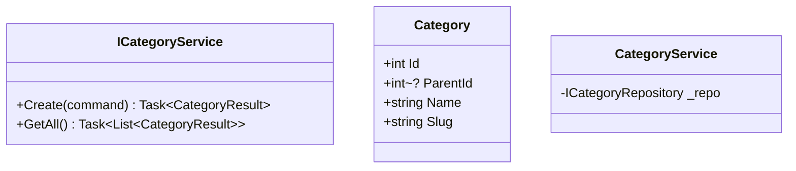
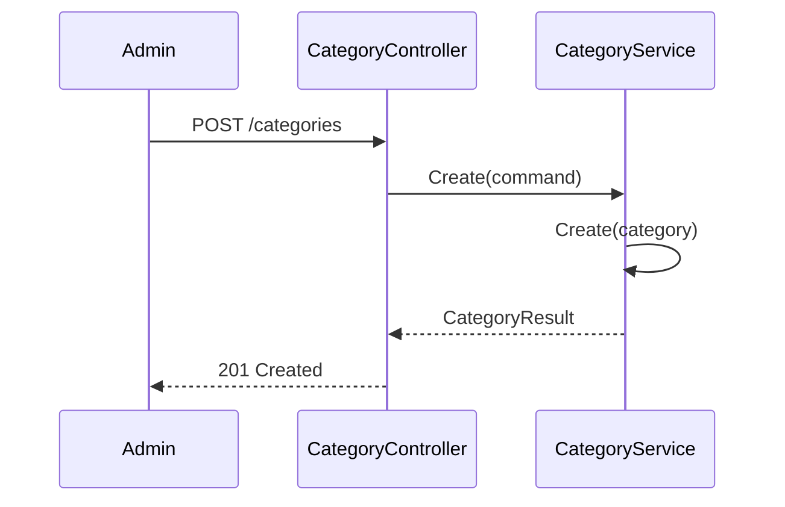
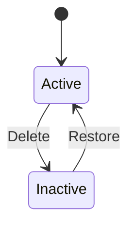

# Category Component - Low Level Design

---

## Use Cases

1. Create Category
2. Update Category
3. Delete Category
4. Get Categories (tree)
5. Move Category

---

## Class Diagram

---

## Sequence: Create Category

---

## State Diagram

---

## Design Patterns

- Tree/Composite
- CQRS

---

## SOLID ✅