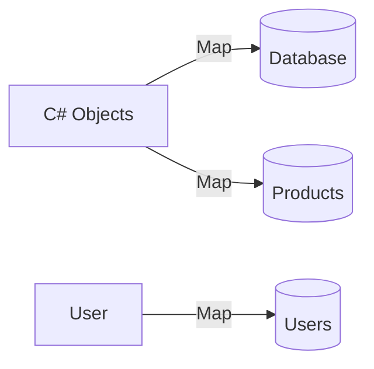
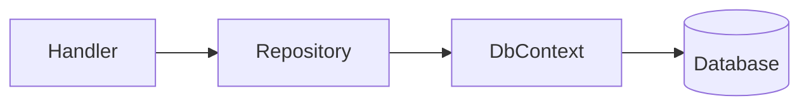

# Database & Entity Framework

This document explains Entity Framework Core, DbContext, and the repository pattern.

---

## What is Entity Framework Core?

**EF Core** is an ORM (Object-Relational Mapper) - it maps C# objects to database tables.



### Why EF Core?

| Benefit | Explanation |
|---------|-------------|
| **Productivity** | Write C# instead of SQL |
| **Type Safety** | Compile-time checks |
| **Database Agnostic** | Switch databases without code changes |
| **Migration Support** | Track schema changes |

---

## Our Database Setup

We use **In-Memory Database** for development:

```csharp
// Program.cs
builder.Services.AddDbContext<ProductsDbContext>(options =>
    options.UseInMemoryDatabase("ProductsDb"));

builder.Services.AddDbContext<AuthDbContext>(options =>
    options.UseInMemoryDatabase("AuthDb"));
```

In-memory means:
- Data stored in RAM (not disk)
- No SQL Server needed
- Perfect for development/testing
- Not for production

---

## DbContext Explained

### ProductsDbContext

```csharp
// Infrastructure/Data/ProductsDbContext.cs
namespace Modules.Products.Infrastructure.Data;

public class ProductsDbContext : DbContext
{
    public ProductsDbContext(DbContextOptions<ProductsDbContext> options)
        : base(options) { }

    public DbSet<Product> Products => Set<Product>();

    protected override void OnModelCreating(ModelBuilder modelBuilder)
    {
        modelBuilder.Entity<Product>(entity =>
        {
            entity.HasKey(e => e.Id);
            entity.Property(e => e.Name).IsRequired().HasMaxLength(100);
            entity.Property(e => e.Price).HasPrecision(18, 2);
            entity.Property(e => e.Description).HasMaxLength(500);
        });
    }
}
```

### DbContext Methods

| Method | Purpose |
|--------|---------|
| `DbSet<T>` | Represents a table |
| `OnModelCreating` | Configures entities |
| `SaveChangesAsync` | Saves to database |

---

## Entity Configuration

### Fluent API

We use Fluent API for configuration:

```csharp
entity.HasKey(e => e.Id);                    // Primary key
entity.Property(e => e.Name).IsRequired();       // NOT NULL
entity.Property(e => e.Name).HasMaxLength(100); // VARCHAR(100)
entity.Property(e => e.Price).HasPrecision(18, 2); // DECIMAL(18,2)
```

### Configuration Options

| Method | Purpose |
|--------|---------|
| `HasKey()` | Primary key |
| `IsRequired()` | NOT NULL |
| `IsOptional()` | NULL allowed |
| `HasMaxLength()` | String max length |
| `HasPrecision()` | Decimal precision |

---

## Entity Classes

### Product Entity

```csharp
// Domain/Entities/Product.cs
namespace Modules.Products.Domain.Entities;

public class Product : BaseEntity
{
    public string Name { get; set; } = string.Empty;
    public decimal Price { get; set; }
    public string? Description { get; set; }
    public int Stock { get; set; }
}
```

### BaseEntity

```csharp
// Shared/Kernel/BaseEntity.cs
namespace Shared.Kernel;

public class BaseEntity
{
    public int Id { get; set; }
    public DateTime CreatedAt { get; set; } = DateTime.UtcNow;
    public DateTime UpdatedAt { get; set; } = DateTime.UtcNow;
}
```

---

## Repository Pattern

### What is the Repository Pattern?

The Repository pattern wraps DbContext with a clean interface:



### IProductRepository Interface

```csharp
// Domain/Interfaces/IProductRepository.cs
namespace Modules.Products.Domain.Interfaces;

public interface IProductRepository
{
    Task<List<Product>> GetAllAsync(int page, int pageSize);
    Task<Product?> GetByIdAsync(int id);
    Task<Product> CreateAsync(Product product);
    Task<Product?> UpdateAsync(int id, Product product);
    Task<bool> DeleteAsync(int id);
    Task<List<Product>> SearchAsync(string name);
}
```

### ProductRepository Implementation

```csharp
// Infrastructure/Repositories/ProductRepository.cs
namespace Modules.Products.Infrastructure.Repositories;

public class ProductRepository : IProductRepository
{
    private readonly ProductsDbContext _context;

    public ProductRepository(ProductsDbContext context)
    {
        _context = context;
    }

    public async Task<List<Product>> GetAllAsync(int page, int pageSize)
    {
        return await _context.Products
            .Skip((page - 1) * pageSize)
            .Take(pageSize)
            .ToListAsync();
    }

    public async Task<Product?> GetByIdAsync(int id)
    {
        return await _context.Products.FindAsync(id);
    }

    public async Task<Product> CreateAsync(Product product)
    {
        _context.Products.Add(product);
        await _context.SaveChangesAsync();
        return product;
    }

    public async Task<Product?> UpdateAsync(int id, Product product)
    {
        var existing = await _context.Products.FindAsync(id);
        if (existing is null) return null;

        existing.Name = product.Name;
        existing.Price = product.Price;
        existing.Description = product.Description;
        existing.Stock = product.Stock;
        existing.UpdatedAt = DateTime.UtcNow;

        await _context.SaveChangesAsync();
        return existing;
    }

    public async Task<bool> DeleteAsync(int id)
    {
        var product = await _context.Products.FindAsync(id);
        if (product is null) return false;

        _context.Products.Remove(product);
        await _context.SaveChangesAsync();
        return true;
    }

    public async Task<List<Product>> SearchAsync(string name)
    {
        return await _context.Products
            .Where(p => p.Name.Contains(name))
            .ToListAsync();
    }
}
```

### Repository vs DbContext

| Repository | Without Repository |
|----------|---------------|
| Abstracts database | Direct DbContext |
| Business-oriented methods | Raw operations |
| Easy to test (can mock) | Hard to test |
| Can swap DB implementation | Coupled to EF |

---

## Handler Pattern (CQRS)

The Handler receives repository via DI and processes commands:

```csharp
// Application/Handlers/CreateProductHandler.cs
public class CreateProductHandler : IRequestHandler<CreateProductCommand, ProductResult>
{
    private readonly IProductRepository _repository;

    public CreateProductHandler(IProductRepository repository)
    {
        _repository = repository;
    }

    public async Task<ProductResult> Handle(CreateProductCommand request,
        CancellationToken cancellationToken)
    {
        var product = new Product
        {
            Name = request.Name,
            Price = request.Price,
            Description = request.Description,
            Stock = request.Stock
        };

        var created = await _repository.CreateAsync(product);

        return ProductResult.Ok(new ProductDto(
            created.Id, created.Name, created.Price,
            created.Description, created.Stock,
            created.CreatedAt, created.UpdatedAt));
    }
}
```

---

## Database Operations

### CRUD Operations

```mermaid
flowchart TD
    subgraph Create["CREATE"]
        A[_context.Products.Add()]
    end

    subgraph Read["READ"]
        B[_context.Products.FindAsync()]
        C[_context.Products.ToListAsync()]
    end

    subgraph Update["UPDATE"]
        D[product.Property = newValue]
        E[_context.SaveChangesAsync()]
    end

    subgraph Delete["DELETE"]
        F[_context.Products.Remove()]
    end
```

### Pagination

```csharp
// Page 1, 10 items per page
context.Products
    .Skip((1 - 1) * 10)  // Skip 0
    .Take(10)
    .ToListAsync();
```

### Filtering

```csharp
// WHERE Name LIKE '%laptop%'
context.Products
    .Where(p => p.Name.Contains("laptop"))
    .ToListAsync();

// WHERE Price > 100
context.Products
    .Where(p => p.Price > 100)
    .ToListAsync();
```

---

## Dependency Injection

DbContext and Repositories are registered in DI:

```csharp
// Program.cs
builder.Services.AddDbContext<ProductsDbContext>(options =>
    options.UseInMemoryDatabase("ProductsDb"));

builder.Services.AddScoped<IProductRepository, ProductRepository>();
```

| Lifetime | Created | Use Case |
|----------|---------|----------|
| `AddScoped` | Per request | DbContext, Repositories |
| `AddSingleton` | Once | Settings |

---

## Next Steps

- See [CODE_WALKTHROUGH.md](./CODE_WALKTHROUGH.md) for code patterns
- See [ENDPOINTS.md](./ENDPOINTS.md) for API endpoints
- See [CQRS_MEDIATOR.md](./CQRS_MEDIATOR.md) for CQRS pattern