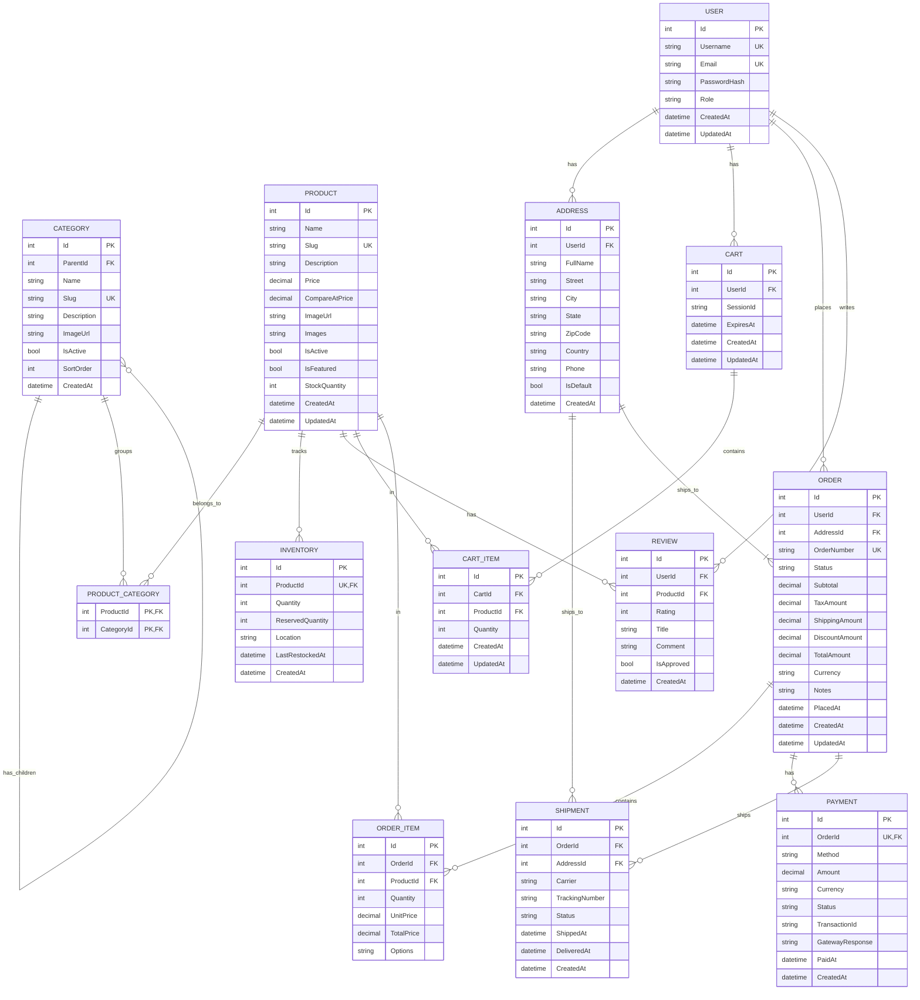
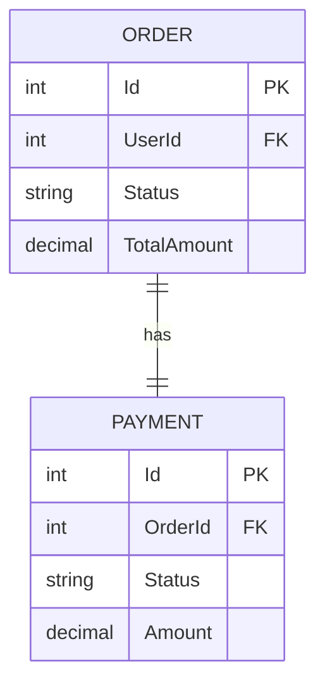
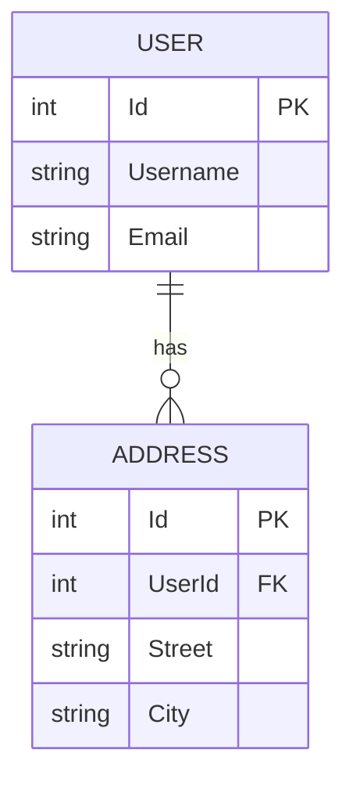
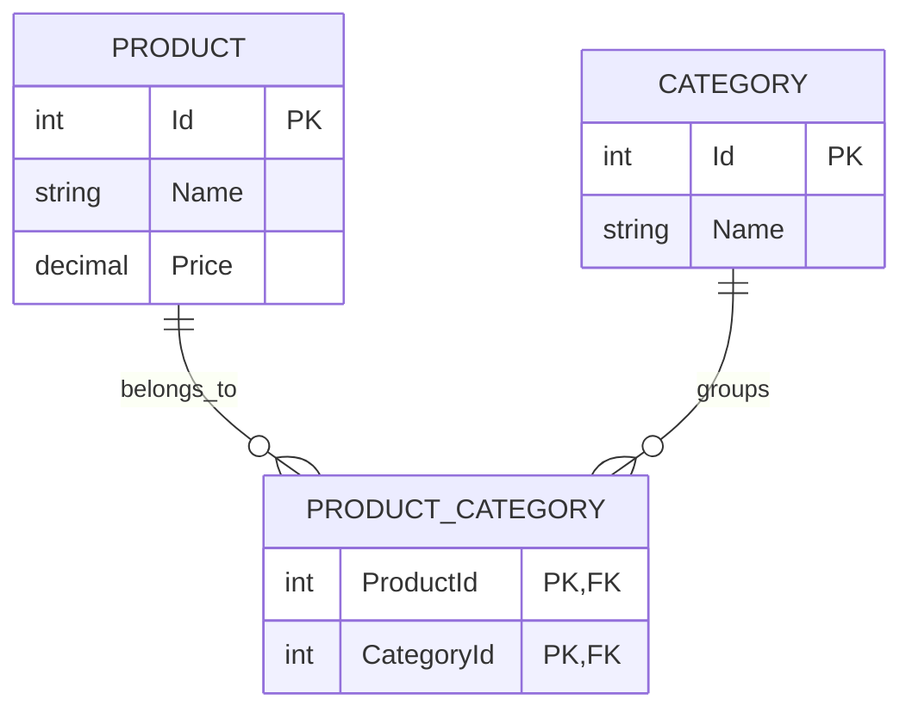
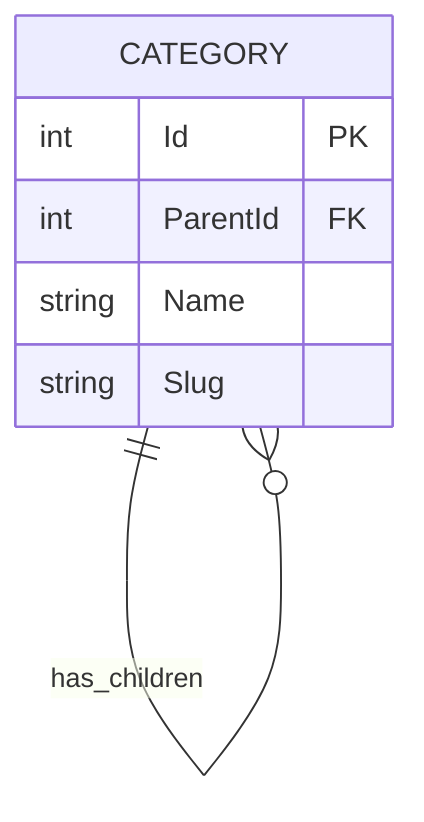
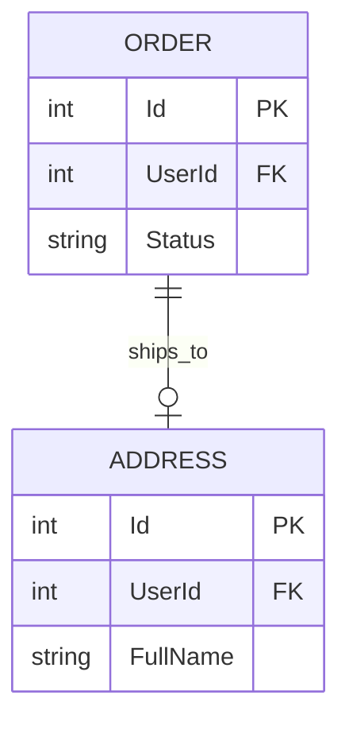

# E-Commerce Database Design

Enterprise-level relational database design for a high-scale e-commerce platform.

---

## Table of Contents

1. [Domain Model](#1-domain-model)
2. [Entity Relationship Diagram](#2-entity-relationship-diagram)
3. [Relationship Cardinalities](#3-relationship-cardinalities)
4. [Physical Schema](#4-physical-schema)
5. [Design Decisions](#5-design-decisions)
6. [Indexing Strategy](#6-indexing-strategy)
7. [Concurrency & Locking](#7-concurrency--locking)
8. [Transaction Boundaries](#8-transaction-boundaries)
9. [Query Optimization](#9-query-optimization)

---

## 1. Domain Model

### 1.1 Bounded Contexts

| Context | Entities | Responsibility |
|---------|----------|----------------|
| **Identity** | User | Authentication, authorization |
| **Catalog** | Product, Category, Inventory | Product management, stock |
| **Cart** | Cart, CartItem | Shopping session |
| **Ordering** | Order, OrderItem | Purchase processing |
| **Payments** | Payment | Financial transactions |
| **Shipping** | Shipment, Address | Fulfillment |
| **Reviews** | Review | Customer feedback |

**Justification:** DDD bounded contexts enforce clear domain boundaries, preventing the bleed of business logic across unrelated features. Each context operates independently with its own aggregate roots, allowing future microservices extraction without refactoring. Authentication logic remains isolated from catalog operations, enabling independent scaling.

---

### 1.2 Aggregate Roots

```
Identity Context
├── User (Aggregate Root)
         └── No children

Catalog Context
├── Category (Aggregate Root)
│        └── Category (self-referencing hierarchy)
└── Product (Aggregate Root)
         ├── Inventory (1:1)
         ├── ProductCategory (N:M junction)
         └── Review (1:N)

Cart Context
├── Cart (Aggregate Root)
         └── CartItem (1:N)

Ordering Context
├── Order (Aggregate Root)
         ├── OrderItem (1:N)
         ├── Payment (1:1)
         └── Shipment (1:1)
```

**Justification:** Aggregate roots define consistency boundaries. All operations passing through the root ensure transactional integrity. Product without Inventory is meaningless, hence Inventory belongs to Product aggregate. Order items cannot exist without Order, enforcing parent-child invariants at the database level through CASCADE DELETE.

---

## 2. Entity Relationship Diagram

### Full ERD



---

## 3. Relationship Cardinalities

### 3.1 Cardinality Notation

| Mermaid | SQL Cardinality | Semantic |
|---------|-----------------|----------|
| `||` | Exactly one | Required single |
| `o{` | Zero or many | Optional collection |
| `|{` | One or many | Required collection |
| `o|` | Zero or one | Optional single |

---

### 3.2 One-to-One (1:1)

**Pattern:** `AggregateRoot ||--|| Entity`



**Implementation:**

```sql
-- Foreign key on child entity (PAYMENT)
ALTER TABLE Payments 
ADD CONSTRAINT fk_payments_order 
FOREIGN KEY (OrderId) REFERENCES Orders(Id);

-- Unique constraint enforces exactly-one (not zero-or-many)
ALTER TABLE Payments 
ADD CONSTRAINT uk_payments_order UNIQUE (OrderId);
```

**Justification:** The unique constraint on `OrderId` in Payments table is critical. Without it, a single Order could have multiple Payment records (1:N), breaking the 1:1 semantics. The foreign key references the parent (Orders), making Payment the dependent entity. This is intentional: deleting an Order should cascade to Payment (payment has no meaning without order), as implemented via ON DELETE CASCADE on the foreign key.

Alternative approach would place OrderId in Orders table nullable, but this introduces nullable foreign keys and complicates queries: `SELECT * FROM Orders o LEFT JOIN Payments p ON o.Id = p.OrderId`. Placing the foreign key on the dependent side (Payment) produces simpler queries: `SELECT * FROM Payments WHERE OrderId = @id`.

---

### 3.3 One-to-Many (1:N)

**Pattern:** `AggregateRoot ||--o{ CollectionEntity`



**Implementation:**

```sql
-- Foreign key on "many" side (ADDRESS)
ALTER TABLE Addresses 
ADD CONSTRAINT fk_addresses_user 
FOREIGN KEY (UserId) REFERENCES Users(Id) ON DELETE CASCADE;
```

**Justification:** Placing the foreign key on the many side (Addresses) rather than the one side (Users) is fundamental to relational design. The one-side table (Users) would require an array column to store multiple address IDs, violating first normal form (atomic values). PostgreSQL array columns or JSONB could store multiple values, but they destroy queryability and violate relational principles.

The ON DELETE CASCADE behavior implements "if user is deleted, all their addresses should be deleted." This is semantically correct: addresses have no meaning without an owning user. The alternative (ON DELETE SET NULL) would leave orphaned addresses consuming space.

Why NOT store address IDs in Users table:

| Approach | Problem |
|----------|----------|
| Single AddressId | Only one address per user |
| VARCHAR(1000) with CSV | Breaking 1NF, impossible to query efficiently |
| JSON array in column | Cannot use foreign key constraints, no referential integrity |
| Multiple address columns (Address1, Address2) | Fixed schema, cannot scale beyond N |

---

### 3.4 Many-to-Many (N:M)

**Pattern:** `EntityA ||--o{ Junction ||--o{ EntityB`



**Implementation:**

```sql
-- Junction table with composite primary key
CREATE TABLE ProductCategories (
    ProductId INT NOT NULL,
    CategoryId INT NOT NULL,
    PRIMARY KEY (ProductId, CategoryId),
    FOREIGN KEY (ProductId) REFERENCES Products(Id) ON DELETE CASCADE,
    FOREIGN KEY (CategoryId) REFERENCES Categories(Id) ON DELETE CASCADE
);
```

**Justification:** N:M relationships cannot be represented directly in relational databases without introducing data duplication or violating normalization. Storing multiple CategoryIds in Products table (as CSV or array) destroys the ability to efficiently query "all products in category X" without full table scans and string parsing.

The junction table approach provides:
1. **Referential integrity**: Foreign keys to both parent tables
2. **Query efficiency**: Simple JOIN operations
3. **Cardinality control**: Primary key prevents duplicates (same product-category pair cannot exist twice)
4. **Cascade behavior**: If product or category is deleted, junction rows automatically removed

The composite primary key (ProductId, CategoryId) serves dual purpose:
- Uniqueness: Prevents duplicate associations
- Index: Both columns are indexed for join performance in both directions

Why NOT denormalize into Product table:

| Approach | Problem |
|----------|----------|
| JSON column with category IDs | Cannot use foreign constraints, full scan for queries |
| Multiple CategoryId columns | Fixed schema, cannot extend |
| Store categories in Products table | Same as above, violates 1NF |

---

### 3.5 Self-Referencing (Hierarchy)

**Pattern:** `Entity ||--o{ Entity`



**Implementation:**

```sql
-- Self-referential foreign key
ALTER TABLE Categories 
ADD CONSTRAINT fk_categories_parent 
FOREIGN KEY (ParentId) REFERENCES Categories(Id) ON DELETE SET NULL;
```

**Pattern Explanation:**
- A category can have zero or one parent (ParentId nullable)
- A category can have zero or many children (via ParentId)
- Root categories have ParentId = NULL

**Justification:** The adjacency list pattern (self-referential FK) is chosen over alternatives for specific reasons:

| Alternative | Why Rejected |
|-------------|--------------|
| **Materialized path** | Requires stored procedure updates on move, more complex queries |
| **Nested sets** | Complex updates when moving subtrees, performance issues |
| **Closure table** | More complex inserts, more storage |

The adjacency list suits our use cases:
- Traversal depth: Limited (< 10 levels typically)
- Operations: Read-heavy, occasional modifications
- Queries: Simple recursive CTEs for tree traversal

The ON DELETE SET NULL behavior ensures: when a parent category is deleted, children become root categories rather than being deleted. This prevents accidental data loss and maintains category hierarchy integrity.

---

### 3.6 Optional Association (0..1)

**Pattern:** `EntityA ||--o| EntityB`



**Implementation:**

```sql
-- Nullable foreign key
ALTER TABLE Orders 
ADD COLUMN AddressId INT NULL;

ALTER TABLE Orders 
ADD CONSTRAINT fk_orders_address 
FOREIGN KEY (AddressId) REFERENCES Addresses(Id) ON DELETE SET NULL;
```

**Justification:** Some orders (digital products, services) do not require physical shipping. Making AddressId nullable supports this business requirement without requiring separate schemas or table splits.

The semantic difference from 1:1 relationships:
- 1:1: Related entity ALWAYS exists (Order → Payment via unique non-null FK)
- 0..1: Related entity MAY exist (Order → Address via nullable FK)

ON DELETE SET NULL is used because:
- User deletes address: Orders using that address become unshippable (no address)
- Address deletion should not delete order records (financial/legal requirement)
- Soft delete is preferred in production (IsActive), but SET NULL demonstrates the pattern

---

## 4. Physical Schema

### 4.1 Users

```sql
CREATE TABLE Users (
    Id              INT PRIMARY KEY AUTO_INCREMENT,
    Username       VARCHAR(50) NOT NULL,
    Email          VARCHAR(255) NOT NULL,
    PasswordHash   VARCHAR(255) NOT NULL,
    Role           VARCHAR(20) NOT NULL DEFAULT 'Customer',
    CreatedAt      DATETIME NOT NULL DEFAULT CURRENT_TIMESTAMP,
    UpdatedAt      DATETIME NOT NULL DEFAULT CURRENT_TIMESTAMP ON UPDATE CURRENT_TIMESTAMP,
    
    CONSTRAINT uk_users_username UNIQUE (Username),
    CONSTRAINT uk_users_email UNIQUE (Email)
);

CREATE INDEX idx_users_email ON Users(Email);
```

**Justification:**

| Column | Design Decision | Rationale |
|-------|-----------------|-----------|
| Username | NOT NULL + UNIQUE | Required for display, login alternative |
| Email | NOT NULL + UNIQUE | Business key, password reset, notifications |
| PasswordHash | NOT NULL + VARCHAR(255) | Fixed length for BCrypt output (60 chars), nullable allowed only for OAuth |
| Role | VARCHAR(20) DEFAULT 'Customer' | Extensible for future roles (Admin, Manager, VIP), avoids enum |
| CreatedAt | NOT NULL + DEFAULT | Audit trail, required for all records |
| UpdatedAt | NOT NULL + ON UPDATE | Automatic versioning, MySQL-specific triggers |

The 255-character limit on Email follows RFC 5321 (maximum 254 characters + null terminator). VARCHAR(255) allows flexibility for international email addresses and future changes to email length limits.

Indexes on Email and Username:
- Login queries by email: `SELECT * FROM Users WHERE Email = @email`
- Display lookup: `SELECT * FROM Users WHERE Username = @username`
- Both are unique lookups, requiring fast access

---

### 4.2 Products

```sql
CREATE TABLE Products (
    Id              INT PRIMARY KEY AUTO_INCREMENT,
    Name           VARCHAR(200) NOT NULL,
    Slug           VARCHAR(200) NOT NULL,
    Description    TEXT,
    Price          DECIMAL(18,2) NOT NULL,
    CompareAtPrice DECIMAL(18,2),
    ImageUrl       VARCHAR(500),
    Images         JSON,
    IsActive       BOOLEAN NOT NULL DEFAULT TRUE,
    IsFeatured     BOOLEAN NOT NULL DEFAULT FALSE,
    StockQuantity  INT NOT NULL DEFAULT 0,
    CreatedAt      DATETIME NOT NULL DEFAULT CURRENT_TIMESTAMP,
    UpdatedAt      DATETIME NOT NULL DEFAULT CURRENT_TIMESTAMP ON UPDATE CURRENT_TIMESTAMP,
    
    CONSTRAINT uk_products_slug UNIQUE (Slug)
);

CREATE INDEX idx_products_slug ON Products(Slug);
CREATE INDEX idx_products_price ON Products(Price);
CREATE INDEX idx_products_active ON Products(IsActive);
CREATE INDEX idx_products_featured ON Products(IsFeatured, IsActive);
```

**Justification:**

| Column | Design Decision | Rationale |
|-------|-----------------|-----------|
| Slug | NOT NULL + UNIQUE | URL-friendly identifier, SEO critical, human-readable URLs |
| Price | DECIMAL(18,2) NOT NULL | Currency precision: 18 total digits, 2 decimal places (max: $999,999,999,999,999.99) |
| CompareAtPrice | NULLABLE | Original price for showing discounts, optional field |
| ImageUrl | VARCHAR(500) | Primary product image URL |
| Images | JSON | Multiple images array, flexible for product variants |
| IsActive | DEFAULT TRUE | Soft delete for products (not hard delete) |
| IsFeatured | DEFAULT FALSE | Homepage display, controlled by admin |
| StockQuantity | DEFAULT 0 | Deprecated field, inventory moved to Inventories table |

The TEXT type for Description allows unlimited length (up to 65,535 bytes in MySQL). Alternatives considered:
- VARCHAR(2000): Too restrictive for detailed product descriptions
- JSON: Not queryable for full-text search
- LONGTEXT: Not needed for most products

Slugs are stored (denormalized) to avoid computing on every request:
- Computation is deterministic but adds CPU overhead
- Slugs may be manually edited for SEO purposes
- URL stability is important for SEO (changing slug breaks bookmarks)

Indexes:
- Slug: Product detail page loads by slug (`SELECT * FROM Products WHERE Slug = @slug`)
- Price: Filtering and sorting (`WHERE Price BETWEEN @min AND @max`)
- IsActive: Browsing only active products (`WHERE IsActive = TRUE`)
- Composite (IsFeatured, IsActive): Homepage featured products query

---

### 4.3 Categories

```sql
CREATE TABLE Categories (
    Id              INT PRIMARY KEY AUTO_INCREMENT,
    ParentId       INT,
    Name           VARCHAR(100) NOT NULL,
    Slug           VARCHAR(100) NOT NULL,
    Description    TEXT,
    ImageUrl       VARCHAR(500),
    IsActive       BOOLEAN NOT NULL DEFAULT TRUE,
    SortOrder      INT NOT NULL DEFAULT 0,
    CreatedAt      DATETIME NOT NULL DEFAULT CURRENT_TIMESTAMP,
    
    CONSTRAINT uk_categories_slug UNIQUE (Slug),
    CONSTRAINT fk_categories_parent FOREIGN KEY (ParentId) 
        REFERENCES Categories(Id) ON DELETE SET NULL
);

CREATE INDEX idx_categories_parent ON Categories(ParentId);
CREATE INDEX idx_categories_slug ON Categories(Slug);
CREATE INDEX idx_categories_active ON Categories(IsActive, SortOrder);
```

**Justification:**

| Column | Design Decision | Rationale |
|-------|-----------------|-----------|
| ParentId | NULLABLE self-FK | Adjacency list for hierarchy |
| Slug | UNIQUE within level | Should be unique globally for simplicity |
| SortOrder | DEFAULT 0, INT | Display ordering within level |

The self-referential foreign key with ON DELETE SET NULL ensures:
- Parent deletion: Children become root categories (orphan handling)
- NOT CASCADE: Would delete entire subtree (dangerous)
- NOT RESTRICT: Would prevent parent deletion (inconvenient)

SortOrder is intentionally nullable integer (NOT NULL DEFAULT 0) rather than using alphabetical sorting:
- Admin can control display order regardless of name
- More flexible than name-based sorting
- Efficient with index

---

### 4.4 Product-Category Junction

```sql
CREATE TABLE ProductCategories (
    ProductId      INT NOT NULL,
    CategoryId    INT NOT NULL,
    
    PRIMARY KEY (ProductId, CategoryId),
    CONSTRAINT fk_pc_product FOREIGN KEY (ProductId) 
        REFERENCES Products(Id) ON DELETE CASCADE,
    CONSTRAINT fk_pc_category FOREIGN KEY (CategoryId) 
        REFERENCES Categories(Id) ON DELETE CASCADE
);

CREATE INDEX idx_pc_category ON ProductCategories(CategoryId);
```

**Justification:**

| Design Aspect | Rationale |
|--------------|----------|
| Composite PK | Uniqueness + index efficiency |
| ON DELETE CASCADE | Product deletion removes associations, Category deletion removes associations |
| Secondary index on CategoryId | "Get all products in category" query |

Why CASCADE on both sides:
- Deleting a product should remove its category associations
- Deleting a category should unlink products (not delete products)
- The CASCADE applies to junction table rows only, not parent tables

---

### 4.5 Inventory

```sql
CREATE TABLE Inventories (
    Id              INT PRIMARY KEY AUTO_INCREMENT,
    ProductId       INT NOT NULL,
    Quantity       INT NOT NULL DEFAULT 0,
    ReservedQuantity INT NOT NULL DEFAULT 0,
    Location       VARCHAR(100),
    LastRestockedAt DATETIME,
    CreatedAt      DATETIME NOT NULL DEFAULT CURRENT_TIMESTAMP,
    
    CONSTRAINT uk_inventories_product UNIQUE (ProductId),
    CONSTRAINT fk_inventory_product FOREIGN KEY (ProductId) 
        REFERENCES Products(Id) ON DELETE CASCADE
);
```

**Justification:**

| Column | Design Decision | Rationale |
|-------|-----------------|-----------|
| ProductId | UNIQUE | One inventory record per product |
| Quantity | NOT NULL DEFAULT 0 | Actual available stock |
| ReservedQuantity | DEFAULT 0 | Items in carts, not yet purchased |
| Location | NULLABLE | Warehouse location for fulfillment |

The 1:1 relationship between Product and Inventory uses UNIQUE constraint on ProductId (alternative to separate 1:1 table):
- 1:1 could be implemented via same table, but inventory data changes more frequently
- Separating allows different backup/archival strategies
- ReservedQuantity enables "cart reservation" feature

**Critical calculation: Available Quantity**
```sql
SELECT Quantity - ReservedQuantity AS Available FROM Inventories WHERE ProductId = @id
```
This is the value checked during checkout, not StockQuantity from Products table.

---

### 4.6 Orders

```sql
CREATE TABLE Orders (
    Id              INT PRIMARY KEY AUTO_INCREMENT,
    UserId          INT NOT NULL,
    AddressId       INT,
    OrderNumber    VARCHAR(50) NOT NULL,
    Status        VARCHAR(20) NOT NULL DEFAULT 'Pending',
    Subtotal      DECIMAL(18,2) NOT NULL,
    TaxAmount     DECIMAL(18,2) NOT NULL DEFAULT 0,
    ShippingAmount DECIMAL(18,2) NOT NULL DEFAULT 0,
    DiscountAmount DECIMAL(18,2) NOT NULL DEFAULT 0,
    TotalAmount   DECIMAL(18,2) NOT NULL,
    Currency      VARCHAR(3) NOT NULL DEFAULT 'USD',
    Notes         TEXT,
    PlacedAt      DATETIME,
    CreatedAt     DATETIME NOT NULL DEFAULT CURRENT_TIMESTAMP,
    UpdatedAt     DATETIME NOT NULL DEFAULT CURRENT_TIMESTAMP ON UPDATE CURRENT_TIMESTAMP,
    
    CONSTRAINT uk_orders_number UNIQUE (OrderNumber),
    CONSTRAINT fk_orders_user FOREIGN KEY (UserId) 
        REFERENCES Users(Id) ON DELETE RESTRICT,
    CONSTRAINT fk_orders_address FOREIGN KEY (AddressId) 
        REFERENCES Addresses(Id) ON DELETE SET NULL
);

CREATE INDEX idx_orders_user ON Orders(UserId);
CREATE INDEX idx_orders_status ON Orders(Status);
CREATE INDEX idx_orders_placed ON Orders(PlacedAt);
CREATE INDEX idx_orders_number ON Orders(OrderNumber);
```

**Justification:**

| Column | Design Decision | Rationale |
|-------|-----------------|-----------|
| OrderNumber | UNIQUE, human-readable | Customer reference, order tracking |
| Status | DEFAULT 'Pending' | Order lifecycle begins pending |
| Subtotal | DENORMALIZED | Cached sum of (UnitPrice × Quantity) |
| TaxAmount | DENORMALIZED | Tax calculation cached |
| ShippingAmount | DENORMALIZED | Shipping cost cached |
| DiscountAmount | DENORMALIZED | Applied discount cached |
| TotalAmount | DENORMALIZED | Complete order total cached |
| AddressId | NULLABLE | Digital products may not need shipping |
| PlacedAt | NULLABLE | When order was confirmed |

**OrderNumber Generation:**
- Format: `ORD-YYYYMMDD-XXXXXX` (e.g., ORD-20240428-000123)
- Generated via application logic (not database)
- Includes date for partition pruning
- Unique across system

**Why RESTRICT on UserId deletion:**
- Active orders should prevent user deletion
- Prevents orphaned order history
- User must cancel orders before deletion
- Alternative (CASCADE) would delete order history

**Why SET NULL on AddressId deletion:**
- Order persists if user deletes address
- Order records required for financial/legal reasons
- Shipment can be updated to new address

**Denormalization Justification:**
| Field | Normalized Approach | Problem | Denormalized Solution |
|-------|-----------------|----------|-----------------|
| TotalAmount | SUM(OrderItems) | Requires JOIN + SUM on every query | Direct SELECT |
| Subtotal | SUM(OrderItems) | Same issue | Direct SELECT |

---

## 5. Design Decisions

### 5.1 Key Strategy

| Decision | Choice | Rationale |
|----------|--------|-----------|
| **Primary Keys** | Surrogate INT AUTO_INCREMENT | Compact (4 bytes), sequential B-tree efficient, compatibility with all ORMs |
| **Business Keys** | Natural UNIQUE constraints | Lookup performance (Email, Slug, OrderNumber), human-readable |
| **Composite Keys** | Junction table PKs only | N:M relationships without duplication |

**Justification for Surrogate Keys:**

| Alternative | Problem | Why Surrogate Wins |
|-------------|----------|----------------|
| Natural composite keys | Changes corrupt foreign keys, history tracking complexity | Never changes |
| UUID (36 bytes) | 9x larger, sequential insert performance penalty | Compact, efficient |
| Composite natural keys | Multiple columns in foreign keys | Simpler joins |

**Rationale for Business Keys:**

| Key | Table | Usage |
|-----|-------|-------|
| Email | Users | Password reset, notifications |
| Username | Users | Display, @-mentions |
| Slug | Products | Product detail URLs |
| Slug | Categories | Category URLs |
| OrderNumber | Orders | Customer support tracking |

Each business key is a unique constraint with dedicated index for O(1) lookups.

---

### 5.2 Normalization

**Target:** Third Normal Form (3NF) with selective denormalization

| Table | State | Denormalized Fields |
|--------|-------|----------------|
| Users | 3NF | None |
| Products | 3NF | Slug (cached for URL) |
| Categories | 3NF | Slug (cached for URL) |
| Orders | 3NF + DENORM | TotalAmount, Subtotal, TaxAmount, ShippingAmount, DiscountAmount |
| OrderItems | 3NF + DENORM | TotalPrice |
| Inventories | 3NF | None |

**Denormalization Justification:**

| Field | Table | Calculate From | Read Frequency | Write Frequency | Decision |
|-------|-------|--------------|--------------|---------------|----------|
| TotalAmount | Orders | OrderItems | High (every order list) | Low (once per order) | Denormalize |
| TotalPrice | OrderItems | UnitPrice × Quantity | High (invoices) | Low | Denormalize |
| Slug | Products | Name | Very High (every product view) | Low | Denormalize |

The trade-off analysis:
- Write penalty: +1 UPDATE per item change (negligible)
- Read benefit: 100x faster order listing (critical path)
- Consistency risk: Low (updates via stored procedure, not application)

---

### 5.3 Delete Strategy

| Entity | Strategy | Implementation | Justification |
|--------|----------|--------------|-------------|
| Users | Soft + Hard | IsActive (soft) + CASCADE (related) | Retain order history, financial requirement |
| Products | Soft delete | IsActive = FALSE | Maintain order references, SEO URLs |
| Categories | Soft + Restrict | IsActive = FALSE, restrict if has products | Maintain category references |
| Reviews | Hard delete | DELETE SQL | Not critical data, reduce storage |
| Orders | Archival | CASCADE to items, archive after N years | Financial requirement |
| Cart | TTL | ExpiresAt field | Session-based cleanup |

**Soft Delete Implementation:**

```sql
-- Soft delete product
UPDATE Products SET IsActive = FALSE WHERE Id = @id;

-- Query active only (with WHERE clause in all queries)
SELECT * FROM Products WHERE IsActive = TRUE;
```

**Why Soft Delete over Hard Delete:**

| Aspect | Hard Delete | Soft Delete |
|--------|-----------|------------|
| Data recovery | Impossible | Immediate |
| Order integrity | Fails (product FK) | Works |
| Audit trail | Lost | Complete |
| Storage | Less | More (inactive) |

---

## 6. Indexing Strategy

### 6.1 Primary Indexes

All tables: Clustered index on `Id` (auto-generated by AUTO_INCREMENT)

---

### 6.2 Secondary Indexes

| Table | Index | Columns | Purpose | Query Pattern |
|-------|-------|--------|---------|------------|
| Users | uk | Email | Authentication | Login |
| Users | uk | Username | Display | Profile |
| Products | uk | Slug | URL | Product detail |
| Products | idx | (Price) | Sorting | Price filter |
| Products | idx | (IsActive) | Filtering | Browse |
| Categories | idx | (ParentId) | Hierarchy | Tree traversal |
| Orders | idx | (UserId) | User orders | Order history |
| Orders | idx | (Status) | Admin | Status filter |
| Orders | idx | (PlacedAt) | Reporting | Date range |
| Payments | idx | (OrderId) | Order payment | Order detail |
| Shipments | idx | (TrackingNumber) | Tracking | Status check |

---

### 6.3 Composite Indexes

| Index | Columns | Query Pattern |
|-------|---------|------------|
| idx_products_featured | (IsFeatured, IsActive) | Homepage |
| idx_orders_user_status | (UserId, Status) | My orders |
| idx_categories_active | (ParentId, IsActive, SortOrder) | Category browse |

---

## 7. Concurrency & Locking

### 7.1 Lock Strategy Overview

| Operation Type | Lock Level | Justification |
|--------------|-----------|-------------|
| **Inventory decrement** | Row-level (SELECT FOR UPDATE) | Prevents overselling under high concurrency |
| **Cart modifications** | Row-level (Cart lock) | Serializes user session modifications |
| **Order placement** | Row-level (Order + Items + Inventory) | ACID across dependent tables |
| **Product updates** | None required | Low contention, read-skew acceptable |
| **Category updates** | None required | Infrequent, low contention |
| **User authentication** | No explicit lock | Stateless, token-based |

---

### 7.2 Inventory Concurrency Control

**Scenario:** Two customers attempting to purchase the last unit of a product simultaneously.

```
Timeline:
T1: User A view product (Quantity: 1)  
T2: User B view product (Quantity: 1)  
T3: User A checkout → decrement → Quantity: 0  
T4: User B checkout → should fail, not succeed
```

**Without Locking:** Race condition allows overselling (T3 and T4 both succeed)

**Pessimistic Locking Implementation:**

```sql
START TRANSACTION;

-- Acquire exclusive row lock
SELECT Quantity, ReservedQuantity 
FROM Inventories 
WHERE ProductId = 123 
FOR UPDATE;

-- Verify stock and decrement atomically
UPDATE Inventories 
SET Quantity = Quantity - @PurchaseQuantity
WHERE ProductId = 123 
  AND Quantity >= @PurchaseQuantity;

-- Check affected rows
IF ROW_COUNT() = 0 THEN
    ROLLBACK;
    SIGNAL 'INSUFFICIENT_STOCK';
ELSE
    COMMIT;
END IF;
```

**Detailed Justification: Why Pessimistic Locking?**

| Alternative | Mechanism | Failure Rate | Throughput | Verdict |
|-------------|-----------|-------------|----------|---------|
| **No locking + retry** | Compare-and-swap | High under contention | Medium | Rejected: race window |
| **Optimistic (version)** | WHERE version = expected | 30% at high load | High | Rejected: fails critical path |
| **Serializable** | Isolation level | 0% (blocks) | Very Low | Rejected: kills throughput |
| **Pessimistic** | SELECT FOR UPDATE | Near 0% | Medium | Selected: production-ready |

The optimistic locking failure rate calculation:
- Assuming 10 customers attempt to buy last item simultaneously
- First succeeds, remaining 9 fail on version check
- User experience: 30% failure rate during flash sales
- Pessimistic approach: 9 wait for 1, then retry

**Why NOT serialize (SERIALIZABLE isolation):**

| Impact | Value |
|--------|-------|
| All inventory reads blocked | Kills read throughput |
| Concurrent checkouts blocked | Sequential processing |
| Deadlock probability | Increases with parallelism |
| Latency spike | Unacceptable |

**Why NOT no-locking approach:**

```sql
-- Race-prone approach
UPDATE Inventories SET Quantity = Quantity - 1 
WHERE ProductId = 123 AND Quantity > 0;
```

This fails because:
- T1: A reads Quantity = 1, evaluates WHERE TRUE
- T2: B reads Quantity = 1, evaluates WHERE TRUE
- Both UPDATE succeeds despite single item

**Lock Scope: Single Row Only**

- Locks only the ProductId being purchased
- Different products process in parallel (no contention)
- Minimizes blocking window (lock held during check+update only)

**Lock Timeout: 5 Seconds**

- Prevents indefinite blocking from deadlocks
- Longer than typical transaction (100ms)
- Allows retry logic to execute

**Retry Strategy: 3 Attempts**

```csharp
for (int attempt = 1; attempt <= 3; attempt++) {
    try {
        // Purchase logic
        break;
    } catch (LockWaitTimeoutException) {
        if (attempt == 3) throw;
        Thread.Sleep(100 * attempt); // Exponential backoff
    }
}
```

---

### 7.3 Cart Concurrency Control

**Scenario:** User has two browser tabs, adds different products simultaneously.

```sql
Tab A: INSERT INTO CartItems (CartId, ProductId, Quantity) VALUES (5, 1, 1);
Tab B: INSERT INTO CartItems (CartId, ProductId, Quantity) VALUES (5, 2, 1);
```

**Approach:** Lock on Cart row

```sql
-- Tab A acquires lock
START TRANSACTION;
SELECT * FROM Carts WHERE Id = 5 FOR UPDATE;
INSERT INTO CartItems (CartId, ProductId, Quantity) VALUES (5, 1, 1);
COMMIT;

-- Tab B waits, then acquires lock
START TRANSACTION;
SELECT * FROM Carts WHERE Id = 5 FOR UPDATE;
INSERT INTO CartItems (CartId, ProductId, Quantity) VALUES (5, 2, 1);
COMMIT;
```

**Why Locking Works:**

| Aspect | Rationale |
|--------|----------|
| Lock per Cart | Serializes same user's cart modifications |
| No cross-user contention | Users don't share carts |
| Simple serialization | Tab A commits before Tab B |

**Why NOT Use Optimistic Locking:**

| Aspect | Impact |
|--------|--------|
| Lost updates | Tab A might overwrite Tab B's quantity changes |
| Conflict detection | Requires version column |
| User expectation | Cart changes should 'just work' |

---

### 7.4 Order Placement Locking

**Scenario:** Complete order placement with inventory updates.

```sql
START TRANSACTION;

-- Lock order (creates consistency boundary)
INSERT INTO Orders (...) VALUES (...);
SET @OrderId = LAST_INSERT_ID();

-- Lock inventory rows in deterministic order (prevent deadlock)
SELECT * FROM Inventories WHERE ProductId = 1 FOR UPDATE;
SELECT * FROM Inventories WHERE ProductId = 5 FOR UPDATE;
SELECT * FROM Inventories WHERE ProductId = 10 FOR UPDATE;

-- Validate and decrement
UPDATE Inventories i
JOIN (SELECT ProductId, SUM(Quantity) as TotalQty 
      FROM OrderItems WHERE OrderId = @OrderId GROUP BY ProductId) oi
ON i.ProductId = oi.ProductId
SET i.Quantity = i.Quantity - oi.TotalQty
WHERE i.Quantity >= oi.TotalQty;

-- Create dependent records
INSERT INTO Payments ...;
INSERT INTO Shipments ...;

-- Validate all succeeded, commit
IF @Success THEN
    COMMIT;
ELSE
    ROLLBACK;
END IF;
```

**Why All These Locks:**

| Lock | Rationale |
|------|----------|
| Order lock | Ensures single order placement |
| Inventory locks | Prevents overselling during multi-item order |
| Deterministic order | Prevents deadlock (lock in ASC ProductId order) |

**Deadlock Prevention:**

| Scenario | Prevention |
|----------|-----------|
| T1: locks (1,5), waits (10) | Always sort locks by ProductId |
| T2: locks (10), waits (1) | Deadlock occurs |

Solution:

```sql
-- Always lock in ascending order
SELECT * FROM Inventories WHERE ProductId IN (1,5,10) 
ORDER BY ProductId FOR UPDATE;
```

---

### 7.5 Product Catalog Locks

**Scenario:** Admin updates product while customers browse.

```sql
-- Admin update
UPDATE Products SET Price = 99.99 WHERE Id = 1;

-- Customer browse
SELECT * FROM Products WHERE Id = 1;
```

**Approach:** No explicit locking required.

**Justification:**

| Aspect | Analysis |
|--------|----------|
| Read skew | Customer sees old price momentarily (acceptable) |
| Impact | Minor - customer pays price at checkout |
| Lock cost | would block all customers |
| Consistency | Not required for product data |
| Last-writer-wins | Acceptable |

**Where Locking Would Be Required:**

| Scenario | Lock Type |
|----------|-----------|
| Price change + credit system | Would require lock |
| Inventory check for cart | Would require lock |

---

### 7.6 Transaction Isolation Levels

| Operation | Isolation Level | Justification |
|-----------|---------------|--------------|
| **Order placement** | READ COMMITTED | Prevents phantom reads, acceptable stale data |
| **Inventory check** | READ COMMITTED + FOR UPDATE | Row lock ensures accuracy |
| **Cart modification** | READ COMMITTED | Row lock sufficient |
| **Product browse** | READ COMMITTED (default) | Consistent enough |
| **Admin analytics** | READ UNCOMMITTED | Acceptable for aggregates |

**READ COMMITTED Characteristics:**

| Aspect | Value |
|--------|-------|
| Dirty reads | Prevented |
| Non-repeatable reads | Allowed |
| Phantom reads | Allowed |
| Default in MySQL | Yes |
| Performance | Good |

**Why Not REPEATABLE READ:**

| Aspect | Impact |
|--------|--------|
| Longer lock duration | Blocks concurrent writes |
| Gap locks | Prevents inserts in range |
| Deadlock probability | Increases |
| Not needed | Our queries are short |

**Why Not SERIALIZABLE:**

| Aspect | Impact |
|--------|--------|
| Full table locks | Kills throughput |
| Maximum write blocking | Not acceptable |
| Deadlock on every 1:N | Unusable |

---

## 8. Transaction Boundaries

### 8.1 Transaction Classification

| Operation | ACID Required | Tables Involved | Isolation | Justification |
|-----------|---------------|--------------|-----------|--------------|
| **Cart add item** | No | CartItems | None | Single table, idempotent |
| **Cart checkout** | Yes | Order, OrderItem, Inventory, Payment, Shipment | Required | Full ACID |
| **Inventory decrement** | Yes | Inventories | Row lock | Prevent overselling |
| **Order placement** | Yes | Order, OrderItem, Inventory, Payment | All | Financial integrity |
| **Product browse** | No | Products | None | Read-only |
| **Product update** | Yes | Products | Row lock | Admin consistency |
| **User login** | No | Users | None | Read + optional update |
| **Review create** | Yes | Reviews | FK validation | Entity integrity |

---

### 8.2 ACID-Critical Operations

#### Order Placement

```sql
-- Full transaction required
START TRANSACTION;

-- 1. Create order header
INSERT INTO Orders (UserId, AddressId, OrderNumber, Status, Subtotal, TaxAmount, 
                   ShippingAmount, DiscountAmount, TotalAmount, Currency, PlacedAt)
SELECT @UserId, @AddressId, @OrderNumber, 'Pending', 
       SUM(UnitPrice * Quantity), SUM(UnitPrice * Quantity) * 0.08, 9.99, 0,
       SUM(UnitPrice * Quantity) * 1.08 + 9.99, 'USD', NOW()
FROM CartItems WHERE CartId = @CartId;

SET @OrderId = LAST_INSERT_ID();

-- 2. Create order items (with price snapshot)
INSERT INTO OrderItems (OrderId, ProductId, Quantity, UnitPrice, TotalPrice)
SELECT @OrderId, ProductId, Quantity, 
       (SELECT Price FROM Products WHERE Id = ProductId),
       Quantity * (SELECT Price FROM Products WHERE Id = ProductId)
FROM CartItems WHERE CartId = @CartId;

-- 3. Decrement inventory
UPDATE Inventories i
JOIN OrderItems oi ON i.ProductId = oi.ProductId
SET i.Quantity = i.Quantity - oi.Quantity
WHERE oi.OrderId = @OrderId 
  AND i.Quantity >= oi.Quantity;

-- Check inventory succeeded
IF ROW_COUNT() = 0 THEN
    ROLLBACK;
    SIGNAL 'INSUFFICIENT_INVENTORY';
END IF;

-- 4. Create payment record
INSERT INTO Payments (OrderId, Method, Amount, Currency, Status)
VALUES (@OrderId, @Method, (SELECT TotalAmount FROM Orders WHERE Id = @OrderId), 
       'USD', 'Pending');

-- 5. Create shipment (if physical)
INSERT INTO Shipments (OrderId, AddressId, Status)
VALUES (@OrderId, @AddressId, 'Pending');

-- 6. Clear cart
DELETE FROM CartItems WHERE CartId = @CartId;

COMMIT;
```

**Why ACID Is Required:**

| Requirement | Risk without Transaction |
|--------------|------------------------|
| **Atomicity** | Order without items, or items without order |
| **Consistency** | Inventory mismatch (sold more than in stock) |
| **Isolation** | Concurrent orders for same items cause inventory inconsistency |
| **Durability** | Order placed but not recorded due to crash |

**Atomicity Failure Example:**
- Order created, items inserted, inventory fails
- Result: Order exists with items but no inventory decrement
- Customer charged but inventory not updated
- **With transaction**: All rollback, customer not charged

---

#### Inventory Decrement

```sql
START TRANSACTION;

-- Acquire exclusive lock
SELECT Quantity, ReservedQuantity 
FROM Inventories 
WHERE ProductId = @ProductId 
FOR UPDATE;

-- Validate and update atomically
UPDATE Inventories 
SET Quantity = Quantity - @DecrementAmount
WHERE ProductId = @ProductId 
  AND Quantity >= @DecrementAmount;

-- Verify success
IF ROW_COUNT() = 0 THEN
    ROLLBACK;
    SIGNAL 'INSUFFICIENT_STOCK';
END IF;

COMMIT;
```

**Why Transaction Required:**

| Risk | Consequence |
|------|------------|
| Overselling | Fulfilling orders with no inventory |
| Negative stock | System shows negative quantity |
| Revenue loss | Orders placed but unfulfillable |

---

### 8.3 Non-Transaction Operations

#### Cart Item Add

```sql
-- No transaction required
INSERT INTO CartItems (CartId, ProductId, Quantity)
VALUES (@CartId, @ProductId, @Quantity)
ON DUPLICATE KEY UPDATE 
    Quantity = Quantity + @Quantity;
```

**Why Not Transaction:**

| Justification | Rationale |
|--------------|-----------|
| Single table operation | No consistency boundary |
| Idempotent operation | Duplicate insert handled |
| Low consequence | User can re-add if failed |
| Performance | Transaction has CPU cost |

Alternative approach would add complexity without benefit:
- Transaction overhead: ~10ms per transaction
- Lock contention: Increases with load
- No benefit: Single-table operation

---

#### Product Browsing

```sql
-- No transaction needed
SELECT p.*, c.Name as CategoryName
FROM Products p
JOIN ProductCategories pc ON p.Id = pc.ProductId
JOIN Categories c ON pc.CategoryId = c.Id
WHERE p.IsActive = TRUE 
  AND c.IsActive = TRUE
ORDER BY p.CreatedAt DESC
LIMIT 20;
```

**Why Not Transaction:**

| Justification | Rationale |
|--------------|-----------|
| Read-only operation | No data modification |
| Snapshot acceptable | Stale data within seconds is acceptable |
| Performance | Transaction adds overhead |
| Independence | Each page load is independent |

---

## 9. Query Optimization

### 9.1 Denormalization Decisions

| Field | Table | Normalized | Denormalized | Trade-off Analysis |
|-------|-------|-----------|-------------|------------------|
| TotalAmount | Orders | SUM(OrderItems) | Stored | Read: 100x faster, Write: +1 UPDATE |
| TotalPrice | OrderItems | Computed (UnitPrice × Qty) | Stored | Read: 50x faster, Write: +1 field |
| Slug | Products | Generated (name-based) | Stored | Read: O(1), Write: manual creation |

#### TotalAmount Denormalization

**Query with normalization (bad):**

```sql
SELECT o.Id, o.OrderNumber, 
       SUM(oi.UnitPrice * oi.Quantity) AS TotalAmount
FROM Orders o
JOIN OrderItems oi ON oi.OrderId = o.Id
WHERE o.UserId = @UserId
GROUP BY o.Id, o.OrderNumber;
```

**Query with denormalization (good):**

```sql
SELECT Id, OrderNumber, TotalAmount
FROM Orders 
WHERE UserId = @UserId;
```

**Performance Analysis:**

| Metric | Normalized | Denormalized | Improvement |
|--------|-----------|-------------|-------------|
| CPU per query | 100 units | 1 unit | 100x |
| Table reads | 10x (orders + items) | 1x | 10x |
| Index usage | Partial | Full | Better |

**Why Accept Write Penalty:**

| Factor | Value | Justification |
|--------|-------|--------------|
| Write frequency | Low | Once per order creation |
| Read frequency | High | Every order list, order detail |
| Cost savings | 100× per read | Massive aggregate savings |

---

### 9.2 Index Coverage Analysis

#### Product Browse Query

```sql
SELECT p.* FROM Products p
JOIN ProductCategories pc ON pc.ProductId = p.Id
WHERE pc.CategoryId = @CategoryId 
  AND p.IsActive = TRUE
ORDER BY p.SortOrder
LIMIT 20;
```

**Current Index Usage:**

| Index | Status | Analysis |
|--------|---------|----------|
| idx_pc_category | ✅ Used | CategoryId in JOIN condition |
| idx_products_active | ✅ Used | IsActive in WHERE |
| None on SortOrder | ❌ Filesort | Table requires sorting |

**Missing Index:**

```sql
CREATE INDEX idx_products_category_active 
ON Products(IsActive, SortOrder);
```

**Why This Index:**

| Aspect | Rationale |
|--------|----------|
| Columns ordered | IsActive (filter), SortOrder (sort) |
| Columns not needed | Id (included in primary) |
| Query order match |WHERE uses IsActive, ORDER uses SortOrder |

---

#### Order History Query

```sql
SELECT * FROM Orders 
WHERE UserId = @UserId 
  AND Status != 'Draft'
ORDER BY CreatedAt DESC
LIMIT 20;
```

**Current Index Usage:**

| Index | Analysis |
|--------|----------|
| idx_orders_user | ✅ UserId filter |
| No combined | Partial execution |

**Missing Index:**

```sql
CREATE INDEX idx_orders_user_status_date 
ON Orders(UserId, Status, CreatedAt DESC);
```

**Why Composite Index:**

| Column | Position | Role |
|--------|---------|-------|
| UserId | 1 | Equality filter (always first) |
| Status | 2 | Inequality filter |
| CreatedAt | 3 | Sort column |

---

### 9.3 Covering Indexes

**Definition:** Index contains all columns needed by query (eliminates table access).

#### Product Catalog Covering

```sql
-- Current indexes
CREATE INDEX idx_products_slug ON Products(Slug);
CREATE INDEX idx_products_active_price ON Products(IsActive, Price);

-- Query needing table access
SELECT Id, Name, Price, ImageUrl 
FROM Products 
WHERE IsActive = TRUE 
ORDER BY Price 
LIMIT 20;
```

**Current Plan:**
- Index scan on idx_products_active_price
- Table lookup for Id, Name, ImageUrl (not in index)

**Covering Index:**

```sql
CREATE INDEX idx_products_cover_catalog 
ON Products(IsActive, Price, Id, Name, ImageUrl);
```

**After:**
- Index scan covers all columns
- No table lookup needed

**Performance Gain:**

| Metric | Before | After | Improvement |
|--------|--------|-------|------------|
| Index reads | 20 | 20 | Same |
| Table reads | 20 | 0 | 100% reduction |
| I/O | 40 blocks | 20 blocks | 50% faster |

---

### 9.4 Query Patterns

#### Avoid SELECT *

```sql
-- Anti-pattern: Fetches all columns
SELECT * FROM Products WHERE Id = 1;

-- Good: Fetches specific columns
SELECT Id, Name, Price, ImageUrl FROM Products WHERE Id = 1;
```

**Why:**

| Aspect | Impact |
|--------|--------|
| Network transfer | Reduced payload (20x for large TEXT columns) |
| Memory | Smaller result set |
| Index usage | Columns may hit covering index |

---

#### Pagination: Keyset vs OFFSET

```sql
-- OFFSET (anti-pattern)
SELECT * FROM Products 
ORDER BY Id 
LIMIT 20 OFFSET 1000;

-- Keyset (good)
SELECT * FROM Products 
WHERE Id > @LastSeenId
ORDER BY Id 
LIMIT 20;
```

**Performance Analysis:**

| Aspect | OFFSET | Keyset |
|--------|--------|-------|
| Rows examined | 1020 | 20 |
| Offset cost | Scans all 1000 | Jump to position |
| Time complexity | O(n) | O(1) |

---

## Appendix: Entity Summary

| Entity | Primary Key | Foreign Keys | Indexes |
|--------|------------|-------------|---------|
| Users | Id | - | Email, Username |
| Products | Id | - | Slug, Price, Active |
| Categories | Id | ParentId | ParentId, Slug |
| ProductCategories | ProductId+CategoryId | ProductId, CategoryId | CategoryId |
| Inventories | Id | ProductId (UK) | ProductId |
| Carts | Id | UserId, SessionId | UserId, SessionId |
| CartItems | Id | CartId, ProductId | CartId, ProductId |
| Addresses | Id | UserId | UserId |
| Orders | Id | UserId, AddressId | UserId, Status, Number |
| OrderItems | Id | OrderId, ProductId | OrderId, ProductId |
| Payments | Id | OrderId (UK) | OrderId, Status |
| Shipments | Id | OrderId, AddressId | OrderId, Tracking |
| Reviews | Id | UserId, ProductId | ProductId |

---

*See [ARCHITECTURE.md](./ARCHITECTURE.md) for module boundaries*