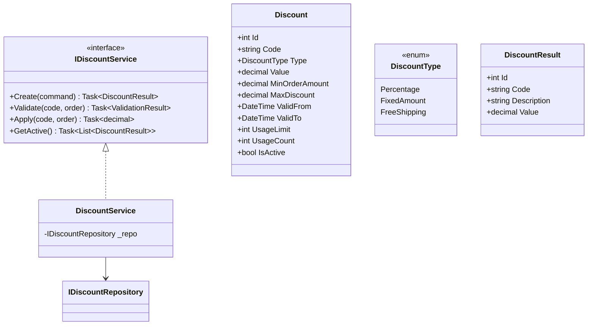
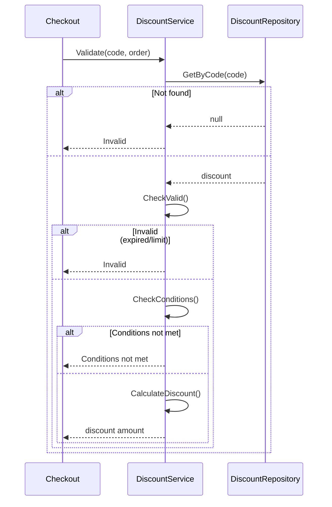

# Discounts Module - Low Level Design

---

## Table of Contents

1. [Use Cases](#1-use-cases)
2. [Class Diagram](#2-class-diagram)
3. [Sequence Diagrams](#3-sequence-diagrams)
4. [Discount Types](#4-discount-types)
5. [Design Patterns](#5-design-patterns)
6. [SOLID Compliance](#6-solid-compliance)

---

## 1. Use Cases

### 1.1 Create Coupon

```
Actors: Admin
Flow: Enter code, type, value, conditions → Validate → Create coupon
```

### 1.2 Apply Coupon

```
Actors: Customer
Flow: Enter code at checkout → Validate → Calculate discount → Apply
```

### 1.3 Validate Coupon

```
Actors: Cart Service (internal)
Flow: Check code valid → Check conditions met → Return discount
```

### 1.4 Expire Coupon

```
Actors: System
Flow: Check expiration daily → Mark expired → Stop applying
```

### 1.5 Get Active Promotions

```
Actors: Customer
Flow: Fetch active promotions → Return list
```

---

## 2. Class Diagram



---

## 3. Sequence: Apply Coupon



---

## 4. Discount Types

| Type | Calculation |
|------|-------------|
| **Percentage** | order × value / 100 |
| **FixedAmount** | value (up to max) |
| **FreeShipping** | discount = shipping cost |

### 4.1 Conditions

| Condition | Field | Validation |
|-----------|-------|------------|
| Minimum order | MinOrderAmount | order.Subtotal >= value |
| Usage limit | UsageLimit | UsageCount < limit |
| Date range | ValidFrom/ValidTo | Now within range |
| Single use | UsageLimit=1 | Not previously used |

---

## 5. Design Patterns

### 5.1 Strategy Pattern

```csharp
public interface IDiscountStrategy {
    decimal Calculate(Order order, Discount discount);
}

public class PercentageDiscount : IDiscountStrategy { }
public class FixedDiscount : IDiscountStrategy { }
public class FreeShippingDiscount : IDiscountStrategy { }
```

### 5.2 Chain of Responsibility

```csharp
// Validation chain
await _validatorChain.Validate(code)  // Expiration → Usage → Conditions → Active
```

---

## 6. SOLID Compliance ✅