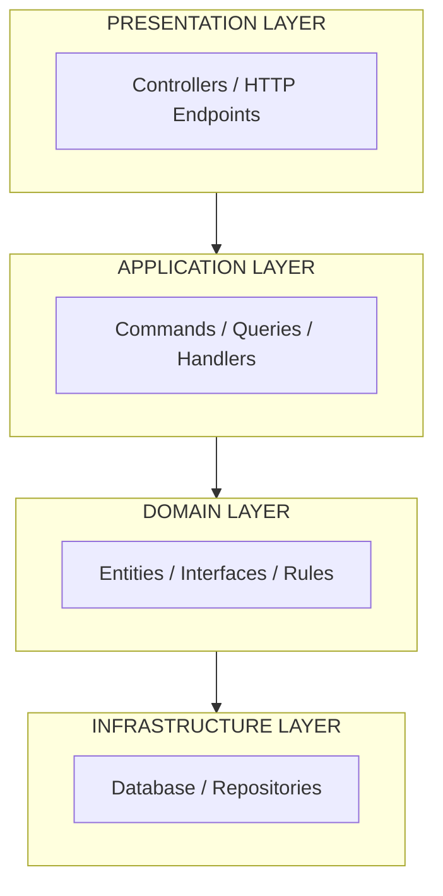
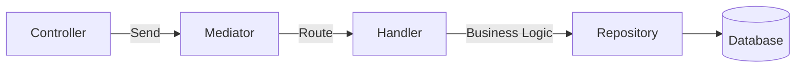
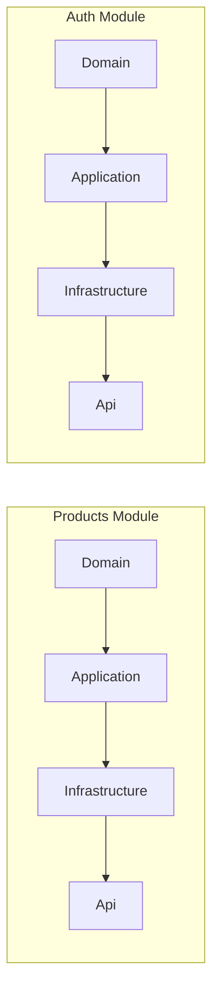
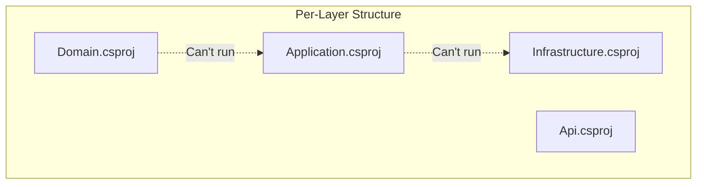
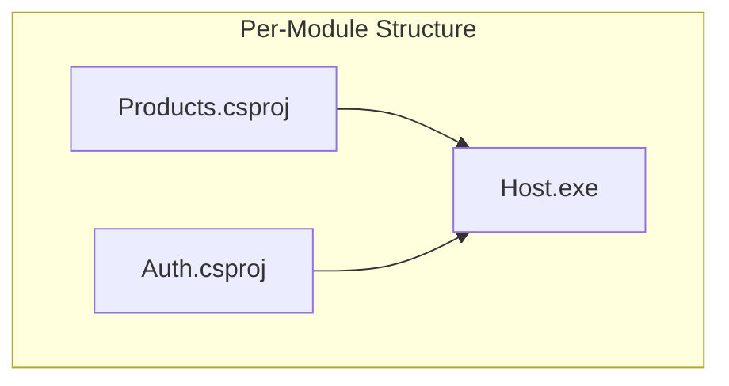
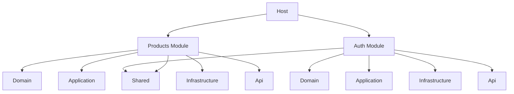
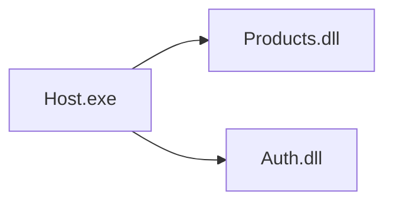
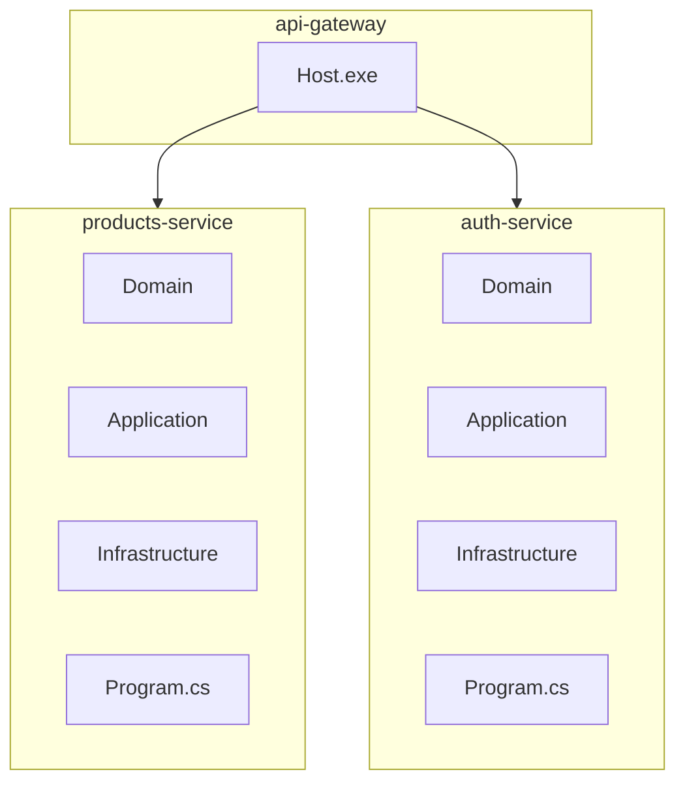

# Architecture Overview

This document explains the Clean Architecture principles and how our project is structured for modularity and scalability.

---

## What is Clean Architecture?

**Clean Architecture** (also known as Onion Architecture or Hexagonal Architecture) is a software design pattern that organizes code into layers with strict dependency rules:



**Golden Rule**: Dependencies only point INWARD. Inner layers know nothing about outer layers.

---

## Why Clean Architecture?

| Benefit | Explanation |
|---------|-------------|
| **Testability** | Handlers can be tested without database or web server |
| **Maintainability** | Changes in one layer don't ripple to others |
| **Flexibility** | Swap databases (SQL → MongoDB) without changing handlers |
| **Scalability** | Each module can become an independent microservice |

---

## CQRS + MediatR Pattern

Our architecture uses **CQRS** (Command Query Responsibility Segregation) with **MediatR** for request handling:



### Why CQRS + MediatR?

| Without MediatR | With MediatR |
|----------------|-------------|
| Controller calls Service directly | Controller just sends command |
| Business logic in service | Business logic in handlers |
| Hard to test | Easy to test handlers |
| Validation scattered | FluentValidation in validators |

---

## This Project's Architecture

### Per-Module Structure

We use a **Per-Module** structure instead of Per-Layer:



### Why Per-Module?

When extracting to microservices later, you extract the ENTIRE module (all layers together), not individual layers.

**Per-Layer (WRONG for microservices)**:



**Per-Module (CORRECT)**:



---

## Layer Responsibilities

### 1. Domain Layer (Innermost)

Contains:
- **Entities**: Core business objects (Product, User)
- **Interfaces**: Contracts for data access (IProductRepository)
- **Business Rules**: Validation logic that belongs to the entity

**Rules**:
- Zero external dependencies
- No database code
- No HTTP/framework code

```csharp
// Domain/Entities/Product.cs
namespace Modules.Products.Domain.Entities;

public class Product : BaseEntity
{
    public string Name { get; set; } = string.Empty;
    public decimal Price { get; set; }
    public string? Description { get; set; }
    public int Stock { get; set; }
}
```

### 2. Application Layer

Contains:
- **Commands**: WRITE operations (Create, Update, Delete)
- **Queries**: READ operations (Get, Search)
- **Handlers**: Business logic implementation
- **Validators**: FluentValidation rules
- **Results**: Response models

```csharp
// Application/Commands/CreateProductCommand.cs
namespace Modules.Products.Application.Commands;

using MediatR;
using Modules.Products.Application.Results;

public record CreateProductCommand(
    string Name,
    decimal Price,
    string? Description,
    int Stock
) : IRequest<ProductResult>;
```

```csharp
// Application/Queries/GetAllProductsQuery.cs
namespace Modules.Products.Application.Queries;

using MediatR;
using Modules.Products.Application.Results;

public record GetAllProductsQuery(
    int Page,
    int PageSize
) : IRequest<ProductListResult>;
```

```csharp
// Application/Handlers/CreateProductHandler.cs
namespace Modules.Products.Application.Handlers;

using MediatR;
using Modules.Products.Application.Commands;
using Modules.Products.Application.Results;
using Modules.Products.Domain.Interfaces;

public class CreateProductHandler : IRequestHandler<CreateProductCommand, ProductResult>
{
    private readonly IProductRepository _repository;

    public CreateProductHandler(IProductRepository repository)
    {
        _repository = repository;
    }

    public async Task<ProductResult> Handle(CreateProductCommand request,
        CancellationToken cancellationToken)
    {
        var product = new Product
        {
            Name = request.Name,
            Price = request.Price,
            Description = request.Description,
            Stock = request.Stock
        };

        var created = await _repository.CreateAsync(product);

        return ProductResult.Ok(new ProductDto(
            created.Id, created.Name, created.Price,
            created.Description, created.Stock,
            created.CreatedAt, created.UpdatedAt));
    }
}
```

### 3. Infrastructure Layer

Contains:
- **DbContext**: EF Core database context
- **Repositories**: Data access implementation

```csharp
// Infrastructure/Repositories/ProductRepository.cs
namespace Modules.Products.Infrastructure.Repositories;

public class ProductRepository : IProductRepository
{
    private readonly ProductsDbContext _context;

    public ProductRepository(ProductsDbContext context)
    {
        _context = context;
    }

    public async Task<List<Product>> GetAllAsync(int page, int pageSize)
    {
        return await _context.Products
            .Skip((page - 1) * pageSize)
            .Take(pageSize)
            .ToListAsync();
    }
}
```

### 4. Presentation Layer (API)

Contains:
- **Controllers**: HTTP endpoint handlers (thin, only routing)
- **Middleware**: Cross-cutting concerns

```csharp
// Api/Controllers/ProductController.cs
namespace Modules.Products.Api.Controllers;

using MediatR;
using Microsoft.AspNetCore.Authorization;
using Microsoft.AspNetCore.Mvc;
using Modules.Products.Application.Commands;
using Modules.Products.Application.Queries;

[ApiController]
[Route("api/[controller]")]
[Authorize]
public class ProductController : ControllerBase
{
    private readonly IMediator _mediator;

    public ProductController(IMediator mediator)
    {
        _mediator = mediator;
    }

    [HttpGet]
    public async Task<IActionResult> GetAll([FromQuery] int page = 1, [FromQuery] int pageSize = 10)
    {
        var result = await _mediator.Send(new GetAllProductsQuery(page, pageSize));

        if (!result.Success)
            return BadRequest(result.Error);

        return Ok(new { result.Products, result.Page, result.PageSize, result.TotalCount });
    }

    [HttpPost]
    public async Task<IActionResult> Create([FromBody] CreateProductCommand command)
    {
        var result = await _mediator.Send(command);

        if (!result.Success)
            return BadRequest(result.Error);

        return CreatedAtAction(nameof(GetById), new { id = result.Product?.Id }, result.Product);
    }
}
```

---

## Dependency Flow



---

## Module Communication

### Within Monolith

Modules communicate via **MediatR**:

```csharp
// Controller sends command/query
var result = await _mediator.Send(new CreateProductCommand(...));
```

### After Microservices Extraction

Modules communicate via **HTTP**:

```csharp
// When extracted, call via HTTP
var response = await _httpClient.PostAsJsonAsync(
    "http://products-service/api/product",
    command);
```

---

## Migration Path to Microservices

### Current (Monolith)



### After Extraction



**Steps to Extract**:

1. Move Products.csproj to `services/products/`
2. Add its own Program.cs with minimal endpoints
3. Deploy as separate container
4. Update Host to call Products via HTTP

---

## Next Steps

- See [PROJECT_STRUCTURE.md](./PROJECT_STRUCTURE.md) for file organization
- See [CQRS_MEDIATOR.md](./CQRS_MEDIATOR.md) for CQRS pattern details
- See [DATABASE.md](./DATABASE.md) for EF Core explanation
- See [AUTHENTICATION.md](./AUTHENTICATION.md) for JWT flow