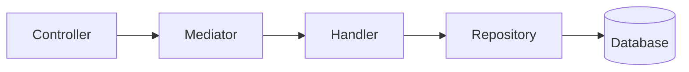
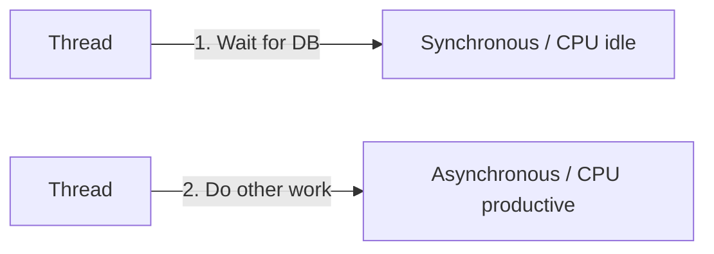
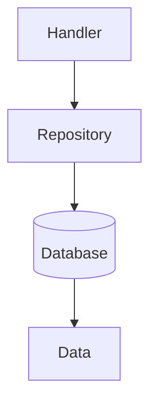
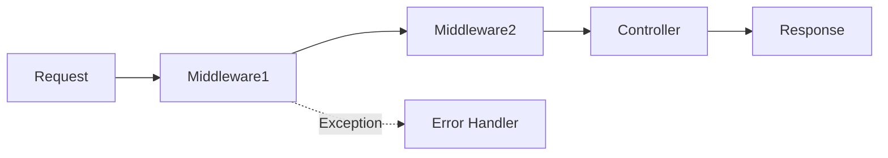

# Code Walkthrough

This document explains key code patterns with detailed examples from our CQRS + MediatR architecture.

---

## Program.cs - Entry Point

The starting point of the application:

```csharp
var builder = WebApplication.CreateBuilder(args);

// 1. Load JWT settings from appsettings.json
var jwtSettings = new JwtSettings();
builder.Configuration.GetSection(JwtSettings.SectionName).Bind(jwtSettings);
builder.Services.AddSingleton(jwtSettings);

// 2. Configure databases (In-Memory)
builder.Services.AddDbContext<ProductsDbContext>(options =>
    options.UseInMemoryDatabase("ProductsDb"));
builder.Services.AddDbContext<AuthDbContext>(options =>
    options.UseInMemoryDatabase("AuthDb"));

// 3. Configure JWT authentication
builder.Services.AddAuthentication(JwtBearerDefaults.AuthenticationScheme)
    .AddJwtBearer(options =>
    {
        options.TokenValidationParameters = new TokenValidationParameters
        {
            ValidateIssuer = true,
            ValidateAudience = true,
            ValidateLifetime = true,
            ValidateIssuerSigningKey = true,
            ValidIssuer = jwtSettings.Issuer,
            ValidAudience = jwtSettings.Audience,
            IssuerSigningKey = new SymmetricSecurityKey(
                Encoding.UTF8.GetBytes(jwtSettings.SecretKey)),
            ClockSkew = TimeSpan.Zero
        };
    });

// 4. Register MediatR and FluentValidation
builder.Services.AddMediatR(cfg =>
    cfg.RegisterServicesFromAssemblyContaining<CreateProductCommand>());
builder.Services.AddFluentValidationAutoValidation();
builder.Services.AddValidatorsFromAssemblyContaining<CreateProductValidator>();

// 5. Register repositories
builder.Services.AddScoped<IProductRepository, ProductRepository>();
builder.Services.AddScoped<IUserRepository, UserRepository>();

// 6. Register TokenService (singleton for JWT)
builder.Services.AddSingleton<ITokenService>(sp =>
    new TokenService(Encoding.UTF8.GetBytes(jwtSettings.SecretKey)));

// 7. Add Swagger/OpenAPI
builder.Services.AddEndpointsApiExplorer();
builder.Services.AddSwaggerGen();

// 8. Build the application
var app = builder.Build();

// 9. Configure middleware (order matters!)
app.UseExceptionHandlingMiddleware();
app.UseRequestLoggingMiddleware();
app.UseSwagger();
app.UseSwaggerUI();
app.UseAuthentication();
app.UseAuthorization();

// 10. Map endpoints
app.MapControllers();
app.MapGet("/", () => "Learning API - Modular Monolith");

// 11. Run the server
app.Run();
```

---

## Dependency Injection (DI)

### What is DI?

DI is a technique where dependencies are passed into a class rather than created by it:



### Constructor Injection (with MediatR)

```csharp
// Controller receives IMediator via DI container
public class ProductController : ControllerBase
{
    private readonly IMediator _mediator;

    public ProductController(IMediator mediator)
    {
        _mediator = mediator;
    }

    [HttpGet]
    public async Task<IActionResult> GetAll([FromQuery] int page = 1, [FromQuery] int pageSize = 10)
    {
        // Controller only sends, doesn't know about implementation
        var result = await _mediator.Send(new GetAllProductsQuery(page, pageSize));
        return Ok(result);
    }
}
```

### Handler Constructor Injection

```csharp
// Handler receives repository via DI
public class CreateProductHandler : IRequestHandler<CreateProductCommand, ProductResult>
{
    private readonly IProductRepository _repository;

    public CreateProductHandler(IProductRepository repository)
    {
        _repository = repository;
    }

    public async Task<ProductResult> Handle(CreateProductCommand request,
        CancellationToken cancellationToken)
    {
        // Business logic here
    }
}
```

### Service Registration

```csharp
// In Program.cs - MediatR registration
builder.Services.AddMediatR(cfg =>
    cfg.RegisterServicesFromAssemblyContaining<CreateProductCommand>());

// Repository registration
builder.Services.AddScoped<IProductRepository, ProductRepository>();
```

### Lifetime Scopes

| Registration | Created | Use Case |
|--------------|---------|----------|
| `AddSingleton` | Once at startup | Settings, TokenService |
| `AddScoped` | Once per HTTP request | DbContext, Repositories, Handlers |
| `AddTransient` | Every time called | Lightweight utilities |

---

## Async/Await Pattern

### Why Async?



### Async Pattern

```csharp
// Asynchronous (non-blocking)
public async Task<Product> GetByIdAsync(int id)
{
    await Task.Delay(1000);  // Frees thread
    return await _context.Products.FindAsync(id);
}
```

### Async Rules

1. **Use `async` all the way** - don't mix sync/async
2. **Return `Task<T>`** - not `T` directly
3. **Use `await`** - on every async call

---

## CQRS Pattern

### Command (WRITE)

```csharp
// Application/Commands/CreateProductCommand.cs
public record CreateProductCommand(
    string Name,
    decimal Price,
    string? Description,
    int Stock
) : IRequest<ProductResult>;
```

### Query (READ)

```csharp
// Application/Queries/GetAllProductsQuery.cs
public record GetAllProductsQuery(
    int Page,
    int PageSize
) : IRequest<ProductListResult>;
```

### Results (Response Models)

```csharp
// Application/Results.cs
public record ProductResult(
    bool Success,
    ProductDto? Product,
    string? Error
)
{
    public static ProductResult Ok(ProductDto product) => new(true, product, null);
    public static ProductResult NotFound(string error) => new(false, null, error);
}

public record ProductDto(
    int Id,
    string Name,
    decimal Price,
    string? Description,
    int Stock,
    DateTime CreatedAt,
    DateTime UpdatedAt
);
```

---

## Repository Pattern

### Interface (Domain Layer)

```csharp
// Domain/Interfaces/IProductRepository.cs
public interface IProductRepository
{
    Task<List<Product>> GetAllAsync(int page, int pageSize);
    Task<Product?> GetByIdAsync(int id);
    Task<Product> CreateAsync(Product product);
    Task<Product?> UpdateAsync(int id, Product product);
    Task<bool> DeleteAsync(int id);
    Task<List<Product>> SearchAsync(string name);
}
```

### Implementation (Infrastructure Layer)

```csharp
// Infrastructure/Repositories/ProductRepository.cs
public class ProductRepository : IProductRepository
{
    private readonly ProductsDbContext _context;

    public ProductRepository(ProductsDbContext context)
    {
        _context = context;
    }

    public async Task<List<Product>> GetAllAsync(int page, int pageSize)
    {
        return await _context.Products
            .Skip((page - 1) * pageSize)
            .Take(pageSize)
            .ToListAsync();
    }
}
```

### Why Repository?



| With Repository | Without Repository |
|-----------------|---------------|
| Abstracted | Direct DbContext |
| Easy to test | Hard to mock |
| Can swap DB | Coupled to EF |

---

## DTOs (Data Transfer Objects)

### What is a DTO?

DTOs are simplified objects for API responses:

```csharp
// Entity (database)
public class Product : BaseEntity
{
    public string Name { get; set; } = string.Empty;
    public decimal Price { get; set; }
    public string? Description { get; set; }
    public int Stock { get; set; }
}

// DTO (API response)
public record ProductDto(
    int Id,
    string Name,
    decimal Price,
    string? Description,
    int Stock,
    DateTime CreatedAt,
    DateTime UpdatedAt
);
```

### Why DTOs?

- **Hide internal structure** - Don't expose DB schema
- **Shape data** - Different response from DB entity
- **Versioning** - Easy to change without breaking
- **Security** - Don't expose sensitive fields

---

## Controller Pattern (CQRS)

### Basic Structure

```csharp
[ApiController]          // Enables API conventions
[Route("api/[controller]")] // Route: /api/product
[Authorize]              // Requires auth
public class ProductController : ControllerBase
{
    private readonly IMediator _mediator;

    public ProductController(IMediator mediator)
    {
        _mediator = mediator;
    }

    [HttpGet]
    public async Task<IActionResult> GetAll(
        [FromQuery] int page = 1,
        [FromQuery] int pageSize = 10)
    {
        var result = await _mediator.Send(new GetAllProductsQuery(page, pageSize));

        if (!result.Success)
            return BadRequest(result.Error);

        return Ok(new {
            result.Products,
            result.Page,
            result.PageSize,
            result.TotalCount
        });
    }

    [HttpPost]
    public async Task<IActionResult> Create([FromBody] CreateProductCommand command)
    {
        var result = await _mediator.Send(command);

        if (!result.Success)
            return BadRequest(result.Error);

        return CreatedAtAction(nameof(GetById), new { id = result.Product?.Id }, result.Product);
    }
}
```

### HTTP Method Attributes

| Attribute | HTTP Method | Purpose |
|----------|------------|---------|
| `[HttpGet]` | GET | Read |
| `[HttpPost]` | POST | Create |
| `[HttpPut]` | PUT | Update (full) |
| `[HttpPatch]` | PATCH | Update (partial) |
| `[HttpDelete]` | DELETE | Delete |

### Parameter Binding

| Attribute | Source | Example |
|----------|--------|---------|
| `[FromRoute]` | URL path | `/product/{id}` |
| `[FromQuery]` | Query string | `/product?id=1` |
| `[FromBody]` | Request body | POST JSON |

---

## Handler Pattern

### Command Handler

```csharp
// Handlers/CreateProductHandler.cs
public class CreateProductHandler : IRequestHandler<CreateProductCommand, ProductResult>
{
    private readonly IProductRepository _repository;

    public CreateProductHandler(IProductRepository repository)
    {
        _repository = repository;
    }

    public async Task<ProductResult> Handle(CreateProductCommand request,
        CancellationToken cancellationToken)
    {
        var product = new Product
        {
            Name = request.Name,
            Price = request.Price,
            Description = request.Description,
            Stock = request.Stock
        };

        var created = await _repository.CreateAsync(product);

        return ProductResult.Ok(new ProductDto(
            created.Id, created.Name, created.Price,
            created.Description, created.Stock,
            created.CreatedAt, created.UpdatedAt));
    }
}
```

### Query Handler

```csharp
// Handlers/GetAllProductsHandler.cs
public class GetAllProductsHandler : IRequestHandler<GetAllProductsQuery, ProductListResult>
{
    private readonly IProductRepository _repository;

    public GetAllProductsHandler(IProductRepository repository)
    {
        _repository = repository;
    }

    public async Task<ProductListResult> Handle(GetAllProductsQuery request,
        CancellationToken cancellationToken)
    {
        var products = await _repository.GetAllAsync(request.Page, request.PageSize);

        var dtos = products.Select(p => new ProductDto(
            p.Id, p.Name, p.Price, p.Description, p.Stock,
            p.CreatedAt, p.UpdatedAt
        )).ToList();

        return ProductListResult.Ok(dtos, request.Page, request.PageSize, dtos.Count);
    }
}
```

---

## FluentValidation

### Validator Example

```csharp
// Validators/CreateProductValidator.cs
public class CreateProductValidator : AbstractValidator<CreateProductCommand>
{
    public CreateProductValidator()
    {
        RuleFor(x => x.Name)
            .NotEmpty().WithMessage("Name is required")
            .MaximumLength(100);

        RuleFor(x => x.Price)
            .GreaterThan(0).WithMessage("Price must be greater than 0");

        RuleFor(x => x.Stock)
            .GreaterThanOrEqualTo(0);
    }
}
```

### Registration

```csharp
// In Program.cs
builder.Services.AddFluentValidationAutoValidation();
builder.Services.AddValidatorsFromAssemblyContaining<CreateProductValidator>();
```

---

## Records (C# 9+)

### Why Records?

```csharp
// ❌ Class (mutable)
public class ProductDto
{
    public int Id { get; set; }
    public string Name { get; set; }
}

// ✅ Record (immutable, with value equality)
public record ProductDto(
    int Id,
    string Name,
    decimal Price);
```

| Feature | Class | Record |
|--------|------|--------|
| Mutability | Yes | No (immutable) |
| Value equality | Reference | Yes (compares values) |
| Conciseness | Verbose | Yes (one-liner) |

---

## Middleware Pattern

### Custom Middleware

```csharp
// Middleware class
public class RequestLoggingMiddleware
{
    private readonly RequestDelegate _next;
    private readonly ILogger<RequestLoggingMiddleware> _logger;

    public RequestLoggingMiddleware(RequestDelegate next, ILogger<RequestLoggingMiddleware> logger)
    {
        _next = next;
        _logger = logger;
    }

    public async Task InvokeAsync(HttpContext context)
    {
        _logger.LogInformation("Request: {Method} {Path}",
            context.Request.Method,
            context.Request.Path);

        await _next(context);

        _logger.LogInformation("Response: {StatusCode}",
            context.Response.StatusCode);
    }
}
```

### Middleware Flow



---

## Next Steps

- See [CQRS_MEDIATOR.md](./CQRS_MEDIATOR.md) for detailed CQRS pattern
- See [QUICK_REFERENCE.md](./QUICK_REFERENCE.md) for commands
- See [SETTINGS.md](./SETTINGS.md) for configuration
- See [AUTHENTICATION.md](./AUTHENTICATION.md) for JWT details