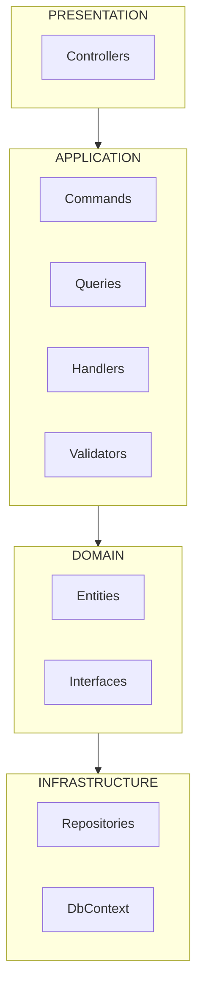
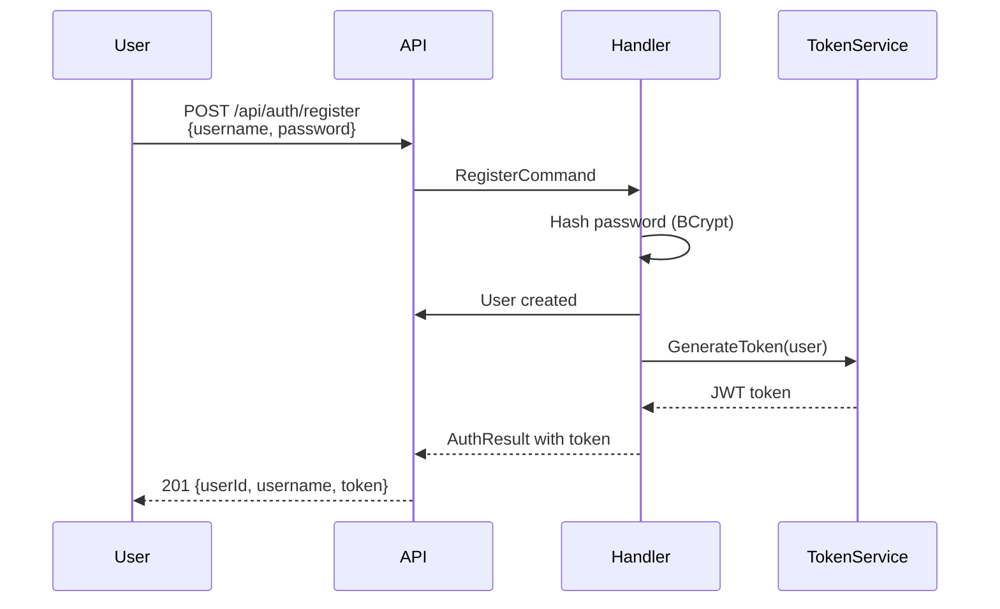

# Complete Guide

This is the comprehensive guide for the Learning API - a modular monolith with Clean Architecture and CQRS + MediatR pattern.

---

## Table of Contents

1. [Architecture](#architecture)
2. [Project Structure](#project-structure)
3. [CQRS Pattern](#cqrs-pattern)
4. [Authentication](#authentication)
5. [Getting Started](#getting-started)
6. [Testing](#testing)

---

## Architecture

### Clean Architecture

Our project follows **Clean Architecture** principles:



### Key Patterns

| Pattern | Purpose |
|---------|---------|
| **CQRS** | Separate READ from WRITE operations |
| **MediatR** | Decouple controller from business logic |
| **Repository** | Abstract database access |
| **FluentValidation** | Declarative validation |

---

## Project Structure

### Modules

```
src/
├── Host/                    ← Web server (Program.cs)
├── Modules/
│   ├── Products/           ← Products module
│   └── Auth/               ← Auth module
└── Shared/                 ← Shared code (BaseEntity)
```

### Products Module (CQRS)

```
Products/
├── Domain/
│   ├── Entities/Product.cs
│   └── Interfaces/IProductRepository.cs
├── Application/
│   ├── Commands/           ← WRITE (Create, Update, Delete)
│   ├── Queries/            ← READ (GetAll, GetById, Search)
│   ├── Handlers/          ← Business logic
│   ├── Validators/        ← FluentValidation
│   └── Results.cs         ← Response models
├��─ Infrastructure/
│   ├── Data/ProductsDbContext.cs
│   └── Repositories/ProductRepository.cs
└── Api/
    └── Controllers/ProductController.cs
```

### Auth Module (CQRS)

```
Auth/
├── Domain/
│   ├── Entities/User.cs
│   └── Interfaces/IUserRepository.cs
├── Application/
│   ├── Commands/           ← Register, Login
│   ├── Handlers/          ← Auth handlers
│   ├── Validators/        ← FluentValidation
│   └── Results.cs         ← Auth response
├── Infrastructure/
│   ├── Data/AuthDbContext.cs
│   ├── Repositories/UserRepository.cs
│   └── Services/TokenService.cs
└── Api/
    └── Controllers/AuthController.cs
```

---

## CQRS Pattern

### Commands (WRITE)

```csharp
// Create a product
public record CreateProductCommand(
    string Name,
    decimal Price,
    string? Description,
    int Stock
) : IRequest<ProductResult>;

// Update a product
public record UpdateProductCommand(
    int Id,
    string Name,
    decimal Price,
    string? Description,
    int Stock
) : IRequest<ProductResult>;

// Delete a product
public record DeleteProductCommand(int Id) : IRequest<ProductResult>;
```

### Queries (READ)

```csharp
// Get all products (paginated)
public record GetAllProductsQuery(
    int Page,
    int PageSize
) : IRequest<ProductListResult>;

// Get product by ID
public record GetProductByIdQuery(int Id) : IRequest<ProductResult>;

// Search products
public record SearchProductsQuery(string Name) : IRequest<ProductListResult>;
```

### Handlers

```csharp
public class CreateProductHandler : IRequestHandler<CreateProductCommand, ProductResult>
{
    private readonly IProductRepository _repository;

    public CreateProductHandler(IProductRepository repository)
    {
        _repository = repository;
    }

    public async Task<ProductResult> Handle(CreateProductCommand request,
        CancellationToken cancellationToken)
    {
        var product = new Product
        {
            Name = request.Name,
            Price = request.Price,
            Description = request.Description,
            Stock = request.Stock
        };

        var created = await _repository.CreateAsync(product);

        return ProductResult.Ok(new ProductDto(
            created.Id, created.Name, created.Price,
            created.Description, created.Stock,
            created.CreatedAt, created.UpdatedAt));
    }
}
```

### Controller (MediatR)

```csharp
public class ProductController : ControllerBase
{
    private readonly IMediator _mediator;

    public ProductController(IMediator mediator)
    {
        _mediator = mediator;
    }

    [HttpPost]
    public async Task<IActionResult> Create([FromBody] CreateProductCommand command)
    {
        var result = await _mediator.Send(command);

        if (!result.Success)
            return BadRequest(result.Error);

        return CreatedAtAction(nameof(GetById), new { id = result.Product?.Id }, result.Product);
    }
}
```

---

## Authentication

### JWT Flow



### Token Claims

```csharp
var claims = new[]
{
    new Claim(ClaimTypes.NameIdentifier, user.Id.ToString()),
    new Claim(ClaimTypes.Name, user.Username),
    new Claim(ClaimTypes.Email, user.Email),
    new Claim(ClaimTypes.Role, user.Role),
    new Claim(JwtRegisteredClaimNames.Jti, Guid.NewGuid().ToString())
};
```

### Security

| Feature | Implementation |
|---------|-------------|
| Password Hashing | BCrypt (work factor 12) |
| Token Expiry | 30 minutes |
| ClockSkew | TimeSpan.Zero |
| Algorithm | HmacSha256 |

---

## Getting Started

### Prerequisites

- .NET 10 SDK
- VS Code or Visual Studio

### Build & Run

```bash
# Clone and navigate
cd asp.net-learning

# Build
dotnet build

# Run
dotnet run --project src/Host

# Test in browser
open http://localhost:5000/swagger
```

### Test Auth

```bash
# Register
curl -X POST http://localhost:5000/api/auth/register \
  -H "Content-Type: application/json" \
  -d '{"username":"john","password":"password123","email":"john@example.com"}'

# Login
curl -X POST http://localhost:5000/api/auth/login \
  -H "Content-Type: application/json" \
  -d '{"username":"john","password":"password123"}'
```

### Test Products

```bash
# Create product (with token)
curl -X POST http://localhost:5000/api/product \
  -H "Authorization: Bearer YOUR_TOKEN" \
  -H "Content-Type: application/json" \
  -d '{"name":"Laptop","price":999.99,"description":"High-performance","stock":50}'

# Get all products
curl http://localhost:5000/api/product \
  -H "Authorization: Bearer YOUR_TOKEN"
```

---

## Testing

### HTTP Files

VS Code REST Client extension files in `src/Host/http/`:

- `auth.http` - Auth endpoints
- `product.http` - Product endpoints

```bash
# Run from VS Code
# Open auth.http and click "Send Request"
```

### Manual Testing

1. Start the app: `dotnet run --project src/Host`
2. Open Swagger: http://localhost:5000/swagger
3. Register a user
4. Login to get token
5. Use token for protected endpoints

---

## API Endpoints

### Auth (No auth required)

| Method | Endpoint | Description |
|--------|----------|-------------|
| POST | `/api/auth/register` | Register new user |
| POST | `/api/auth/login` | Login and get token |

### Products (Auth required)

| Method | Endpoint | Description |
|--------|----------|-------------|
| GET | `/api/product` | Get all (paginated) |
| GET | `/api/product/{id}` | Get by ID |
| POST | `/api/product` | Create product |
| PUT | `/api/product/{id}` | Update product |
| DELETE | `/api/product/{id}` | Delete product |
| GET | `/api/product/search?name=X` | Search by name |

---

## Next Steps

| Document | Description |
|----------|-------------|
| [ARCHITECTURE.md](./ARCHITECTURE.md) | Architecture details |
| [CQRS_MEDIATOR.md](./CQRS_MEDIATOR.md) | CQRS pattern |
| [CODE_WALKTHROUGH.md](./CODE_WALKTHROUGH.md) | Code patterns |
| [AUTHENTICATION.md](./AUTHENTICATION.md) | JWT flow |
| [DATABASE.md](./DATABASE.md) | EF Core |
| [ENDPOINTS.md](./ENDPOINTS.md) | API endpoints |
| [PROJECT_STRUCTURE.md](./PROJECT_STRUCTURE.md) | File structure |
| [QUICK_REFERENCE.md](./QUICK_REFERENCE.md) | Quick reference |
| [REQUEST_FLOW.md](./REQUEST_FLOW.md) | Request flow |
| [SETTINGS.md](./SETTINGS.md) | Configuration |
| [COMPILATION.md](./COMPILATION.md) | Build process |