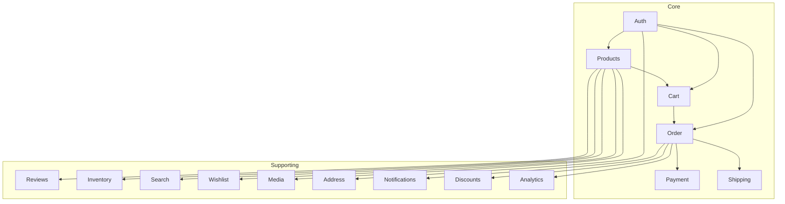

# Low Level Design (LLD) - Complete Index

---

## Overview

This directory contains Low Level Design documents for all e-commerce system components. Each document includes:
- **Use Cases** - Business requirements with flows
- **Class Diagrams** - Object structure and relationships
- **Sequence Diagrams** - Object interactions
- **State Diagrams** - Object lifecycle (where applicable)
- **Class Responsibilities** - SOLID-aligned responsibilities
- **Design Patterns** - Applied patterns
- **SOLID Compliance** - Principle verification

---

## Core Documents

| Document | File | Description |
|----------|------|-------------|
| **Complete System** | [LLD_SYSTEM.md](./LLD_SYSTEM.md) | All modules connected, cross-module sequences |
| **Module Index** | This file | All components summary |

---

## Core Business Modules

| Component | File | Use Cases | State Diagram |
|-----------|------|----------|-------------|
| **Auth** | [LLD_AUTH.md](./LLD_AUTH.md) | 3 | - |
| **Products** | [LLD_PRODUCTS.md](./LLD_PRODUCTS.md) | 6 | - |
| **Cart** | [LLD_CART.md](./LLD_CART.md) | 5 | ✅ |
| **Order** | [LLD_ORDER.md](./LLD_ORDER.md) | 6 | ✅ |
| **Category** | [LLD_CATEGORY.md](./LLD_CATEGORY.md) | 6 | ✅ |
| **Payment** | [LLD_PAYMENT.md](./LLD_PAYMENT.md) | 4 | ✅ |
| **Shipping** | [LLD_SHIPPING.md](./LLD_SHIPPING.md) | 5 | ✅ |

---

## Supporting Modules

| Component | File | Use Cases | State Diagram |
|-----------|------|----------|-------------|
| **Reviews** | [Reviews.md](./Reviews.md) | 5 | ✅ |
| **Inventory** | [Inventory.md](./Inventory.md) | 5 | ✅ |
| **Address** | [Address.md](./Address.md) | 5 | - |
| **Notifications** | [Notifications.md](./Notifications.md) | 5 | - |
| **Search** | [Search.md](./Search.md) | 4 | - |
| **Discounts** | [Discounts.md](./Discounts.md) | 5 | - |
| **Analytics** | [Analytics.md](./Analytics.md) | 5 | - |
| **Media** | [Media.md](./Media.md) | 4 | - |
| **Wishlist** | [Wishlist.md](./Wishlist.md) | 5 | - |

---

## Module Statistics

| Category | Count |
|-----------|-------|
| **Core Modules** | 7 |
| **Supporting Modules** | 9 |
| **Total Components** | 16 |
| **Total Use Cases** | 50+ |

---

## Component Relationships

---

## Design Patterns Used

| Pattern | Modules |
|---------|---------|
| **CQRS** | Products, Cart, Order, Address, Reviews, Discounts, Analytics |
| **Repository** | All modules |
| **Service Layer** | All modules |
| **State Machine** | Cart, Order, Payment, Shipping, Reviews |
| **Strategy** | Payment (gateways), Notifications, Media |
| **Observer** | Notifications, Analytics |
| **Factory** | Auth (tokens), Media (thumbnails) |
| **Composite** | Category (tree) |
| **Adapter** | Media (S3/Cloudflare), Notifications |

---

## SOLID Compliance Summary

| Component | S | O | L | I | D |
|-----------|---|---|---|---|---|
| Auth | ✅ | ✅ | ✅ | ✅ | ✅ |
| Products | ✅ | ✅ | ✅ | ✅ | ✅ |
| Cart | ✅ | ✅ | ✅ | ✅ | ✅ |
| Order | ✅ | ✅ | ✅ | ✅ | ✅ |
| Category | ✅ | ✅ | ✅ | ✅ | ✅ |
| Payment | ✅ | ✅ | ✅ | ✅ | ✅ |
| Shipping | ✅ | ✅ | ✅ | ✅ | ✅ |
| Reviews | ✅ | ✅ | ✅ | ✅ | ✅ |
| Inventory | ✅ | ✅ | ✅ | ✅ | ✅ |
| Address | ✅ | ✅ | ✅ | ✅ | ✅ |
| Notifications | ✅ | ✅ | ✅ | ✅ | ✅ |
| Search | ✅ | ✅ | ✅ | ✅ | ✅ |
| Discounts | ✅ | ✅ | ✅ | ✅ | ✅ |
| Analytics | ✅ | ✅ | ✅ | ✅ | ✅ |
| Media | ✅ | ✅ | ✅ | ✅ | ✅ |
| Wishlist | ✅ | ✅ | ✅ | ✅ | ✅ |

---

## Implementation Priority

| Priority | Components |
|----------|-------------|
| **Phase 1** | Auth, Products, Category, Inventory |
| **Phase 2** | Cart, Order, Address |
| **Phase 3** | Payment, Shipping, Reviews |
| **Phase 4** | Notifications, Search, Media |
| **Phase 5** | Discounts, Wishlist, Analytics |

---

*See [DB_DESIGN.md](../Database/DB_DESIGN.md) for database design*
*See [ARCHITECTURE.md](../Guides/ARCHITECTURE.md) for module structure*