# Low Level Design - Complete System

---

## Table of Contents

1. [System Overview](#1-system-overview)
2. [Module Communication Map](#2-module-communication-map)
3. [Cross-Module Sequences](#3-cross-module-sequences)
4. [Shared Components](#4-shared-components)
5. [Data Flow Architecture](#5-data-flow-architecture)
6. [Event Communication](#6-event-communication)
7. [Integration Points](#7-integration-points)

---

## 1. System Overview

### 1.1 Complete Module Map

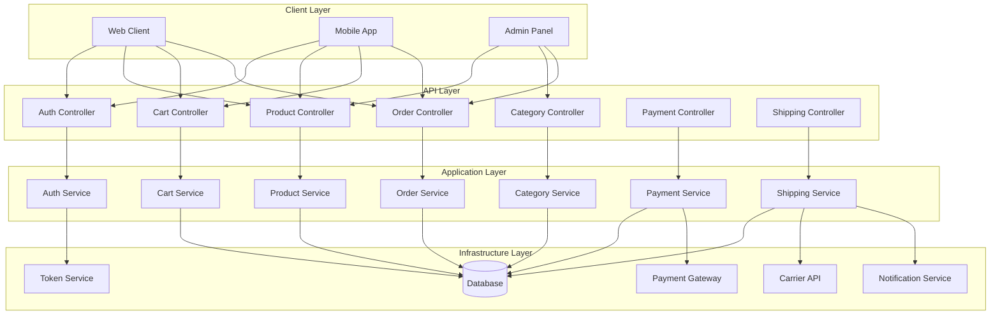

---

## 2. Module Communication Map

### 2.1 Module Dependencies

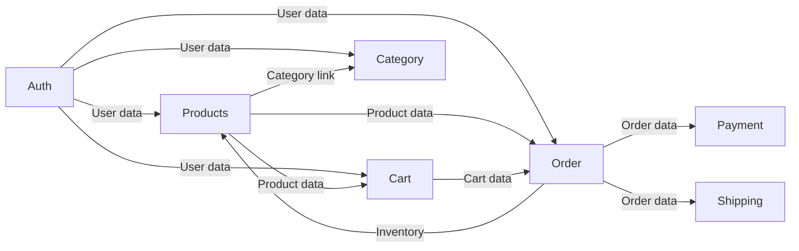

### 2.2 Dependency Table

| Module | Depends On | Provides To |
|--------|------------|-------------|
| **Auth** | None | Products, Cart, Order, Category |
| **Products** | None | Cart, Order, Category |
| **Category** | None | Products |
| **Cart** | Auth, Products | Order |
| **Order** | Auth, Cart, Products, Category | Payment, Shipping |
| **Payment** | Order | None |
| **Shipping** | Order, Auth | None |

### 2.3 Service Communication Matrix

| Consumer | Auth | Products | Category | Cart | Order | Payment | Shipping |
|-----------|------|----------|----------|------|-------|---------|----------|
| **AuthService** | - | ❌ | ❌ | ❌ | ❌ | ❌ | ❌ |
| **ProductService** | UserId validation | - | Category lookup | Product lookup | Product lookup | ❌ | ❌ |
| **CategoryService** | UserId validation | Category link | - | ❌ | ❌ | ❌ | ❌ |
| **CartService** | UserId, Session | Product lookup | ❌ | - | Cart data | ❌ | ❌ |
| **OrderService** | UserId | Inventory decrement | Product data | Cart lookup | - | Payment create | Shipment create |
| **PaymentService** | ❌ | ❌ | ❌ | ❌ | Order lookup | - | ❌ |
| **ShippingService** | UserId | ❌ | ❌ | ❌ | Order lookup | ❌ | - |

---

## 3. Cross-Module Sequences

### 3.1 Complete Checkout Flow

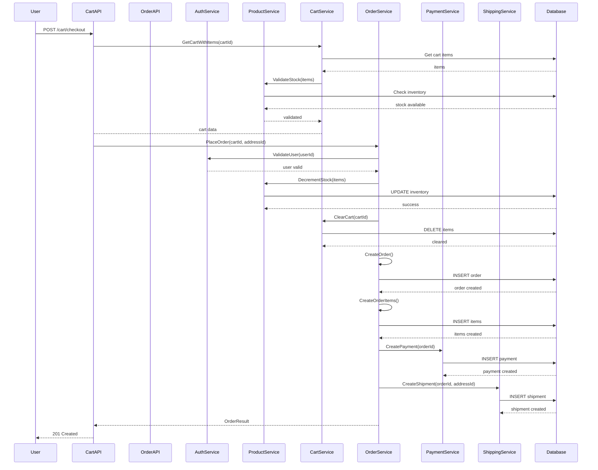

### 3.2 Product Browse Flow

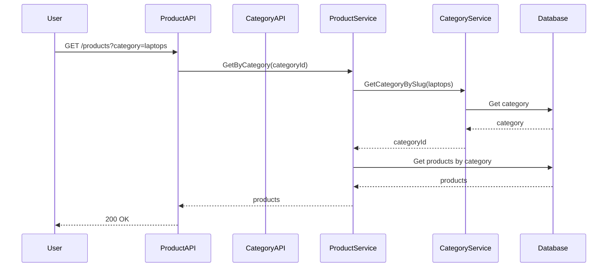

### 3.3 User Registration to First Order

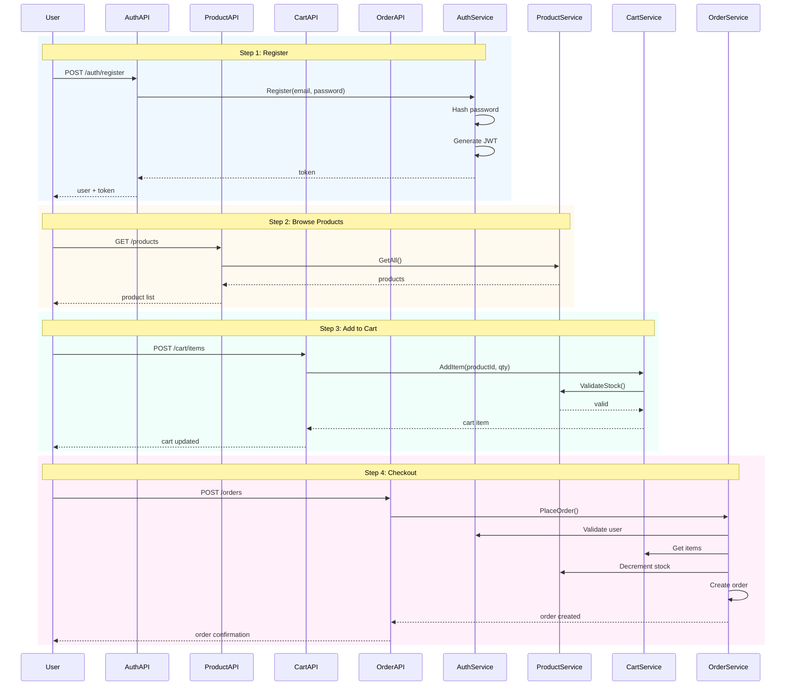

---

## 4. Shared Components

### 4.1 Cross-Cutting Concerns

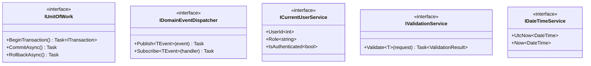

### 4.2 Shared DTOs

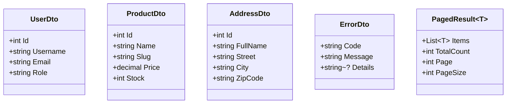

---

## 5. Data Flow Architecture

### 5.1 Read Paths (Queries)

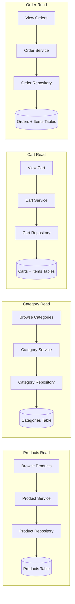

### 5.2 Write Paths (Commands)

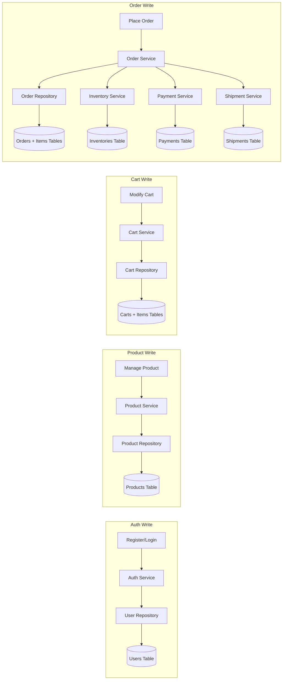

### 5.3 Event-Driven Paths

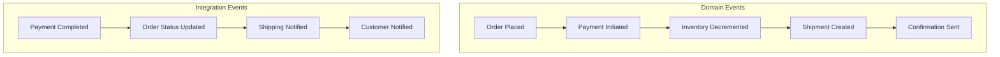

---

## 6. Event Communication

### 6.1 Domain Events

```csharp
// Published by OrderService when order is placed
public record OrderPlacedEvent : INotification {
    public int OrderId { get; init; }
    public int UserId { get; init; }
    public decimal TotalAmount { get; init; }
}

// Published by PaymentService when payment completes
public record PaymentCompletedEvent : INotification {
    public int PaymentId { get; init; }
    public int OrderId { get; init; }
    public bool Success { get; init; }
}

// Published by ShippingService when shipped
public record ShipmentShippedEvent : INotification {
    public int ShipmentId { get; init; }
    public int OrderId { get; init; }
    public string TrackingNumber { get; init; }
}
```

### 6.2 Event Handlers

```csharp
// Handle OrderPlacedEvent -> Create Payment
public class OrderPlacedPaymentHandler : INotificationHandler<OrderPlacedEvent> {
    public async Task Handle(OrderPlacedEvent notification, CancellationToken ct) {
        // Create pending payment record
    }
}

// Handle OrderPlacedEvent -> Decrement Inventory
public class OrderPlacedInventoryHandler : INotificationHandler<OrderPlacedEvent> {
    public async Task Handle(OrderPlacedEvent notification, CancellationToken ct) {
        // Decrement stock for each item
    }
}

// Handle OrderPlacedEvent -> Create Shipment
public class OrderPlacedShipmentHandler : INotificationHandler<OrderPlacedEvent> {
    public async Task Handle(OrderPlacedEvent notification, CancellationToken ct) {
        // Create shipment record
    }
}

// Handle PaymentCompletedEvent -> Update Order Status
public class PaymentCompletedOrderHandler : INotificationHandler<PaymentCompletedEvent> {
    public async Task Handle(PaymentCompletedEvent notification, CancellationToken ct) {
        // Update order to Confirmed status
    }
}
```

### 6.3 Event Flow Diagram

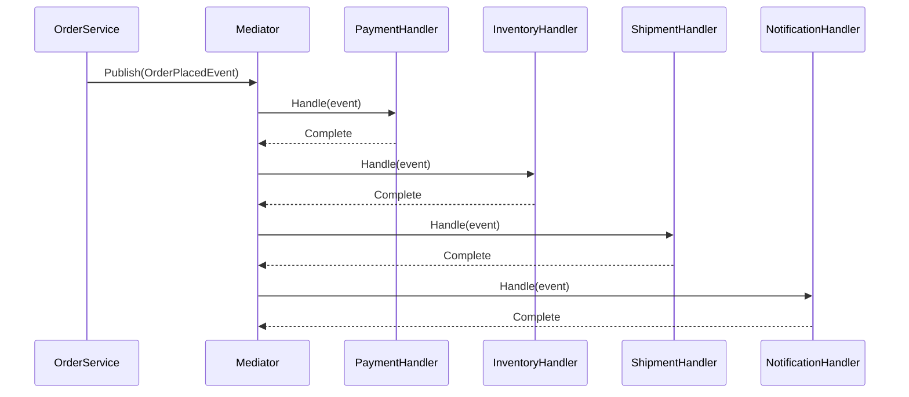

---

## 7. Integration Points

### 7.1 External Services

| Service | Integration Type | Purpose |
|---------|----------------|---------|
| **Stripe/PayPal** | API Gateway | Payment processing |
| **UPS/FedEx/DHL** | Carrier API | Shipping labels + tracking |
| **SendGrid/SNS** | Notification API | Email/SMS notifications |
| **S3/Cloudflare** | Storage CDN | Image serving |

### 7.2 Service Adapters

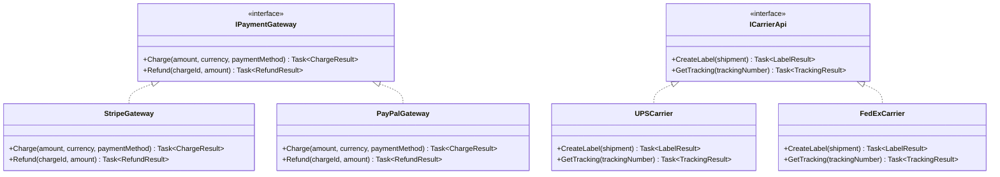

### 7.3 Database Integration

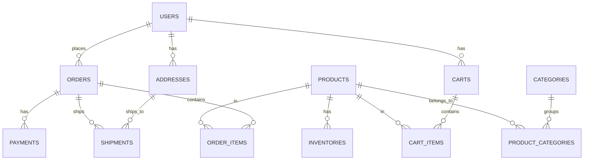

---

## Appendix: Module Communication Summary

### User Journeys

| Step | Module | Operation |
|------|--------|-----------|
| 1 | Auth | Register/Login |
| 2 | Products | Browse/Search |
| 3 | Category | Browse categories |
| 4 | Products | View product detail |
| 5 | Cart | Add to cart |
| 6 | Cart | Update quantity |
| 7 | Cart | View cart |
| 8 | Order | Place order |
| 9 | Order | Inventory validation |
| 10 | Order | Create order |
| 11 | Order | Clear cart |
| 12 | Payment | Process payment |
| 13 | Shipping | Create shipment |
| 14 | Shipping | Track shipment |

### Error Flows

| Error | Module | Response |
|-------|--------|----------|
| Invalid credentials | Auth | 401 Unauthorized |
| Product not found | Products | 404 Not Found |
| Out of stock | Products | 400 Bad Request |
| Empty cart | Cart | 400 Bad Request |
| Cart item stale | Cart | 409 Conflict |
| Insufficient inventory | Order | 400 Bad Request |
| Payment failed | Payment | 400 Bad Request |
| Shipping failed | Shipping | 400 Bad Request |

---

*See [LLD_INDEX.md](./LLD_INDEX.md) for individual module details*
*See [DB_DESIGN.md](../Database/DB_DESIGN.md) for database schema*