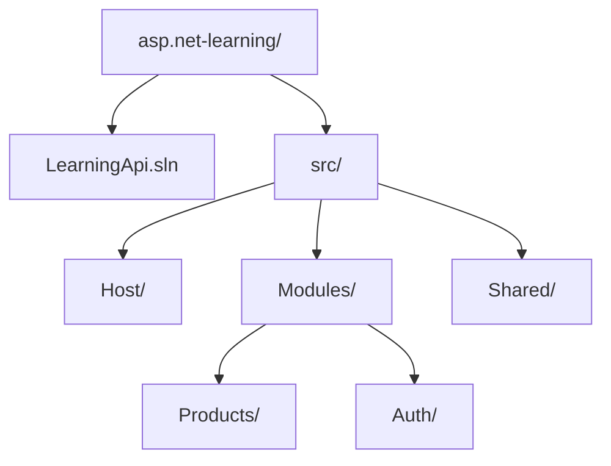
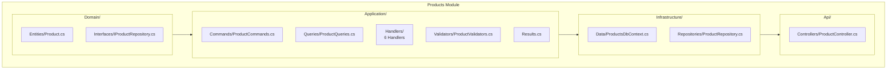
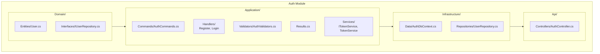

# Project Structure

This document describes the complete folder and file organization of the project.

---

## Root Structure



---

## Solution File (LearningApi.sln)

The `.sln` file contains all projects:

```bash
$ dotnet sln list
Project(s)
----------
src/Host/Host.csproj
src/Modules/Auth/Auth.csproj
src/Modules/Products/Products.csproj
src/Shared/Shared.csproj
```

---

## Products Module Structure



### Products Module Folders

| Folder | Contents |
|--------|---------|
| `Domain/Entities/` | Product entity |
| `Domain/Interfaces/` | IProductRepository |
| `Application/Commands/` | Create, Update, Delete commands |
| `Application/Queries/` | GetAll, GetById, Search queries |
| `Application/Handlers/` | Business logic (6 handlers) |
| `Application/Validators/` | FluentValidation rules |
| `Application/Results/` | ProductResult, ProductDto |
| `Infrastructure/Data/` | ProductsDbContext |
| `Infrastructure/Repositories/` | ProductRepository |
| `Api/Controllers/` | ProductController |

---

## Auth Module Structure



### Auth Module Folders

| Folder | Contents |
|--------|---------|
| `Domain/Entities/` | User entity |
| `Domain/Interfaces/` | IUserRepository |
| `Application/Commands/` | Register, Login commands |
| `Application/Handlers/` | Register, Login handlers |
| `Application/Validators/` | FluentValidation rules |
| `Application/Results/` | AuthResult, AuthDto |
| `Application/Services/` | ITokenService, TokenService |
| `Infrastructure/Data/` | AuthDbContext |
| `Infrastructure/Repositories/` | UserRepository |
| `Api/Controllers/` | AuthController |

---

## Host Project Structure

```
src/Host/
├── Host.csproj
├── Program.cs                 ← Entry point
├── appsettings.json
├── appsettings.Development.json
├── Properties/
│   └── launchSettings.json
├── Configuration/
│   └── JwtSettings.cs
├── Middleware/
│   ├── RequestLoggingMiddleware.cs
│   └── ExceptionHandlingMiddleware.cs
└── http/                  ← REST client test files
    ├── auth.http
    └── product.http
```

### Host.csproj

```xml
<Project Sdk="Microsoft.NET.Sdk.Web">
  <PropertyGroup>
    <TargetFramework>net10.0</TargetFramework>
    <ImplicitUsings>enable</ImplicitUsings>
    <Nullable>enable</Nullable>
  </PropertyGroup>

  <ItemGroup>
    <PackageReference Include="Microsoft.AspNetCore.Authentication.JwtBearer" Version="10.0.0" />
    <PackageReference Include="Microsoft.EntityFrameworkCore.InMemory" Version="10.0.0" />
    <PackageReference Include="Swashbuckle.AspNetCore" Version="7.0.0" />
  </ItemGroup>

  <ItemGroup>
    <ProjectReference Include="..\Modules\Products\Products.csproj" />
    <ProjectReference Include="..\Modules\Auth\Auth.csproj" />
  </ItemGroup>
</Project>
```

---

## Shared Project Structure

```
src/Shared/
├── Shared.csproj
└── Kernel/
    └── BaseEntity.cs           ← Base class for all entities
```

---

## Key Files Explained

### .csproj Files

| File | Purpose | SDK Type |
|------|---------|---------|
| `Host.csproj` | Web server entry point | `Microsoft.NET.Sdk.Web` |
| `Products.csproj` | Products module | `Microsoft.NET.Sdk` |
| `Auth.csproj` | Auth module | `Microsoft.NET.Sdk` |
| `Shared.csproj` | Shared utilities | `Microsoft.NET.Sdk` |

### Required Packages

| Package | Version | Purpose |
|---------|---------|---------|
| `MediatR` | 12.4.1 | CQRS mediator |
| `FluentValidation.AspNetCore` | 11.3.0 | Validation |
| `Microsoft.EntityFrameworkCore` | 10.0.0 | ORM |
| `BCrypt.Net-Next` | 4.1.0 | Password hashing |
| `System.IdentityModel.Tokens.Jwt` | 8.3.1 | JWT tokens |

---

## File Naming Conventions

| Type | Convention | Example |
|------|------------|---------|
| Entity | `[Name].cs` | `Product.cs` |
| Interface | `I[Name].cs` | `IProductRepository.cs` |
| Command | `[Name]Command.cs` | `CreateProductCommand.cs` |
| Query | `[Name]Query.cs` | `GetAllProductsQuery.cs` |
| Handler | `[Name]Handler.cs` | `CreateProductHandler.cs` |
| Validator | `[Name]Validator.cs` | `CreateProductValidator.cs` |
| Result | `Results.cs` | `ProductResult.cs` |
| Controller | `[Name]Controller.cs` | `ProductController.cs` |
| DbContext | `[Name]DbContext.cs` | `ProductsDbContext.cs` |
| Repository | `[Name]Repository.cs` | `ProductRepository.cs` |

---

## Namespace Convention

```
Modules.Module.Layer.Type
│         │      │     │
│         │      │     └─ Class name
│         │      └─────────── Layer (Domain, Application, etc.)
│         └─────────────── Module (Products, Auth)
���─────────────────────── Company (implied)
```

Example:
```csharp
Modules.Products.Domain.Entities.Product
Modules.Products.Application.Commands.CreateProductCommand
Modules.Products.Application.Handlers.CreateProductHandler
Modules.Products.Infrastructure.Repositories.ProductRepository
Modules.Products.Api.Controllers.ProductController

Modules.Auth.Domain.Entities.User
Modules.Auth.Application.Commands.RegisterCommand
Modules.Auth.Application.Handlers.RegisterHandler
Modules.Auth.Infrastructure.Services.TokenService
Modules.Auth.Api.Controllers.AuthController
```

---

## Build Outputs

After `dotnet build`:

```
src/Host/bin/Debug/net10.0/
├── Host.dll
├── Products.dll
├── Auth.dll
├── Shared.dll
└── ... (dependencies)
```

---

## Next Steps

- See [ARCHITECTURE.md](./ARCHITECTURE.md) for layer explanation
- See [CQRS_MEDIATOR.md](./CQRS_MEDIATOR.md) for CQRS pattern
- See [COMPILATION.md](./COMPILATION.md) for build process