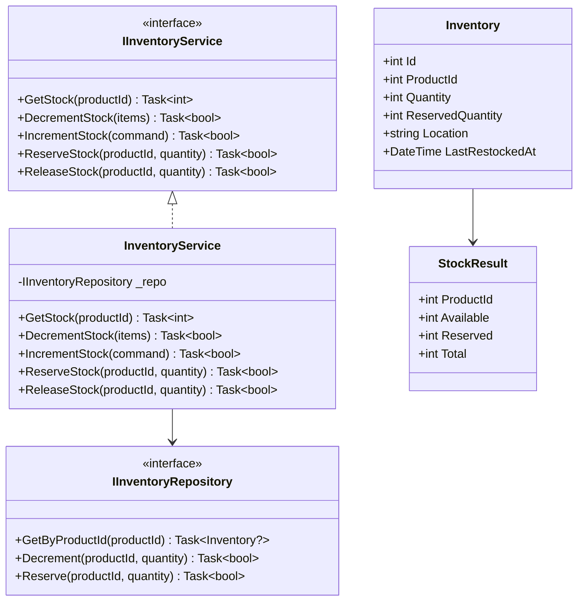
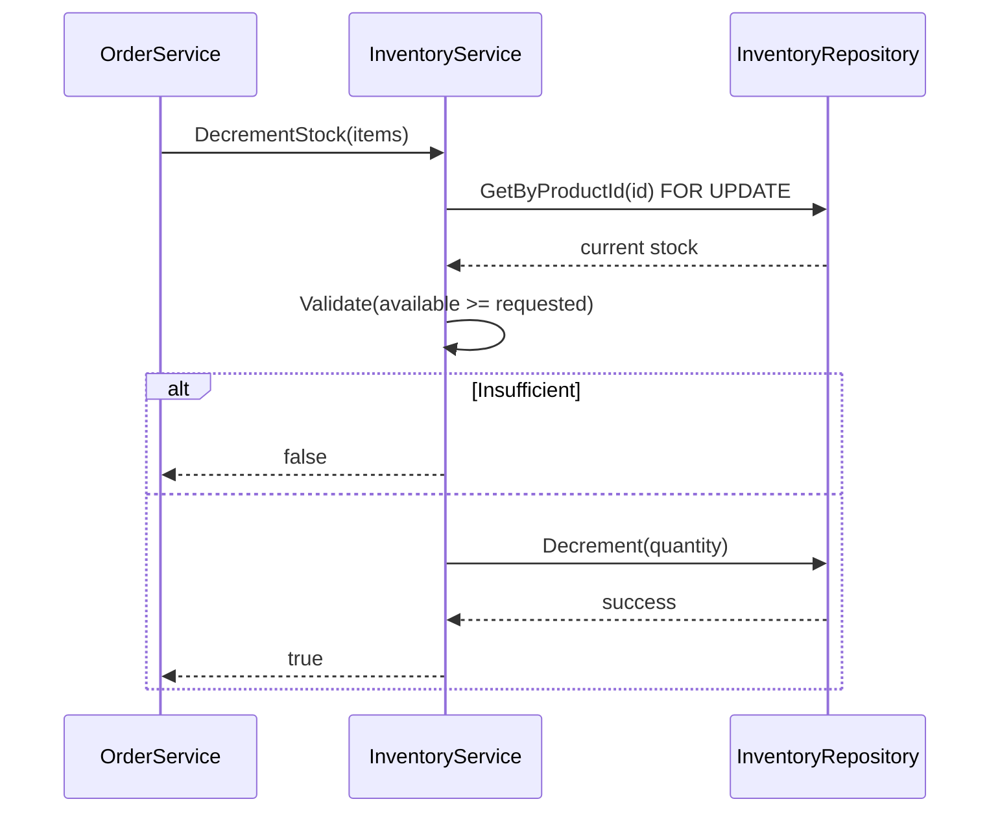
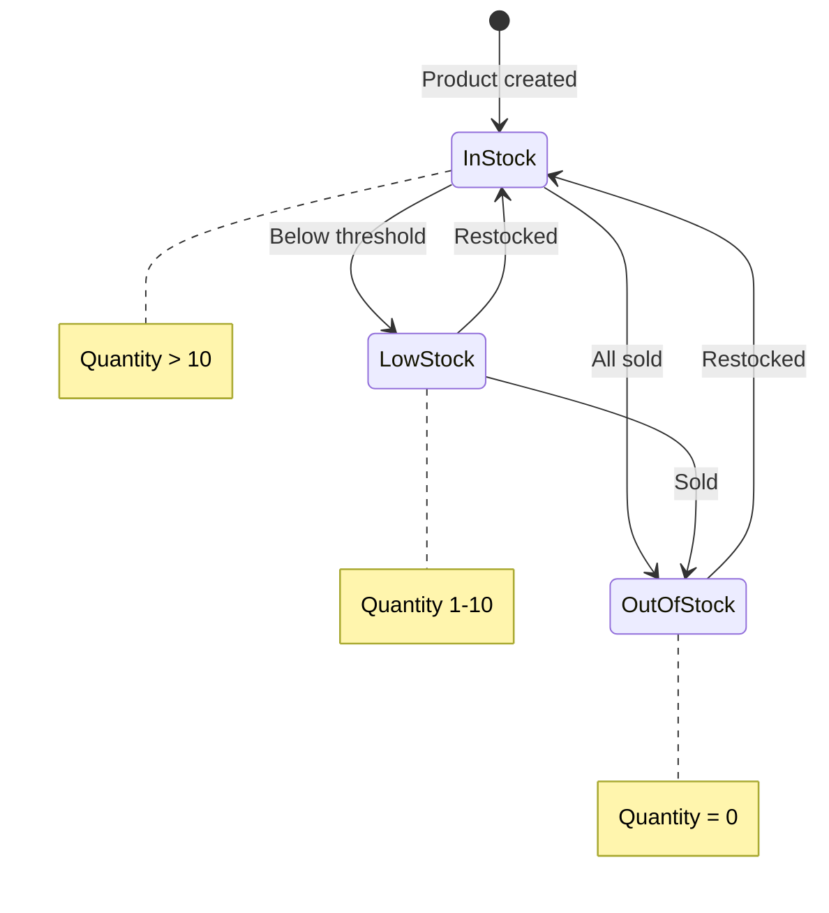

# Inventory Module - Low Level Design

---

## Table of Contents

1. [Use Cases](#1-use-cases)
2. [Class Diagram](#2-class-diagram)
3. [Sequence Diagrams](#3-sequence-diagrams)
4. [State Diagram](#4-state-diagram)
5. [Class Responsibilities](#5-class-responsibilities)
6. [Design Patterns Applied](#6-design-patterns-applied)
7. [SOLID Compliance](#7-solid-compliance)

---

## 1. Use Cases

### 1.1 Get Stock

```
Use Case: UC-801 - Get Stock

Actors: Product Service (internal)
Preconditions: Product exists
Postconditions: Stock returned

Flow:
1. Request stock for product
2. Return quantity available
```

### 1.2 Decrement Stock

```
Use Case: UC-802 - Decrement Stock

Actors: Order Service (internal)
Preconditions: Product exists, quantity available
Postconditions: Stock decremented

Flow:
1. Request decrement with product ID and quantity
2. Lock row (SELECT FOR UPDATE)
3. Validate quantity >= requested
4. Decrement and commit
5. Return success
```

### 1.3 Increment Stock (Restock)

```
Use Case: UC-803 - Increment Stock

Actors: Admin
Preconditions: Product exists
Postconditions: Stock incremented

Flow:
1. Admin enters product ID and quantity
2. Increment stock
3. Update LastRestockedAt
4. Return success
```

### 1.4 Reserve Stock

```
Use Case: UC-804 - Reserve Stock

Actors: Cart Service (internal)
Preconditions: Product exists
Postconditions: Stock reserved

Flow:
1. User adds to cart
2. Reserve stock (quantity in carts)
3. Return reserved quantity
```

### 1.5 Release Stock

```
Use Case: UC-805 - Release Stock

Actors: Cart Service (internal)
Preconditions: Item removed from cart
Postconditions: Stock released

Flow:
1. User removes from cart
2. Release reserved quantity
3. Return success
```

---

## 2. Class Diagram



---

## 3. Sequence Diagrams

### 3.1 Decrement Stock Sequence



---

## 4. State Diagram

### 4.1 Inventory States



---

## 5. Class Responsibilities

### Responsibility: Critical Stock Management

| Method | Description |
|--------|-------------|
| GetStock | Get available quantity |
| DecrementStock | Reduce on order (with locking) |
| IncrementStock | Admin restock |
| ReserveStock | Cart reservation |
| ReleaseStock | Cart cancellation |

---

## 6. Design Patterns

### Key Pattern: Pessimistic Locking

```csharp
// Critical for preventing overselling
public async Task<bool> DecrementStock(int productId, int quantity) {
    await using var conn = await _connectionFactory.OpenAsync();
    await using var tx = await conn.BeginTransactionAsync();
    
    // Lock row exclusively
    var inventory = await conn.QuerySingleAsync<Inventory>(
        "SELECT * FROM Inventories WHERE ProductId = @Id FOR UPDATE",
        new { Id = productId });
    
    if (inventory.Quantity < quantity) return false;
    
    await conn.ExecuteAsync(
        "UPDATE Inventories SET Quantity = Quantity - @Qty WHERE ProductId = @Id",
        new { Id = productId, Qty = quantity });
    
    await tx.CommitAsync();
    return true;
}
```

---

## 7. SOLID Compliance ✅