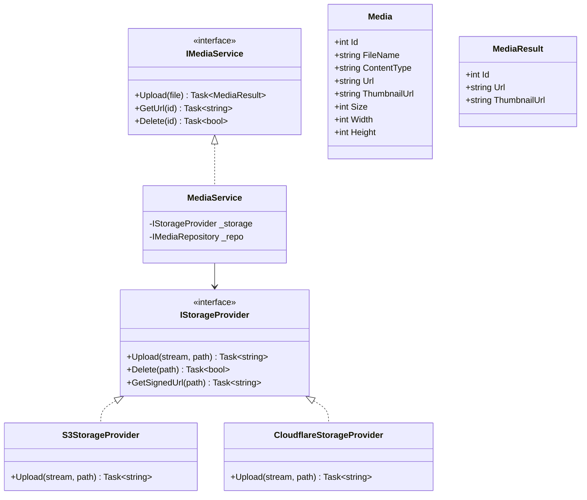
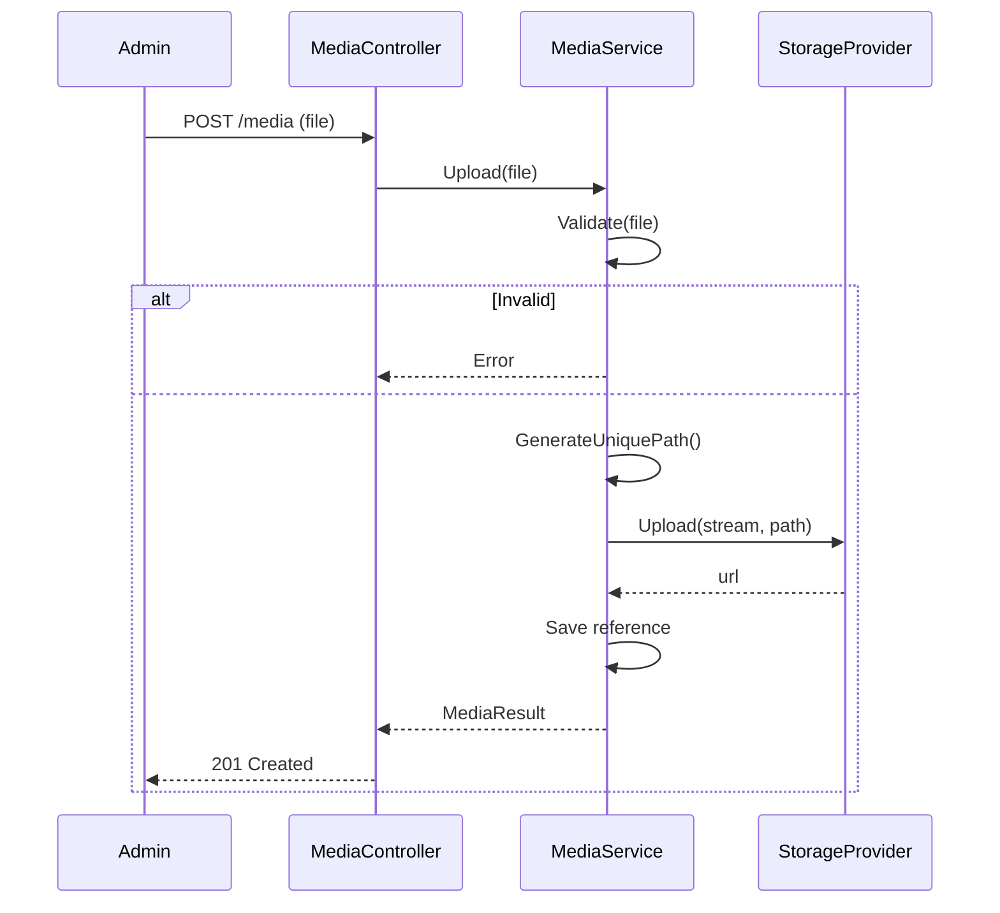

# Media Module - Low Level Design

---

## Table of Contents

1. [Use Cases](#1-use-cases)
2. [Class Diagram](#2-class-diagram)
3. [Sequence Diagrams](#3-sequence-diagrams)
4. [Storage Strategy](#4-storage-strategy)
5. [Design Patterns](#5-design-patterns)
6. [SOLID Compliance](#6-solid-compliance)

---

## 1. Use Cases

### 1.1 Upload Image

```
Actors: Admin
Flow: Select file → Validate type/size → Upload to storage → Save reference → Return URL
```

### 1.2 Get Image

```
Actors: Customer
Flow: Request image → Check permissions → Redirect to CDN
```

### 1.3 Delete Image

```
Actors: Admin
Flow: Delete reference → Mark for deletion → Remove from CDN (async)
```

### 1.4 Generate Thumbnails

```
Actors: System
Flow: Upload triggers → Async job → Generate sizes → Upload → Update reference
```

---

## 2. Class Diagram



---

## 3. Sequence: Upload Image



---

## 4. Storage Strategy

### 4.1 Image Types

| Type | Max Size | Formats |
|------|---------|---------|
| Product Image | 10MB | JPG, PNG, WebP |
| Category Image | 5MB | JPG, PNG |
| User Avatar | 2MB | JPG, PNG |
| Banner | 10MB | JPG, PNG, WebP |

### 4.2 CDN Strategy

```
Upload → S3/Cloudflare → CloudFront/CDN → User

┌─────────────────────────────────────┐
│         Upload Flow                   │
├─────────────────────────────────────┤
│  Admin → API →                   │
│                    S3 Bucket      │
│                    (Original)       │
├─────────────────────────────────────┤
│         Processing (Async)          │
├─────────────────────────────────────┤
│  S3 Event → Lambda →              │
│                    S3 Bucket      │
│                    (Thumbnails)   │
├─────────────────────────────────────┤
│         Serving                    │
├─────────────────────────────────────┤
│  CloudFront → S3                  │
│  (Cached, fast)                   │
└─────────────────────────────────────┘
```

### 4.3 Generated Sizes

| Size | Dimensions | Use |
|------|------------|-----|
| Thumbnail | 150×150 | Grid view |
| Small | 300×300 | Mobile |
| Medium | 600×600 | Product detail |
| Large | 1200×1200 | Zoom |

---

## 5. Design Patterns

### 5.1 Adapter Pattern

```csharp
// Uniform interface for different providers
public interface IStorageProvider {
    Task<string> Upload(Stream stream, string path);
    Task<bool> Delete(string path);
    Task<string> GetSignedUrl(string path);
}
```

### 5.2 Async Processing

```csharp
// Background thumbnail generation
public class ThumbnailGenerator : IJob {
    public async Task Run() {
        // Generate all sizes asynchronously
    }
}
```

---

## 6. SOLID Compliance ✅