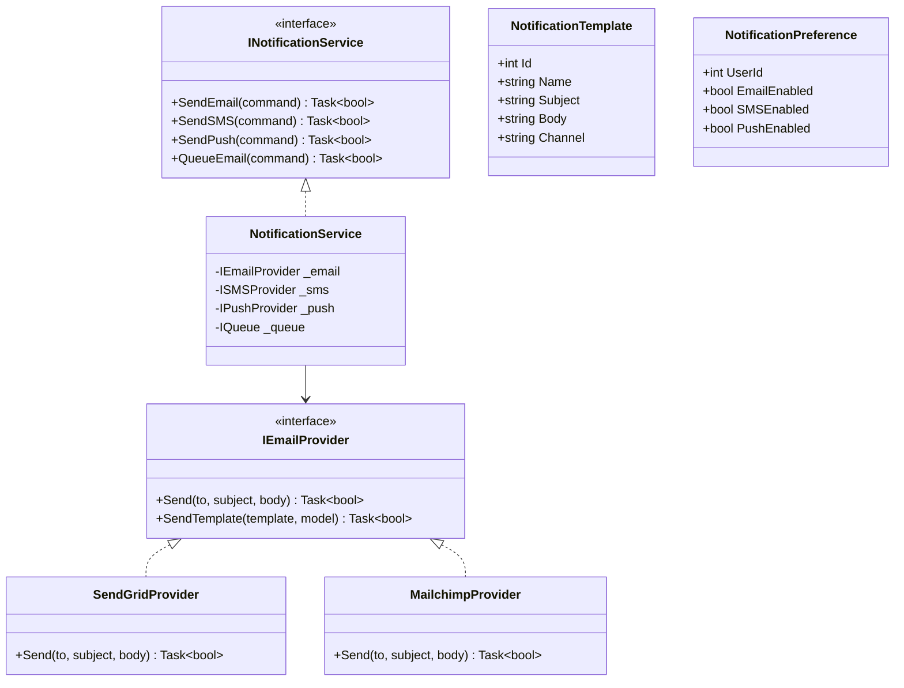
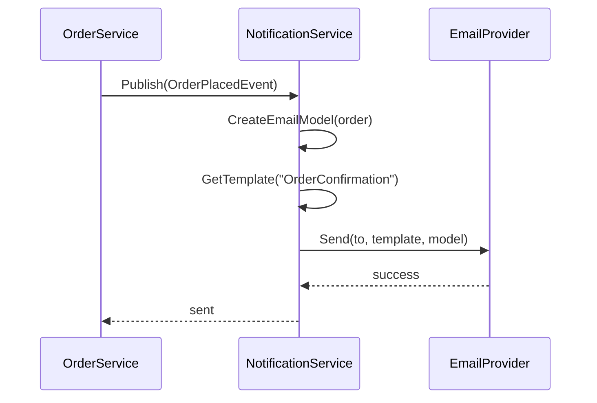

# Notifications Module - Low Level Design

---

## Table of Contents

1. [Use Cases](#1-use-cases)
2. [Class Diagram](#2-class-diagram)
3. [Sequence Diagrams](#3-sequence-diagrams)
4. [Notification Types](#4-notification-types)
5. [Design Patterns](#5-design-patterns)
6. [SOLID Compliance](#6-solid-compliance)

---

## 1. Use Cases

### 1.1 Send Order Confirmation

```
Trigger: Order placed
Channel: Email
Flow: Create notification → Queue → Send via Email Service
```

### 1.2 Send Shipping Notification

```
Trigger: Order shipped
Channel: Email + SMS
Flow: Get tracking → Create notification → Send
```

### 1.3 Send Payment Receipt

```
Trigger: Payment successful
Channel: Email
Flow: Create PDF → Attach → Send
```

### 1.4 Send Password Reset

```
Trigger: User requests reset
Channel: Email
Flow: Generate token → Create link → Send
```

### 1.5 Send Promotional Email

```
Trigger: Admin campaign
Channel: Email
Flow: Select users → Create batch → Send via provider
```

---

## 2. Class Diagram



---

## 3. Sequence: Order Confirmation



---

## 4. Notification Types

| Type | Channel | Trigger |
|------|---------|---------|
| Order Confirmation | Email | Order placed |
| Payment Receipt | Email | Payment successful |
| Shipping Alert | Email + SMS | Order shipped |
| Delivery Notice | Email + SMS | Order delivered |
| Password Reset | Email | User requested |
| Account Welcome | Email | User registered |
| Cart Abandoned | Email | Cart abandoned (24h) |
| Promotional | Email | Admin campaign |

---

## 5. Design Patterns

### 5.1 Strategy Pattern

```csharp
// Different providers
public interface IEmailProvider { Task<bool> Send(...); }
public interface ISMSProvider { Task<bool> Send(...); }
```

### 5.2 Observer Pattern

```csharp
// Event-driven notifications
public class OrderPlacedHandler : INotificationHandler<OrderPlacedEvent> {
    public async Task Handle(OrderPlacedEvent e) {
        await _notificationService.SendOrderConfirmation(e.OrderId);
    }
}
```

### 5.3 Queue Pattern

```csharp
// Async processing
await _queue.Enqueue(new EmailMessage {
    To = user.Email,
    Template = "OrderConfirmation",
    Model = order
});
```

---

## 6. SOLID Compliance ✅