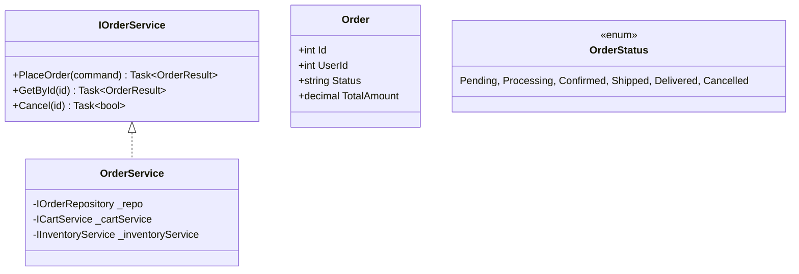
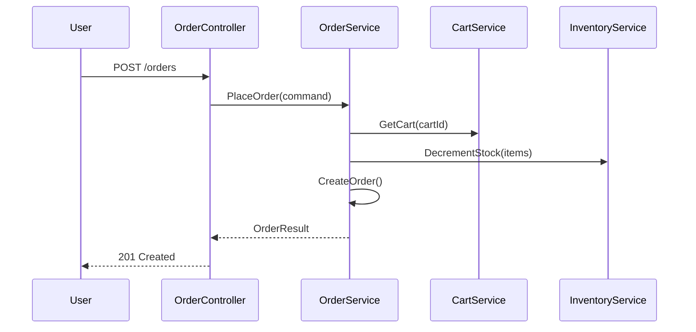
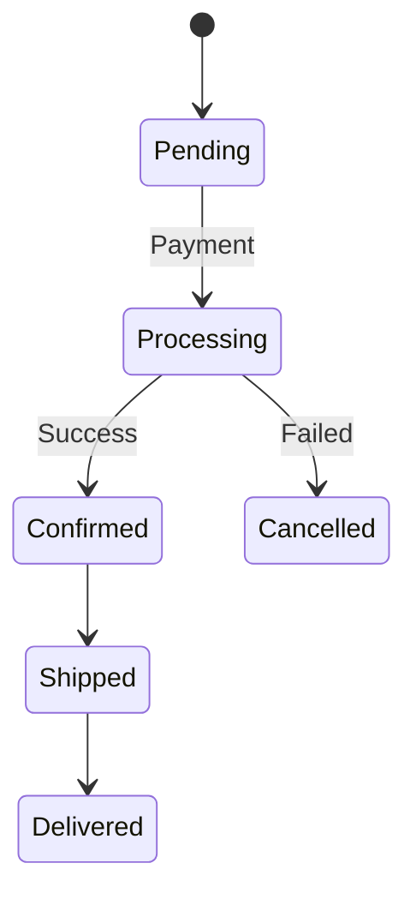

# Order Component - Low Level Design

---

## Use Cases

1. Place Order
2. Get Order by ID
3. Get User Orders
4. Cancel Order
5. Update Status

---

## Class Diagram

---

## Sequence: Place Order

---

## State Diagram

---

## Design Patterns

- CQRS
- Transaction Script
- Domain Events

---

## SOLID ✅