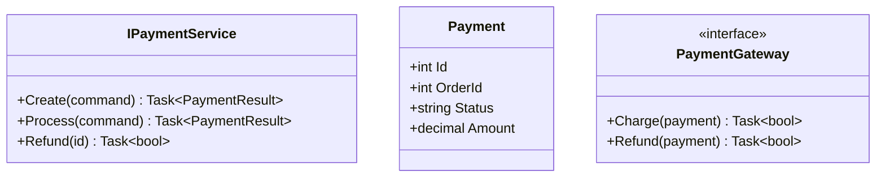
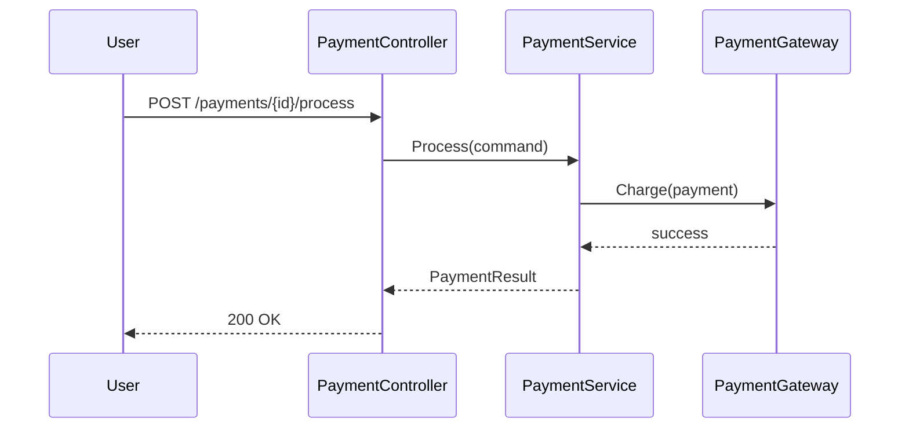
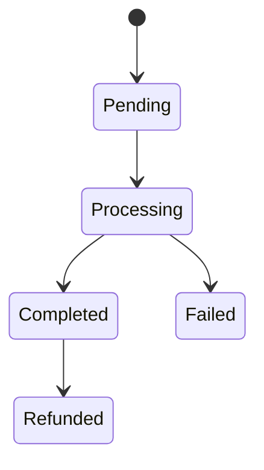

# Payment Component - Low Level Design

---

## Use Cases

1. Create Payment
2. Process Payment
3. Refund Payment
4. Get Payment

---

## Class Diagram

---

## Sequence: Process Payment

---

## State Diagram

---

## Design Patterns

- Strategy (gateways)
- Adapter

---

## SOLID ✅