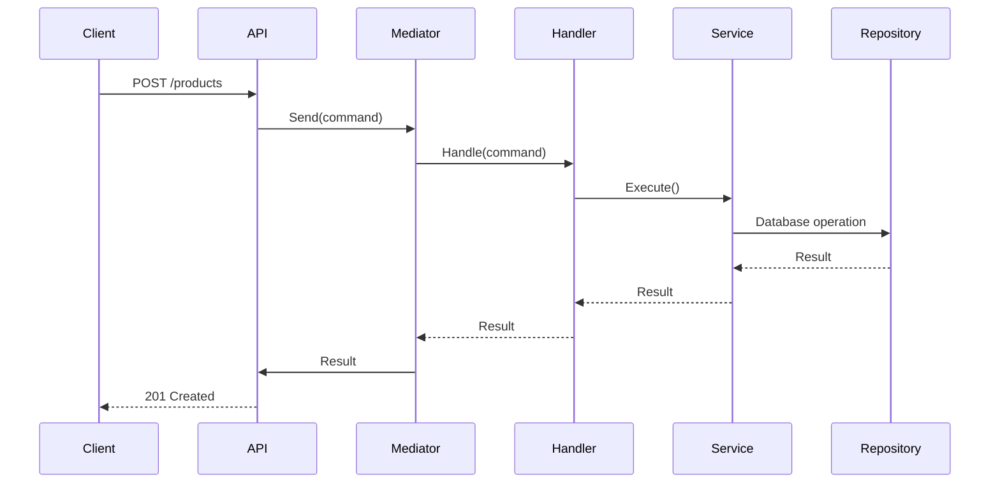

# Products CQRS Implementation

This document shows how CQRS pattern is implemented in Products module.

---

## Command Handler Structure

```csharp
public class CreateProductHandler 
    : IRequestHandler<CreateProductCommand, ProductResult> 
{
    private readonly IProductService _productService;

    public CreateProductHandler(IProductService productService)
    {
        _productService = productService;
    }

    public async Task<ProductResult> Handle(
        CreateProductCommand request, 
        CancellationToken cancellationToken)
    {
        // Validate command
        // Execute business logic
        // Return result
    }
}
```

---

## Query Handler Structure

```csharp
public class GetAllProductsHandler 
    : IRequestHandler<GetAllProductsQuery, List<ProductResult>> 
{
    private readonly IProductService _productService;

    public GetAllProductsHandler(IProductService productService)
    {
        _productService = productService;
    }

    public async Task<List<ProductResult>> Handle(
        GetAllProductsQuery request, 
        CancellationToken cancellationToken)
    {
        return await _productService.GetAll();
    }
}
```

---

## Commands vs Queries Separation

| Type | Operation | Example |
|------|-----------|---------|
| **Command** | Write | CreateProduct, UpdateProduct, DeleteProduct |
| **Query** | Read | GetProduct, GetAllProducts, SearchProducts |

---

## MediatR Integration

```csharp
// Register in DI
services.AddMediatR(cfg => cfg.RegisterServicesFromAssembly(typeof(CreateProductHandler).Assembly));
```

---

## Flow Diagram

