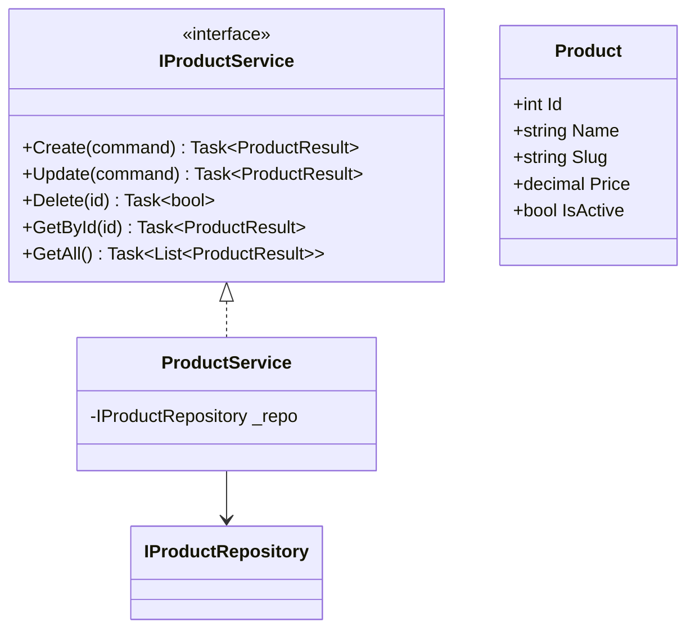
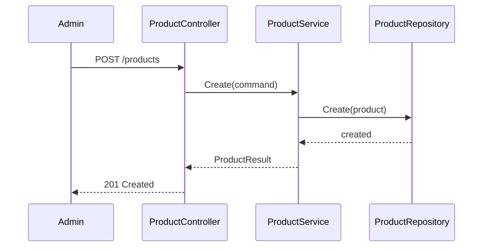
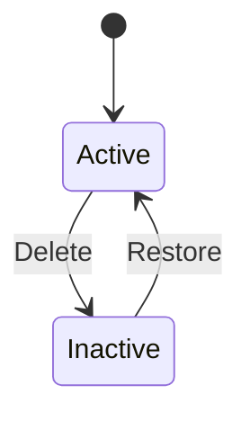

# Products Component - Low Level Design

---

## Table of Contents

1. [Use Cases](#1-use-cases)
2. [Class Diagram](#2-class-diagram)
3. [Sequence Diagrams](#3-sequence-diagrams)
4. [Class Responsibilities](#4-class-responsibilities)
5. [Design Patterns](#5-design-patterns)
6. [SOLID Compliance](#6-solid-compliance)

---

## 1. Use Cases

### 1.1 Create Product
```
Actors: Admin
Flow: Enter details → Validate → Create → Return
```

### 1.2 Update Product
```
Actors: Admin
Flow: Select product → Edit → Update → Return
```

### 1.3 Delete Product
```
Actors: Admin
Flow: Soft delete → Return success
```

### 1.4 Get Products
```
Actors: Customer, Admin
Flow: Fetch paginated → Return list
```

### 1.5 Search Products
```
Actors: Customer
Flow: Search query → Return results
```

---

## 2. Class Diagram



---

## 3. Sequence: Create Product



---

## 4. Responsibilities

| Method | Description |
|--------|-------------|
| Create | Add new product |
| Update | Edit product |
| Delete | Soft delete |
| GetAll | List products |
| GetById | Single product |
| Search | Full-text search |

---

## 5. Design Patterns ✅

- CQRS (Commands/Queries)
- Repository
- Service Layer

---

## 6. SOLID ✅

---

## 7. State Diagram



---

*Last updated: 2026-04-28*