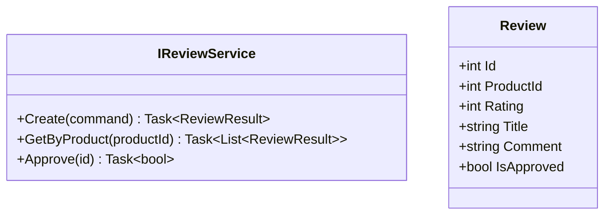
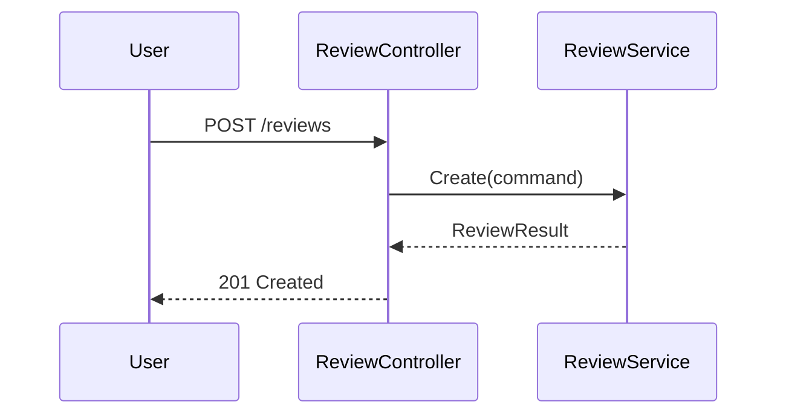
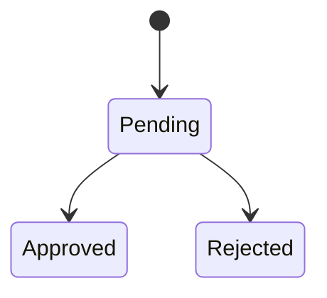

# Reviews Component - Low Level Design

---

## Use Cases

1. Create Review (verified purchase)
2. Get Product Reviews
3. Update Review
4. Delete Review
5. Approve Review (admin)

---

## Class Diagram

---

## Sequence

---

## State Diagram

---

## SOLID ✅