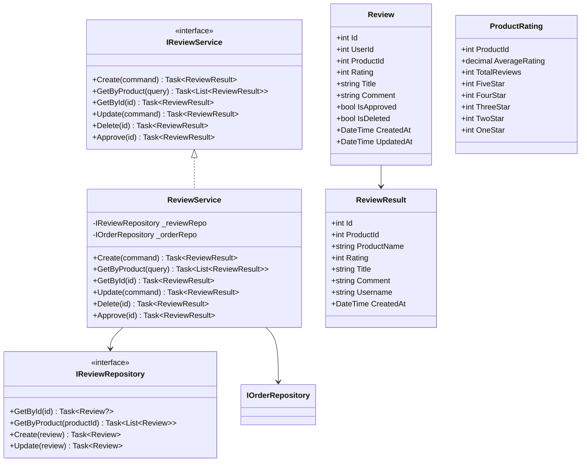
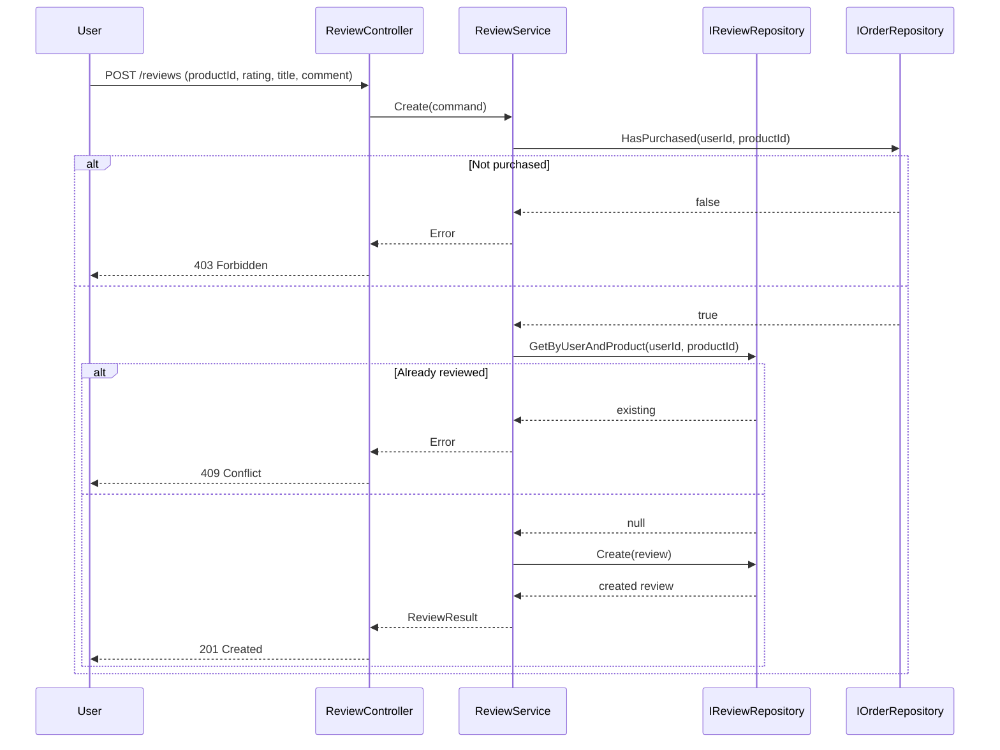
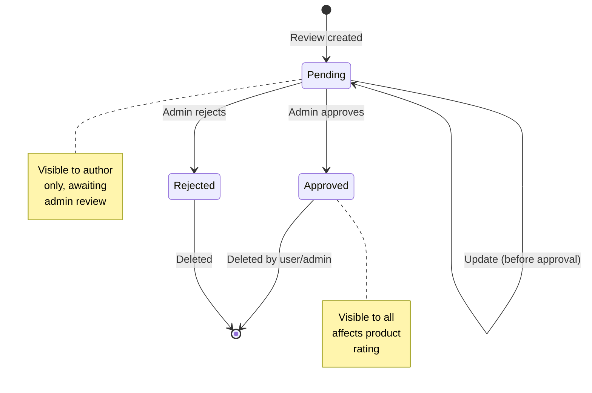

# Reviews Module - Low Level Design

---

## Table of Contents

1. [Use Cases](#1-use-cases)
2. [Class Diagram](#2-class-diagram)
3. [Sequence Diagrams](#3-sequence-diagrams)
4. [State Diagram](#4-state-diagram)
5. [Class Responsibilities](#5-class-responsibilities)
6. [Design Patterns Applied](#6-design-patterns-applied)
7. [SOLID Compliance](#7-solid-compliance)

---

## 1. Use Cases

### 1.1 Create Review

```
Use Case: UC-701 - Create Review

Actors: Customer (verified purchase)
Preconditions: User has purchased product
Postconditions: Review created, pending approval

Flow:
1. User selects product to review
2. Validate user purchased product
3. Check user hasn't reviewed already
4. User enters rating (1-5), title, comment
5. Create review with pending status
6. Return review confirmation
```

### 1.2 Get Product Reviews

```
Use Case: UC-702 - Get Product Reviews

Actors: Customer
Preconditions: Product exists
Postconditions: Reviews returned

Flow:
1. Request reviews for product
2. Fetch approved reviews only
3. Calculate average rating
4. Return paginated reviews
```

### 1.3 Update Review

```
Use Case: UC-703 - Update Review

Actors: Customer (review author)
Preconditions: Review exists
Postconditions: Review updated

Flow:
1. User enters review ID and new values
2. Validate ownership
3. Check not approved yet
4. Update review
5. Return updated review
```

### 1.4 Delete Review

```
Use Case: UC-704 - Delete Review

Actors: Customer, Admin
Preconditions: Review exists
Postconditions: Review deleted

Flow:
1. User/admin enters review ID
2. Validate ownership (user) or admin
3. Soft delete (IsDeleted = true)
4. Recalculate product rating
5. Return success
```

### 1.5 Approve Review

```
Use Case: UC-705 - Approve Review

Actors: Admin
Preconditions: Review pending
Postconditions: Review approved

Flow:
1. Admin enters review ID
2. Validate content (check for profanity)
3. Mark as approved
4. Recalculate product rating
5. Return success
```

---

## 2. Class Diagram



---

## 3. Sequence Diagrams

### 3.1 Create Review Sequence



---

## 4. State Diagram

### 4.1 Review Lifecycle



---

## 5. Class Responsibilities

### 5.1 ReviewService

| Responsibility | Methods |
|---------------|---------|
| Create review | `Create(CreateReviewCommand)` |
| Get by product | `GetByProduct(productId)` |
| Get by ID | `GetById(int id)` |
| Update review | `Update(UpdateReviewCommand)` |
| Delete review | `Delete(int id)` |
| Approve review | `Approve(int id)` |
| Calculate rating | `CalculateProductRating(productId)` |

---

## 6. Design Patterns Applied

### 6.1 CQRS Pattern

```csharp
public record CreateReviewCommand(...) : IRequest<ReviewResult>;
public record GetProductReviewsQuery(...) : IRequest<List<ReviewResult>>;
```

### 6.2 Repository Pattern

```csharp
public interface IReviewRepository {
    Task<Review?> GetById(int id);
    Task<List<Review>> GetByProduct(int productId);
    Task<Review> Create(Review review);
}
```

---

## 7. SOLID Compliance

### All Principles ✅

| Principle | Status |
|-----------|--------|
| Single Responsibility | ✅ |
| Open/Closed | ✅ |
| Liskov Substitution | ✅ |
| Interface Segregation | ✅ |
| Dependency Inversion | ✅ |

---

## Appendix: Review Entity

```csharp
public class Review {
    public int Id { get; set; }
    public int UserId { get; set; }
    public int ProductId { get; set; }
    public int Rating { get; set; }       // 1-5
    public string Title { get; set; }
    public string Comment { get; set; }
    public bool IsApproved { get; set; }
    public bool IsDeleted { get; set; }
    public DateTime CreatedAt { get; set; }
    public DateTime UpdatedAt { get; set; }
}
```