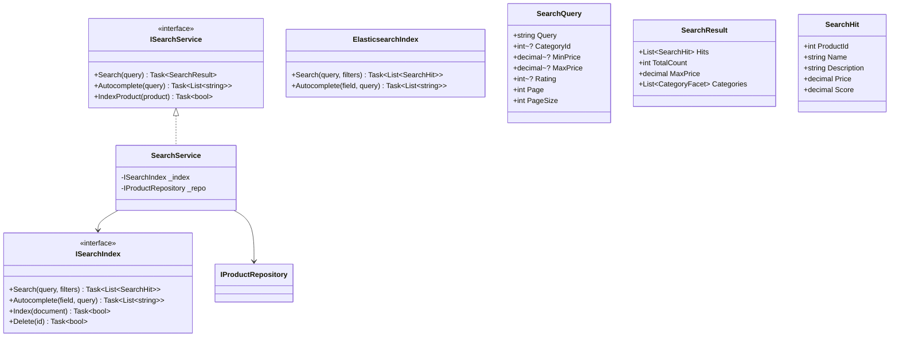
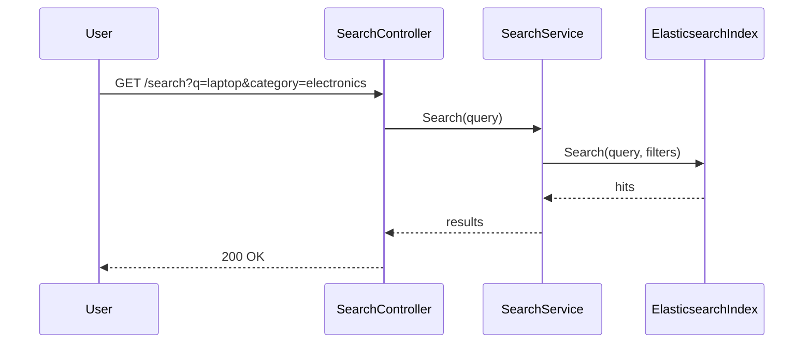

# Search Module - Low Level Design

---

## Table of Contents

1. [Use Cases](#1-use-cases)
2. [Class Diagram](#2-class-diagram)
3. [Sequence Diagrams](#3-sequence-diagrams)
4. [Search Features](#4-search-features)
5. [Design Patterns](#5-design-patterns)
6. [SOLID Compliance](#6-solid-compliance)

---

## 1. Use Cases

### 1.1 Product Search

```
Actors: Customer
Flow: Enter query → Parse → Search → Rank → Return results
```

### 1.2 Category Browse

```
Actors: Customer
Flow: Select category → Get products → Apply filters → Return
```

### 1.3 Autocomplete

```
Actors: Customer
Flow: Type query (3+ chars) → Search products → Return suggestions
```

### 1.4 Advanced Search

```
Actors: Customer
Flow: Apply filters (price, rating, category) → Search → Return
```

---

## 2. Class Diagram



---

## 3. Sequence: Product Search



---

## 4. Search Features

| Feature | Implementation |
|---------|----------------|
| Full-text search | Elasticsearch |
| Autocomplete | Completion suggester |
| Faceted search | Aggregations |
| Fuzzy matching | Levenshtein distance |
| Ranking | BM25 algorithm |
| Synonyms | Dictionary |

### 4.1 Search Query Parameters

| Parameter | Type | Description |
|-----------|------|-------------|
| q | string | Search query |
| category | int? | Category filter |
| min_price | decimal? | Price range |
| max_price | decimal? | Price range |
| rating | int? | Minimum rating |
| sort | string | Sort order (relevance, price, new) |
| page | int | Page number |
| page_size | int | Results per page |

---

## 5. Design Patterns

### 5.1 Repository Pattern (Search Index)

```csharp
public interface ISearchIndex {
    Task<List<SearchHit>> Search(SearchQuery query);
    Task Index(Product product);
}
```

### 5.2 Index Pattern (Full-text)

```json
{
  "product": {
    "properties": {
      "name": { "type": "text", "analyzer": "standard" },
      "description": { "type": "text", "analyzer": "standard" },
      "category": { "type": "keyword" },
      "price": { "type": "float" },
      "rating": { "type": "float" }
    }
  }
}
```

---

## 6. SOLID Compliance ✅

| Principle | Status |
|-----------|--------|
| Single Responsibility | ✅ |
| Open/Closed | ✅ |
| Liskov Substitution | ✅ |
| Interface Segregation | ✅ |
| Dependency Inversion | ✅ |