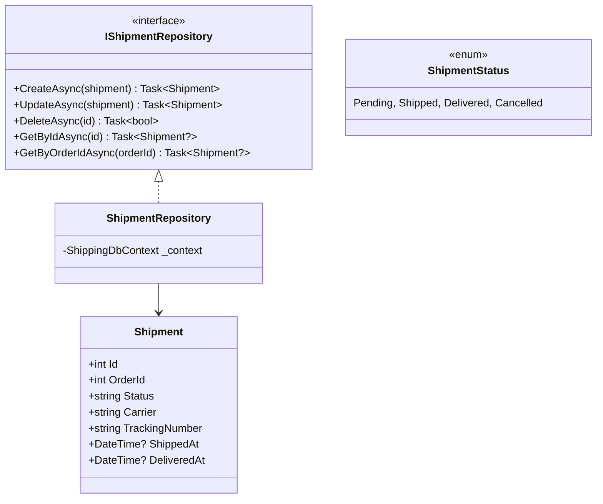
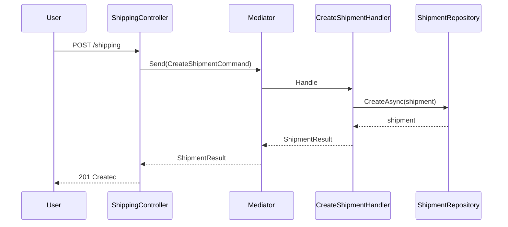
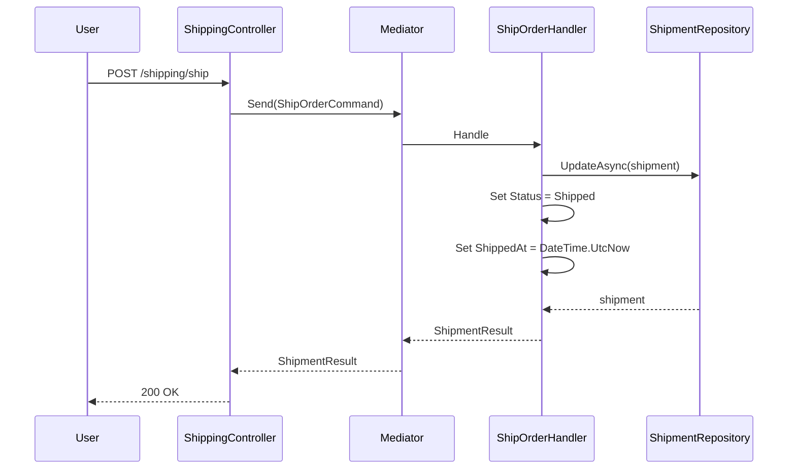
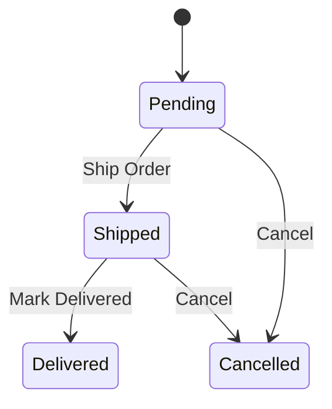

# Shipping Component - Low Level Design

---

## Use Cases

1. Create Shipment
2. Ship Order
3. Update Tracking
4. Cancel Shipment
5. Get Shipment by Order

---

## Class Diagram

---

## Sequence: Create Shipment

---

## Sequence: Ship Order

---

## State Diagram

---

## Design Patterns ✅

- CQRS (Commands/Queries)
- Repository
- Service Layer

---

## SOLID ✅

| Principle | Status | Description |
|-----------|--------|-------------|
| **S** - Single Responsibility | ✅ | Each handler has one job |
| **O** - Open/Closed | ✅ | Can extend with new shipment types |
| **L** - Liskov Substitution | ✅ | Repository interchangeable |
| **I** - Interface Segregation | ✅ | Focused interfaces |
| **D** - Dependency Inversion | ✅ | Depends on abstractions |

---

*Last updated: 2026-04-30*
