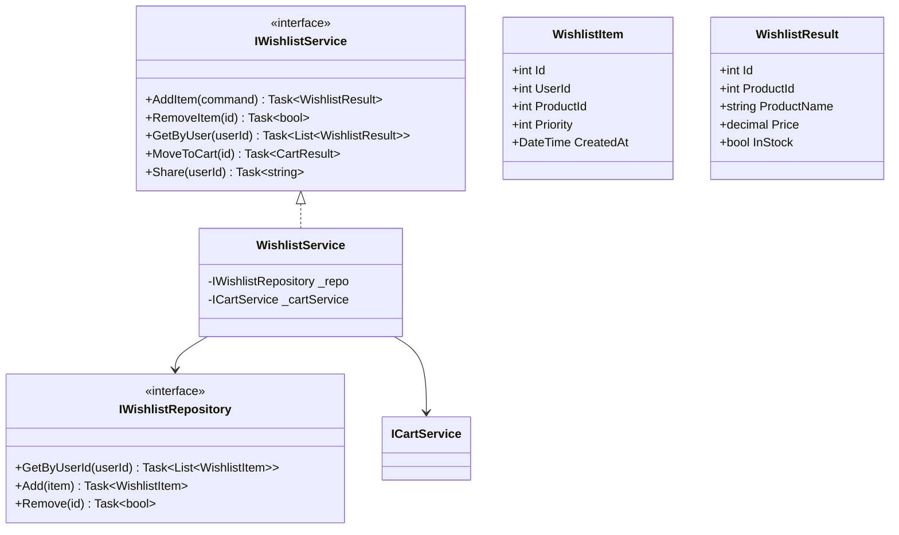
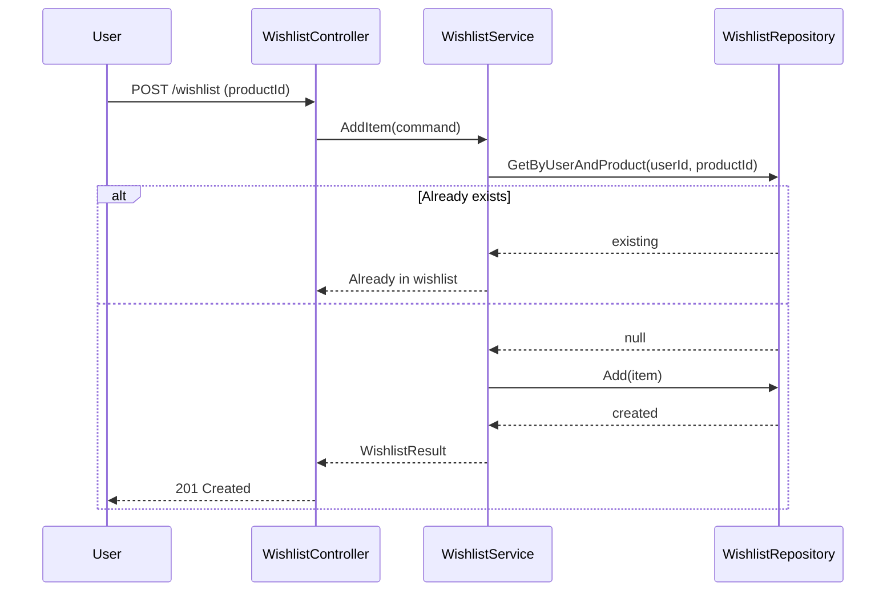

# Wishlist Module - Low Level Design

---

## Table of Contents

1. [Use Cases](#1-use-cases)
2. [Class Diagram](#2-class-diagram)
3. [Sequence Diagrams](#3-sequence-diagrams)
4. [Design Patterns](#4-design-patterns)
5. [SOLID Compliance](#5-solid-compliance)

---

## 1. Use Cases

### 1.1 Add to Wishlist

```
Actors: Customer
Flow: Select product → Add to wishlist → Return success
```

### 1.2 Remove from Wishlist

```
Actors: Customer
Flow: Select item → Remove → Return success
```

### 1.3 Get Wishlist

```
Actors: Customer
Flow: Fetch all wishlist items → Return with product details
```

### 1.4 Move to Cart

```
Actors: Customer
Flow: Select wishlist item → Add to cart → Optionally remove from wishlist
```

### 1.5 Share Wishlist

```
Actors: Customer
Flow: Generate share link → Return public URL
```

---

## 2. Class Diagram



---

## 3. Sequence: Add to Wishlist



---

## 4. Design Patterns

### 4.1 Cart Wishlist Integration

```csharp
public async Task<CartResult> MoveToCart(int wishlistItemId) {
    var item = await _repo.GetById(wishlistItemId);
    var cartResult = await _cartService.AddItem(new AddToCartCommand {
        ProductId = item.ProductId,
        Quantity = 1
    });
    return cartResult;
}
```

---

## 5. SOLID Compliance ✅